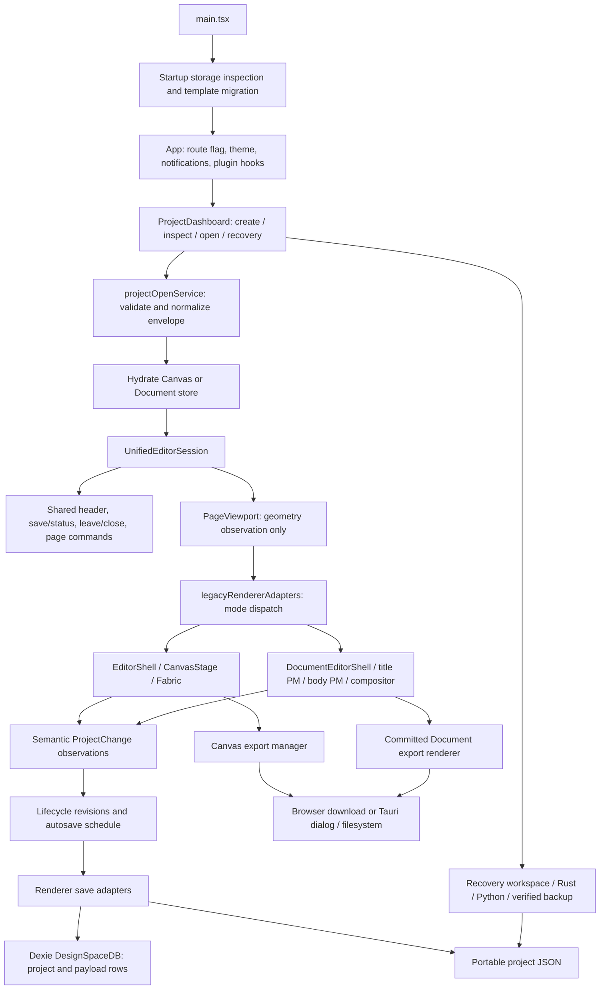
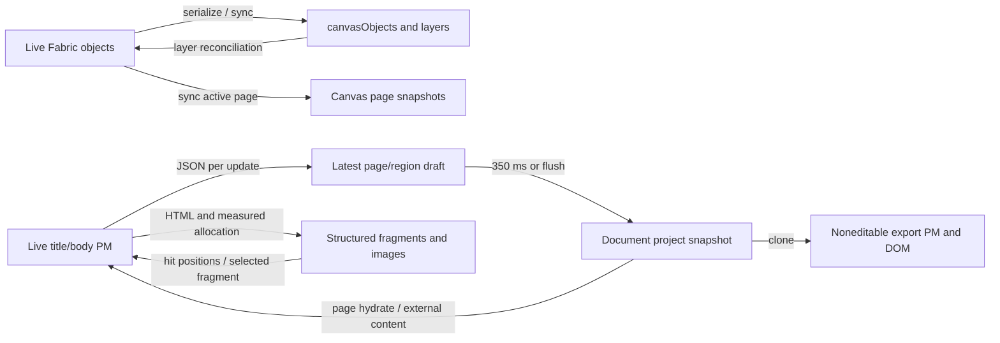
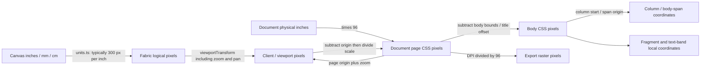
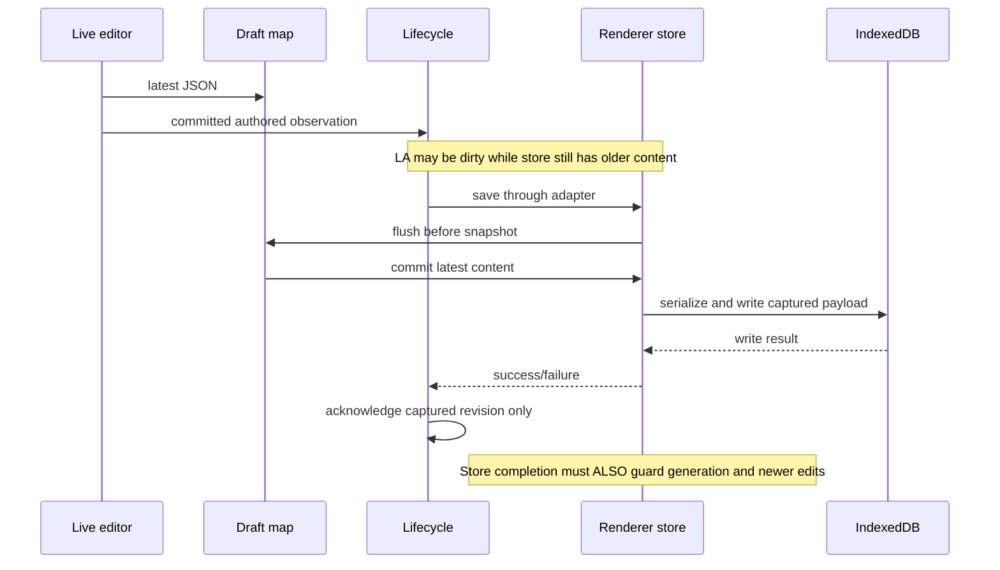

# Design Space: full forensic architecture audit

Audit date: 2026-09-07. Audited HEAD: `b56833a2988875cde238461907e41d137dde0135` (`fix(document): stabilize editor ownership`). Repository: `maplebakin/designspace`.

## Executive finding

**Verdict C: several boundaries remain overcomplicated and should be simplified before new feature development.** This is a usable two-engine publishing application, with substantial working functionality and some good isolation boundaries. It is not a unified document model. Its most serious remaining problems are at the joins between editing, history, snapshots, saving, and session replacement—not exclusively inside Document text layout.

Stabilization improved image targeting, fragment identity, reference targeting, and selection presentation. It did not establish end-to-end exclusive ownership. In particular, a lifecycle watermark can be correct while its renderer adapter overwrites newer state; an undo can restore authored content without telling the lifecycle authority; and asset pruning can invalidate a still-live undo entry.

Using the requested rubric (P0 includes data loss), this audit identifies **2 P0, 4 P1, and 8 P2 findings** in the numbered risk register. The two P0s are bounded, reproduced loss-of-state/asset failures, not a claim that every project is corrupt or the application is insecure. Four targeted probes reproduced failures despite **632/632 unit tests and 9/9 focused Chromium tests passing**.

Only this document was added. No runtime source, existing reports, AGENTS.md, snapshots, or index entries were changed. No commit was made.

## 0. Repository state and evidence method

| Item | Observed state before audit output |
| --- | --- |
| Branch | `main` |
| HEAD | `b56833a2988875cde238461907e41d137dde0135` |
| Upstream | `origin/main` |
| Ahead / behind | `0 / 0` |
| Remote | `git@github.com:maplebakin/designspace.git` |
| Independently queried remote | `git ls-remote --heads --tags origin` returned the same HEAD for `refs/heads/main` |
| Staged | Added `AGENTS.md`; added `docs/audits/document-editor-post-fix-architecture-audit.md` |
| Unstaged | None |
| Untracked | None |
| AGENTS.md separately staged? | Yes, 37 lines; preserved |
| Other pre-existing staged audit | 614 lines; historical testimony, not part of HEAD |
| Branches / tags | Local `main`, remote-tracking `origin/main`; no tags or additional advertised remote branches |

The historical `git log --all` also exposes February stash ancestry. It is not an additional current development branch. The recent work is represented by commits on `main`, not release tags.

Evidence levels used below:

- **Reproduced:** observed against the current app in a fresh, temporary Chromium context, with the exact boundary identified.
- **Code-confirmed:** current implementation and callers establish the behavior; not necessarily reproduced through a complete user workflow.
- **Risk/inference:** an exposed boundary or plausible interleaving, explicitly distinguished from an observed failure.
- **Historical only:** a previous report's measurements, not independently repeated here.

Source citations use repository-relative file links and named symbols/line anchors in prose. Line numbers refer to audited HEAD. Documentation was read for architectural claims and historical causality; large historical ledgers and repeated phase reports were sampled by scope, authority, exclusions, and verification sections. This is a project-wide boundary audit, not a claim to have reviewed every line of every asset, vendored decoder, or peripheral UI component. Important claims have current-source anchors. There is no claim of complete security or desktop certification.

### Recent ~50 commits, grouped by subsystem

These are the latest 50 commits, grouped rather than presented as a chronology. Documentation-only commits are retained because they explain how confidence accumulated.

| Subsystem | Commits and actual topic |
| --- | --- |
| Document ownership and typing | `b56833a2` ownership stabilization; `31b958f7` local canonical layout during typing; `bde21c92` WebKit latency isolation; `6c354e8c` deferred project snapshots; `12dbc570` immediate live typing; `c369917a` coordinate photo/text handoff; `df285137` autosave debounce and empty titles |
| Photo geometry and interaction | `028dd7c8` imperative drag previews; `031bf487` flow-photo pinning/reference stack; `9d6e4a03` default-photo hit targets; `a5adf7a7` secondary stable-ID selection; `a562588c` fixed-photo obstacle stability; `d7f7c844` span dimension preservation; `bf6f6201` frame-bound chrome |
| References | `a8b3a66a` scanned PDF raster validation and decoder resources |
| Shared session/lifecycle | `42d932fd` lifecycle handoff; `89fab44f` remaining mutation boundaries; `a413103b` high-volume content/style observations; `d930b205` Canvas coverage sweep; `fca2c3c7` diagnostic revision; `87420e6f` transaction seam; `4aa56cdb` normalized page mutations; `ec925166` shared chrome; `e3aae423` session seam; `0b25b4ee` consolidation proposal |
| Canvas observation expansion | `2aaf76cf` theme-color lock; `e2e37130` transform lock; `6cc8b754` border-style observation; `671dcebf` grouping; `eb0b1f36` drawing proof |
| Document observation expansion | `e6ce1f97` content/metadata shadow coverage; `e72771da` flow-image lifecycle; `f6536eec` overlays; `4d8ccedf` geometry; `c659bb14` broader shared shadow coverage |
| Authoring primitives and reconstruction | `4791c54f` crop round-trips; `8177d67f` groups/reference UI; `3f81732c` crop/flow primitives; `d79b8ab9` historical page 50; `bd118062` text hit testing; `4f38d35a` editing geometry |
| Export and desktop delivery | `20965b55` Tauri embedded images; `4b9c8dbd` Tauri scaling; `667b5ee6` file delivery; `fa18144c` hyphenation serialization; `1dbe1400` positioned-image export bounds |
| Historical verification ledger | `c0f3d217` exact ledger; `d9a53bac` focused crop documentation; `f5d699e4` visual crops; `94fdf035` typography limitations |

History was checked beyond these commits, through the original January Canvas era, February service/history work, June Product work, and July Document/recovery work. The baseline is not just the latest Document fix.

## 1. Archaeology: claims versus current code

Principal testimony: [unified consolidation audit](unified-editor-consolidation-audit.md), [post-fix Document audit](document-editor-post-fix-architecture-audit.md), [stabilization](../implementation/document-editor-stabilization.md), [authority handoff](../implementation/unified-editor-authority-handoff.md), phase 1–1O reports, boundary closure/coverage reports, photo-transform/drag/selection reports, scanned PDF report, four typing/autosave reports, historical gap/progress/completion reports, `docs/architecture/*`, root Canvas/service/project context reports, and the recovery reader README.

| Historical assertion | Classification | Current evidence / correction |
| --- | --- | --- |
| There is one product editor route | CONFIRMED | [App](../../src/App.tsx) mounts `UnifiedEditorSession`; the adapter chooses one engine shell. |
| Unified means canonical mixed structured/freeform pages | OBSOLETE as an implementation expectation; never delivered | The consolidation audit proposed this future. [projectSession](../../src/editor/session/projectSession.ts) is descriptive; mode-specific payloads and renderers remain. |
| ProjectChange is merely a passive shadow stream | OBSOLETE | [lifecycle authority](../../src/editor/session/projectLifecycleAuthority.ts) now consumes committed transactions as its only authored revision input. Comments retaining “shadow” are historical. |
| Shared dirty/autosave handoff is complete | PARTIALLY TRUE | Timer and chrome ownership moved. Canvas undo remains silent and active text commits only on exit. R1/R7 invalidate universal dirty-coverage confidence. |
| Old-generation completions cannot affect a new session | PARTIALLY TRUE | True inside lifecycle authority; false as a general guarantee about renderer-store completion writes. Canvas writers are not generation guarded; Document download is not guarded. R2/R3. |
| All persistence boundaries flush the live draft | CONTRADICTED BY CURRENT CODE | Call sites exist, but the new scope is disposed by StrictMode's effect probe and cannot register again. Reproduced global flush of zero with live unsaved text. R4. |
| One Document UI selection projection | PARTIALLY TRUE | One React object now replaces four state slots. Store-to-projection reconciliation and independent PM/group/reference contexts remain. Shell lines 670–941. |
| Stable image ID is resolved again before mutation | CONFIRMED for inspected shell image operations | [image extension](../../src/document/extensions/DocumentImageExtension.ts), `getDocumentImageById`, fresh traversal and duplicate rejection. This does not itself scope asynchronous import to a session. |
| Text visual identity is fragment aware | CONFIRMED at layout-build time | `StructuredTextFragmentIdentity` and exact PM node ranges in [structured compositor](../../src/document/components/StructuredDocumentSpanLayout.tsx). |
| Fragment identity makes live editing ownership simple | PARTIALLY TRUE | One PM block can span several fragments; frozen ranges are not transaction-mapped; source placement still measures a DOM range and applies generated CSS. R8. |
| DOM measurement is only an input to initial structured geometry | CONTRADICTED if applied to all geometry | Ordinary flow-image interaction frames are measured after render, lines 2891–2945; live PM range alignment measures again, lines 3325–3363. |
| Full visible single-column source and active-block masking retired | CONFIRMED narrowly | Old active-block attributes/classes are gone or renamed; fragment masking replaces them. The full PM tree remains mounted and CSS selects which source children paint. |
| Synthetic caret/highlight machinery retired | CONTRADICTED | Decoration helpers and `.document-structured-caret` remain, with active-fragment exclusions. Retained compatibility, not deletion. |
| Async reference import targets its starting page | CONFIRMED | Shell lines 1417–1470 capture page and session before ingestion, validate afterward, and call page-targeted `setReference`. Ordinary photo import does not share this protection. |
| Drag preview is compositor-only | CONFIRMED for reposition preview writes | Imperative transform/rAF path; snap/collision calculations still run on the main thread. Resize remains model/state based. |
| Zero structured rebuilds during typing | PARTIALLY TRUE | Ordinary within-block bursts pass. Enter/block-type changes and image transactions can rebuild. “Visible update” counter is a frame callback, not proof that the glyph painted. |
| No per-key whole-project replacement | CONFIRMED for continuous ordinary Document typing | JSON still obtained per update; project replacement occurs on 350 ms idle/boundary flush. Not a statement about Canvas typing or slow typing with long pauses. |
| No multicolumn WebKit contenteditable | PARTIALLY TRUE | Structured live source is forced to one column. Ordinary three-column PM editing without a span image still exists. |
| Autosave compacts unreachable Document assets | CONTRADICTED | `compactDocumentProjectForPersistence` is called by manual save/download, not `flushAutosave` or navigation persistence. |
| Save-time pruning safely removes unused bytes | PARTIALLY TRUE | Current-page reachability works, but PM undo references are not roots; saving deletion can break undo. Reproduced R6. |
| Project row points to one canonical payload row | CONFIRMED | [db.updateProject](../../src/editor/db.ts), lines 183–224, updates the referenced primary key; obsolete rows are diagnosed rather than rewritten. |
| Document export is isolated from live interaction | CONFIRMED | [committed renderer](../../src/document/components/DocumentProjectExportRenderer.tsx) clones input, mounts noneditable pages at zoom 1, omits references. It relies on the caller supplying current content. |
| Historical four-page support is complete | PARTIALLY TRUE | Independent pages, groups, folios, styles, exports exist. Fixtures prove representative reconstruction, not exact transcription or continuous cross-page text flow. |
| Historical layout is still single-page/live-DOM export | OBSOLETE | July gap analysis predates multi-page store and committed export renderer. |
| Root LLM context describes current stack/session restore | OBSOLETE | It says React 18/Fabric beta/localStorage session autosave. Current package uses React 19/Fabric 7; localStorage stores bounded preferences, not project autosave. |
| Tauri smoke measured 2/10/12 ms and no long tasks | UNVERIFIABLE here | Historical stabilization report; no repeatable full desktop harness/raw acceptance run was executed in this audit. Chromium and Rust results cannot verify it. |
| Coverage is complete because a coverage flag is true | CONTRADICTED as proof | `completeAuthoredCoverage: true` is a literal contract/diagnostic field and is asserted by tests. It is not computed from all reachable authored writers. |

The largest historical mistake was keeping “undo/redo is replay, therefore silent” when an observational stream became the sole dirty/autosave input. The largest correct insight was separating PM editing from expensive structured composition and separating transient drag preview from authored geometry.

## 2. Development story and surviving machinery

| Era | Problem being solved | Introduced assumption | Still true? Surviving machinery / later replacement |
| --- | --- | --- | --- |
| January–February Canvas editor | General visual design, layers, selection, themes, print-sized canvases | Serialized objects can drive UI/reconciliation while Fabric performs interactive mutations | Partly. `canvasObjects`, Fabric, layers and page snapshots are synchronized both ways. `layerSyncHandler`, sync locks, dirty-object sets and event registry remain essential. |
| February lifecycle/service extraction | Repeated listeners, hydration races, canvas centering, sprawling store | Extract services but retain store as orchestrator | Yes. Canvas lifecycle hook/event registry are active; 4,059-line store still coordinates content/history/assets/persistence. `historyStore.ts` and `themeStore.ts` are re-export compatibility files, not extra stores. |
| February–April save/library work | Restore sessions and save named designs | Local state plus library/file persistence can provide recovery | Superseded in part. Project session localStorage restore was removed; DB save/update and leave/close prompts remain. Root context documentation is stale. |
| June Product studio | Generate saleable multi-page products from recipes and themes | Product is metadata/recipes over Canvas pages | Still true. `generateProjectFromRecipe`, two recipes, Product navigation and Forge artifacts remain Canvas consumers. Product is not a third rendering engine. |
| July Document reconstruction | Rebuild article pages with text, photos, scans | Two PM stories per page; CSS columns plus a structured renderer when spans require exclusions | Still true. Title/body editors, ordinary flow, structured bands, overlay records and reference layer coexist. |
| July persistence incident/recovery | Startup crashes and very large Chromium IndexedDB histories | Bound startup reads/writes; extract from verified backups | Still true within narrow Chromium localhost scope. Startup gate, payload limits, primary-key updates, Rust orchestration and Python reader remain. Not recovery of arbitrary live PM drafts. |
| Late July–August book composition | Multiple pages, styles, folios, rows/stacks, reliable output | Shared geometric kernel plus browser-measured composition and committed export | Mostly sound. Independent page stories, schema v6, group metadata, export mounts remain. No cross-page story allocator or vector PDF text. |
| August unified session | Duplicated route/chrome/page commands | Engine-neutral descriptor and semantic observation can sit above legacy engines | Yes as seam, not content unification. `legacyRendererAdapters`, page mutation adapters and asset descriptors are active production architecture. |
| August authored coverage/lifecycle handoff | Find real completion boundaries and replace duplicate autosave decisions | Complete semantic observations suffice for dirty truth | Fails at history replay and in-progress Canvas edits. Shadow-era exclusions survived authority promotion. |
| August photo repair sequence | Captions distort chrome; spans resize photos; passive collisions move authored photos; default B cannot be selected | Frame vs occupied region; authored vs resolved geometry; stable IDs; explicit hit targets | These distinctions remain useful. Extra flow-image measurements/hit targets are the compatibility cost of mixed DOM renderers. |
| August typing/performance | Recomposition and React fan-out per key; native WebKit multicolumn stalls | PM owns immediate input; defer store snapshot and freeze structured layout | Valuable but conditional. 350 ms drafts, selective notifications, single-column source, dirty-layout marker survive. The old 500 ms structured idle rebuild is superseded by exit/explicit reconciliation. |
| Local overlay and stabilization | Responsive typing made a three-column page look like one column; block identity did not match fragments | Paint only active PM source blocks over fragment geometry; project selection once | Improved targeting, but more bridge machinery. Fragment IDs, injected styles, pointer intent, scopes and bidirectional selection projection remain. No net subsystem simplification was demonstrated. |

## 3. Architecture from launch

The arrows toward ProjectChange carry descriptions of changes, not changes themselves. A “transaction” in that stream is not an atomic database/PM/Zustand transaction and cannot roll back a partially executed conversion.

Architecture classification:

- **Active canonical:** each engine's authored model; schema normalization; ProjectChange vocabulary; shared lifecycle schedule; DB referenced-row contract; document layout kernel and committed export snapshot.
- **Active compatibility:** `legacyRendererAdapters`, page/asset adapters, scalar image aliases, body-span/page coordinate migration, raw selection fields, layer synchronization, duplicate dirty fields.
- **Legacy still required:** standalone chrome/mode guards where tested, old payload readers, history/theme re-export paths, recovery's historical payload repair.
- **Transient/preview:** drag transforms, resize overrides, PM draft map, selection projections, generated source-position styles, fit/zoom, measured flow-image frames, temporary export mounts.
- **Test-only or likely test-only:** old single-span builder callers, legacy draft registration callers, authored-content projection comparison callers; fixture factories are shared test/reference support. Runtime diagnostics also expose test hooks but are not all compiled out of production.

Secondary systems matter: theme/brand vault, UI theme, vision board, sticker/template IDB, plugin hooks, accessibility/notifications, offline service worker, recipes and internal packaging. They are auxiliary domains, not secretly another unified content model. `src/editor/utils/indexedDb.ts` uses a separate IDB database for stickers/templates/brand vault; Dexie owns project/library records. Project backup does not automatically cover every auxiliary store.

## 4. Authority audit

Abbreviations: ES = `editorStore`; DS = `documentStore`; SS = `projectSessionStore`; LA = lifecycle authority; PM = ProseMirror; SL = structured layout. “Intended authority” is the narrowest current contract that the implementation supports, not a proposed universal owner.

| Responsibility | Intended authority | Actual writers | Actual readers | Mirrors/projections | Legacy owners | Conflicts | Risk |
| --- | --- | --- | --- | --- | --- | --- | --- |
| Project identity | Engine payload/library binding + session identity | Open/normalize/create/save, dashboard DB duplicate | Adapters, writers, recovery | SS descriptor, LA project/session IDs | ES library ID, product metadata ID | Library row ID and portable ID differ; async writes can rebind ES | R2 P1 |
| Page identity | Engine page UUID | Creation/duplication/normalization | Page commands, PM keys, export | Index and descriptor | Legacy Canvas active canvasData alias | IDs survive reorder; index must be resolved at operation boundary | R10 P2 |
| Active page | Engine activePageIndex | Page adapters/store navigation | Renderer and serializer | SS active page; UI tabs | DS navigation dirty reason | Navigation persists a whole snapshot through separate scheduler | R11 P2 |
| Project metadata | Engine project record | Rename, settings, recipes, saves; DB card rename | Chrome, serializers, generators | projectName / metadata.name / productMetadata.title | ES productProjectFields | Duplicate metadata normalized at boundaries; download overwrites newer DS payload | R3 P0 |
| Canvas content | Fabric during gestures, serialized model for reconciliation | Fabric tools/events; ES object actions; layer sync; history | Fabric paint, layers, serialization | canvasObjects, pages, layers, history snapshots | “canvasObjects primary truth” comment | Explicitly bidirectional, not one writer | R2/R14 |
| Document text | Active page/region PM | Keyboard, paste, toolbar, history, external setContent | Live DOM, compositor, draft callback | DS JSON and pending draft | Generic content setters | Store can lag; scope flush can fail | R4 P1 |
| Document image attributes | PM node for flow/inline; DS overlay record for overlay | Stable-ID PM commands, conversion, overlay updates | NodeView/SL/inspector/export | Selected image lookup, model attrs | Cached position fields | No single transaction spans PM plus DS conversion | R12/R14 |
| Image selection | PM NodeSelection / DS overlay choice | Pointer paths, commands, shell/store reconciliation | Inspector, toolbar, adapter | DocumentSelectionProjection; DS selectedFlowImageId | NodeView selected and store fields | Projection can be fed back from mirror; not strictly one-way | R9 P2 |
| Text selection | PM TextSelection in active title/body | PM keyboard and point resolver | Toolbar, native caret, decoration | activeTextRegion, focused region, fragment ID | Synthetic selection decorations | Frozen fragment range can diverge from current PM positions | R8 P2 |
| Group selection | Shell selection projection + primary PM image | Additive gestures/group commands | Group toolbar, SL | DS primary image; page imageGroups membership | Partial setters retained | Membership is authored metadata; selection is separate; wrappers still update pieces | R9/R12 |
| Geometry | Model-specific authored dimensions | Canvas transforms; PM attrs; DS page/overlay mutations | Layout, chrome, serializers | SL resolved/occupied frames, measured flow frames | unitScale/unitZoom, body-span aliases | DOM remains downstream interaction geometry source | R8/R14 |
| Structured layout | SL build + shared kernel | DOM measurer, layout inputs, preview overrides | Bands, frames, hit targets, export | Frozen model, active edit rectangle | Old single-span builder | Browser/font dependent, not deterministic without environment | R8/R13 |
| Zoom | Engine viewport | ES/CoordinateSystem/Fabric fit; DS zoom/fit | Stage, pointer conversion, shared display | SS/PageViewport; root scale measurement | unitZoom, canvasOffset | Multiple projections must agree; shared viewport intentionally does not scale | R14 P2 |
| History/undo | Renderer history | Fabric snapshots/diffs; PM transaction history | Undo buttons/shortcuts | history index, dirty flags | No project command history | Replay not aligned with lifecycle; assets and metadata outside PM history | R1/R6/R12 |
| Dirty state | LA under unified route | Committed observations | Shared save/close/unload | ES/DS dirty flags | markProjectDirty / markDirty | Canvas undo only changes legacy dirty | R1 P1 |
| Save status | LA presentation | Adapter success/failure | Shared chrome | ES/DS status/toast | Old badges and autosaveStatus | Success signal does not protect store snapshot replacement | R2/R3 |
| Autosave | LA authored schedule | 900 ms Document / 2 s Canvas timer | Renderer writers | Eligibility/status | Guarded legacy timers; DS navigation timer | One authored timer, not one total persistence writer | R11 P2 |
| Persisted revision | LA runtime watermark | Save completion / portable acknowledgment | Dirty calculation | DS revision, ES changeRevision | Database timestamps/hashes | Not persisted in DB; represents acknowledged operation, not read-back hash | R1/R2/R3 |
| Live draft | PM plus shell pending map | onUpdate; flush/cleanup | DS snapshot commits | Global registry of scopes | Legacy registration function | StrictMode disposes scope; no durable recovery journal | R4 P1 |
| Recovery state | Rust job/report/verified backup | Recovery commands and Python extraction | RecoveryWorkspace | Client progress/local session preferences | Startup quarantine markers | Scope is Chromium localhost origin, not live desktop stories | R13 P2 |
| Reference state | DS page.reference + assets | Captured page/session import; reference controls | ScanReferenceLayer | Adjust mode, decoded image status | Old locked defaults | Async reference is scoped; concurrent import ordering is still completion order | R10 P2 |
| Export state | Frozen document snapshot; Canvas export inputs | Export command and clean-clone renderer | Raster/SVG/PDF delivery | Export DOM, progress, diagnostics | Live single-canvas export wrappers | Export isolation does not guarantee pre-snapshot flush or durable download | R3/R4 |
| Asset ownership | Engine asset maps | Ingestion, duplication, save compaction, history refs | Renderers, recovery, export | Metadata/fingerprints, runtime URLs | Canvas assetRefCount vs DS reachability | DS pruning ignores PM history; auxiliary IDB separate | R6 P0 |

## 5. State inventory and synchronization protocols

| Container/family | Owns / mirrors | Writers and subscribers | Persistence / derivation / staleness |
| --- | --- | --- | --- |
| ES | Canvas pointer, objects, layers, pages, IDs, tools, selection, dirty state, assets, batching | Tools, Fabric event service, history, serializers, layer sync; Canvas UI and session adapter subscribe | Only selected preferences persisted to localStorage. Objects/pages are library/file snapshots. Live-vs-serialized drift possible. |
| `useCanvasStore` | Page width/height and pending-size handshake | Page initialization/settings; CanvasStage consumes size; export reads | Runtime; width/height also appear in page payload and display descriptor. `consumePendingSize` is an ordering protocol. |
| `useHistoryStore` | Full/diff snapshots, index, dirty-history flag, snapshot asset counts | ES wrappers/event-driven snapshot work; Undo UI | Runtime, page-local reset/hydration. Not a project journal. |
| `useThemeStore` | Vault, active theme, palette and Canvas background | Theme UI/apply commands; Canvas/settings/export | Bounded preference persistence and brand-vault IDB. Background is also serialized into pages. |
| `useUiThemeStore` | App UI colors/theme tokens | UI theme controls/provider | Persistent preference; no authored page content ownership. |
| `useVisionBoardStore` | Boards/items/palettes | VisionBoard and related UI | Persistent auxiliary domain; not interchangeable with project assets. |
| DS | Current normalized project, library ID, page index, raw selection IDs, zoom, legacy revision/status | Shell/PM snapshot commits/page actions; document components/adapters | Project saved explicitly to DB/file. Runtime DS is not Zustand-persisted project recovery. |
| SS | Mode, descriptor/snapshot, high-level selection, viewport, commands | Dashboard, bridge effects, renderer selection callbacks | Derived runtime projection, effect-delayed; does not own engine mutations. |
| ProjectChangeCoordinator | In-flight semantic observation handles/listeners | Page command wrapper and renderer observations; LA/diagnostics subscribe | Runtime only; contains no authored snapshots, bytes, undo steps or rollback. |
| LA | Revision watermarks, timer, in-flight save, presentation state | Coordinator and adapter completion; chrome/exact diagnostics subscribe | Runtime generation state, not a persisted revision database. |
| Document shell local state | Selection projection, last active region, toolbar formatting, export/sidebar/fit | PM callbacks, store reconciliation effects, UI actions | Runtime. Equality guards reduce churn but don't make all incoming sources canonical. |
| Document shell refs | Two editors, DOM roots, pending replacement, draft map/timer/scope, previous page | Editor lifecycle, async input, flush callbacks | Can outlive the editor/page they originally described unless explicitly scoped. |
| FlowEditor local state/refs | Layout/selection revision, heights/origin offset, editing flag + ref, fragment ID, stable signatures, deferred work | PM updates, focus/blur, observers | Deliberately stale layout; current PM state and frozen range metadata differ. |
| SL local state/refs | Resize overrides, ordinary image frames, gestures, captured obstacles, pointer intent, drag deltas, metrics | Pointer events, rAF, layout/resize effects | Transient, not serialized. Source CSS placement depends on matching PM child order. |
| Image/overlay/reference local state | Decode/resize/drag/capture and selection presentation | NodeViews/overlay layer/reference layer | Derived from model with interaction previews; three separate gesture implementations. |
| CanvasStage/interaction refs | Lifecycle abort/cleanup, stage geometry, schedulers, pan/selection/drop | Fabric/browser events, ResizeObserver, store callbacks | Runtime choreography; task queues and locks avoid hydration/reconciliation overlap. |
| RecoveryWorkspace | Job progress, selected backup/destination, confirmation/report | Async native event stream and commands | UI mirror of Rust/manifest authority. Not a content checkpoint mechanism. |
| Diagnostics | Counters, timings, attributes and exact revision subscribers | Instrumented hot paths; tests/dev UI read | Observational runtime state. Some is unconditional overhead; zero counter change only proves the instrumented code did not run. |

Critical “flush before” protocols: active Fabric → page snapshot before save/page switch; live PM → DS before save/download/export/metadata/page operations; reconcile structured model before geometry-sensitive handoff; commit numeric/color interactions before shared observation; wait for Canvas hydration/sync queue before using active objects; wait for committed export mount, fonts and image decode before rasterization.

These are real architecture boundaries. A caller invoking a store setter or exported renderer directly can bypass a protocol without violating its TypeScript signature. The current design relies on call-site discipline, not a single snapshot/operation boundary enforcing all prerequisites.

## 6. Rendering engines and ownership

| Renderer | Model owner | Visual owner | Pointer owner | Caret owner | Geometry owner | Export owner |
| --- | --- | --- | --- | --- | --- | --- |
| Canvas authored objects | Fabric/ES synchronized model | Fabric canvas | Fabric upper canvas + tool handlers | Fabric text editor/hidden input while editing | Fabric object transform + viewport transform | AdvancedExportManager and render/SVG helpers |
| Ordinary Document body | PM | PM DOM/NodeViews with CSS columns | PM and NodeView handlers | PM/native selection | CSS layout plus page constraints | New noneditable PM in export mount |
| Structured idle body | PM JSON/HTML source | SL cloned text bands and image slots | SL text resolver, image frames/hit targets | None until editing; compatibility decorations exist | SL allocation with browser measurement | Fresh SL in export mount |
| Structured active text | PM | Active real PM child plus unmasked frozen fragments | Structured bands/point resolver; source pointer-inert | Native PM caret; inactive decorations excluded/masked | Fragment model + measured PM range correction + generated CSS | Never capture this live state directly |
| Ordinary image inside structured body | PM image atom | Serialized figure inside text band | Separately measured React hit target | Caption is an attribute, not its own PM story | Raw figure DOM for frame, projected into layout space | Serialized figure in committed layout |
| Structured span image/group | PM attrs + DS group metadata | React structured slots | Frame/chrome gesture handler | Caption input uses shell/editor controls | Authored frame vs resolved frame vs occupied region | Fresh committed slots |
| Page overlay image | DS overlayObjects | DocumentOverlayLayer | Overlay capture/resize handler | No independent PM caret | Page/overlay geometry helper + preview | Export page overlay renderer |
| Title | Separate title PM | TitleEditor | Title DOM / Add a title button | Title PM | Browser height plus page/title visibility rules | Separate noneditable TitleEditor |
| Scan reference | DS reference/asset | ScanReferenceLayer | None unless adjustment enabled | None | Contain/stretch/scale/offset in page layer | Excluded |
| Export DOM | Cloned DS project | Offscreen page tree then cleaned clone | None | None | 96 CSS px/in page layout | SVG/foreignObject raster + jsPDF/print |

One authored object can therefore have multiple mounted DOM representations: an image in hidden PM source and structured figure; text in PM source, several structured fragments and export PM; captions in image attributes, source figure and structured slot. Multiple representations are not automatically wrong. They require explicit ownership switching, which currently lives partly in code, partly in selectors and generated styles.

`layoutKernel.ts` is shared rectangle/column/collision math, not the whole compositor. Text measurement, splitting/allocation, DOM range hit testing and source editing remain in the 4,744-line React compositor file. Calling the kernel canonical must not obscure these browser-owned geometry inputs.

## 7. Independent re-audit of stabilization

Compared `HEAD^` (`31b958f7`) with `HEAD`, not report summaries alone.

| Change | Verified improvement | Remaining limit |
| --- | --- | --- |
| Fragment identity | Page/block/range/column/segment/rectangle metadata introduced; PM nodeSize replaces naive block text length | Runtime identity belongs to a particular built layout. It is not mapped through every subsequent PM transaction. |
| PM range mapping | Better initial ranges, UTF-16 and inline atom handling; nontext-inline blocks kept intact | Frozen fragment bounds can become stale during same-block typing. No `transaction.mapping` transport of model fragment bounds was found in SL. |
| Geometry/masking | Exact active fragment IDs control canonical mask; source placed at selected fragment | One source block cannot independently occupy several fragment rectangles. Multiple-fragment selection exposes blocks at first active fragments and can overlap frozen content. |
| Caret/visible text | Native source is the active keyboard/caret surface; active fragment decoration excluded | CSS hides canonical glyphs and clips/moves source; tests do not prove every newly typed glyph stays painted/in bounds. |
| Selection | Four shell state slots consolidated into one equality-guarded object | Compatibility-shaped partial setters and DS → projection effects remain; page/reference/overlay selection is not PM-owned. |
| Image mutations | Fresh stable-ID lookup before inspected mutation paths, duplicate fail-closed behavior | Operation/session identity is a different problem; ordinary asynchronous photo ingestion still uses current body ref. |
| Gestures | Pointer-scoped intent with phase, target and cleanup; guarded click fallback | SL, source NodeViews, overlays and references still have separate interaction implementations. |
| Draft scope | Registry prevents one mount replacing another mount's handler | New disposal lifecycle fails in actual StrictMode app; R4. Scope API has no project/page identity of its own. |
| Reference targeting | Starting page/session validated after await | Only reference import got this rule; photo paste/drop/import did not. |
| Lifecycle | Prior authority preserved, not rewritten | Its known replay exclusion and renderer-write assumptions were not re-audited by this commit. |

Mechanical complexity counts (TypeScript AST call counts, not semantic complexity scores):

| File | Lines before → after | useState before → after | useRef before → after | useEffect/useLayoutEffect before → after |
| --- | --- | --- | --- | --- |
| DocumentEditorShell | 3,797 → 4,202 | 9 → 6 | 9 → 10 | 8 → 10 |
| FlowEditor | 1,409 → 1,478 | 5 → 6 | 16 → 17 | 13 → 14 |
| StructuredDocumentSpanLayout | 4,282 → 4,744 | 3 → 3 | 32 → 32 | 6 → 6 |
| DocumentImageNodeView | 357 → 414 | 2 → 2 | 2 → 3 | 2 → 2 |
| Total, these four files | 9,845 → 10,838 (+993) | 19 → 17 (-2) | 59 → 62 (+3) | 29 → 32 (+3) |

Whole commit: 2,068 insertions / 345 deletions across 15 files including tests/report. Document runtime paths: 1,534 insertions / 329 deletions, net +1,205 lines. No runtime file removed. New projection module: 93 lines. Draft service grew from 20 to 66 lines. CSS changed by 8 additions/7 removals: not a broad mode collapse.

Retirements: old active-block mask and cached-selection-object authority removed; old class names replaced by fragment/source names; singleton registration slot replaced by registry. New abstractions: fragment identity, fragment-aware edit target, projection constructors/equality, draft scope, richer pointer intent and fresh image lookup. Generic page mutation, raw store selection, synthetic decoration, resize overrides, single-column PM source and old single-span builder still exist.

**Answer:** stabilization genuinely reduced some ambiguous targeting and independent selection slots. It mostly added explicit bridges around the remaining multi-renderer ownership. Net ownership complexity did not fall enough to justify verdict B for the whole project.

## 8. CSS as architecture

The `data-document-presentation-state` value is descriptive; the behavior still depends on multiple classes/attributes. It is not a central state machine that alone grants ownership.

| Rule / location | Architectural transition | Judgment / fragile combination |
| --- | --- | --- |
| `document-page.css:1400`, structured source `display:none` | PM remains mounted but stops painting and receiving normal geometry | Ownership switch, not mere styling. |
| `:1411`, structured-text-editing absolute/inset/display:block/pointer-events:none | Source becomes keyboard surface while structured layer owns clicks | Deliberate split; native focus cannot be inferred from pointer accessibility. |
| `:1441`, forced single column | Selects native editing layout algorithm | Performance architecture. Ordinary multicolumn route is separate. |
| `:1452`, hide every PM child | Disables default visible source | Generated `nth-child` rules must expose exactly the right nodes. |
| SL `syncLiveEditBlocks`, generated head stylesheet | Moves, sizes, reveals and sometimes clips real PM children | Architectural geometry writer; selectors use a shared data flag, not a unique instance scope. Current single live body limits exposure; multi-editor composition would require care. |
| `:1516`, hide source images | Avoids duplicate photos while structured renderer paints | Necessary ownership exclusion. |
| `:1521–1572`, structured editing layer, transparent active fragment text and highlight | Frozen fragments remain hit-test geometry; source supplies active glyphs | Clipping, stale ranges, specificity and selection decoration must agree. |
| `data-resolving-text-hit`, force visible text | Temporarily changes rendering conditions for point resolution | More than presentation; geometry/hit code relies on CSS transition. |
| Structured flow image frame pointer-inert + hit-target pointer-auto, around :1705 | Serialized image paints while another element selects | DOM measurement is required to keep ownership aligned. |
| Image/chrome z-index layers | Top frame receives overlap clicks; caption and occupied area differ | Frame-only target is sound; broad slot hit boxes would regress prior fixes. |
| Reference adjustment classes, page root stack around :1214–1317 | Reference becomes pointer owner and authored root becomes inert | Explicit mode-worthy behavior; background opacity can hide a valid scan. |
| Export exclusions / print styles | Remove references, handles, hit targets, placeholders and selection | Strong when nodes are physically excluded; CSS-only hiding is insufficient export proof. |

Typography/color/spacing are presentation details. Selecting which representation can paint, receive pointers or host a caret is architecture. Keep those transitions explicit and test pixels, caret location and next-input behavior together.

## 9. Coordinate systems and conversion boundaries

| Boundary | Implementation / actual authority | Audit note |
| --- | --- | --- |
| Canvas authored units ↔ logical px | `utils/units.ts`, `CoordinateSystem.toFabricUnits/fromFabricUnits` | Print 300 px/in convention; source/export DPI also stored in product metadata. |
| Fabric scene ↔ viewport | Fabric viewportTransform, canvasUtils centering/fit, zoomToSelection, stage interactions | Must include pan/translation, not just zoom. PageViewport does not transform content. |
| Canvas page → shared display size | `projectSession.ts:createCanvasPageSizeDescriptor` | Descriptor converts using source/output DPI; does not migrate Canvas authored objects. |
| Document inches → page | `layout/pageGeometry.ts`, DocumentPageView | 96 CSS px/in; typography points → px uses 96/72. |
| Page ↔ body | Branded `coordinateSpaces.ts` constructors/converters | Good explicit origin distinction; not universally used by raw-number callers. |
| Old body-span Y ↔ newer page-position Y | `measureDocumentPagePositionOriginOffsetPx`, FlowEditor commit helpers | Title/body DOM offset is subtracted for display and added at explicit promotion/commit. Existing body-span projects must not be reinterpreted silently. |
| Span X ↔ body X | spanLeftPx + xOffsetPx; custom placement clamp | xOffset is not a universal page X. Span widening preserves authored width. |
| Fragment → source edit placement | SL fragment rectangle, root client/offset ratio, PM DOM Range rect correction | This downstream measurement is an effective coordinate authority, even if called an “internal offset.” |
| Ordinary image → hit target | SL post-render figure measurement divided by root scale | Raw figure pixels determine frame chrome. Distinct from authored attributes. |
| Pointer deltas → drag preview | Captured client start, viewScale, layout constraint helpers | Imperative preview is in CSS/layout units; root transform supplies display zoom once. |
| Resize preview | NodeView/overlay handlers and SL overrides | Multiple implementations; resize can recompute layout rather than apply one transform. |
| Document → export | `calculateDocumentExportSurfaceGeometry`, committed zoom 1 | CSS size and rounded DPI raster size are separate; Tauri SVG image embedding/scaling is export-only. |
| Canvas → export | `calculateRasterExportScale`, `calculatePdfPageSizeInches` | Different fallback DPI conventions exist in manager helpers; callers must supply source DPI. |

Duplicate formulas include body/column width in shell, export surface and layout kernel; measured rootScale in image hit-target and text source placement; point/delta division in NodeView/overlay/SL; Canvas store zoom, CoordinateSystem zoom and Fabric zoom. These are drift risks, not evidence of a currently reproduced double-scale bug. Existing explicit coordinate tests and frame-bound chrome deserve preservation.

## 10. Persistence and recovery, forward and reverse

All rows ultimately serialize a whole project payload. There is no incremental durable ProjectChange log.

| Authored action | Mutation → observation → snapshot → save |
| --- | --- |
| Canvas text/object edit | Fabric or ES command → sync serialized objects/history → semantic object observation (text waits for editing exit/modified) → LA revision → `syncActivePageFromCanvas` → asset-prepared page payload → ES save/update → Dexie referenced payload row. |
| Canvas transform | Fabric moving/scaling preview → object:modified/committed geometry → legacy history + ES sync and LA revision → shared 2 s autosave → same serializer. Gesture preview is not itself a semantic save boundary. |
| Document typing | PM transaction/history → `getJSON` → shell latest `(pageId,region)` draft + immediate content observation → LA revision → 350 ms/explicit flush → specialized DS snapshot commit → 900 ms shared autosave → JSON → Dexie. R4 breaks the global flush in dev StrictMode. |
| Document image transform | SL/NodeView preview → stable-ID PM attribute transaction on commit → image-state snapshot/group repair and explicit geometry observation → DS/LA → save. Overlay transforms instead mutate DS page records. |
| Document caption | Inspector/native input updates image attribute or overlay caption → image metadata completion observation → DS snapshot/page update → LA → save. It is not a separate article paragraph. |
| Document page metadata | UI input and commit callback → DS `updatePage`/document setters → narrow metadata observation → legacy revision plus LA revision → whole payload serialization. Continuous intermediate values can precede observation. |
| Reference import | File/PDF decode and raster validation → captured page/session validation → DS addAsset + page.reference → reference observation → LA → whole project save. PDF source becomes first-page raster, not an embedded editable PDF. |

Reverse path: dashboard selects library/file → envelope validation and routing in `projectOpenService` → `normalizeDesignSpaceProjectPayload` → mode-specific normalization/hydration → new sessionIdentity/clean LA baseline → Canvas serialized page hydration or keyed title/body PM creation → structured model reconstruction → asset resolution. Recovery emits portable payloads that re-enter this import path; it does not replay LA transactions.

Specific findings:

- **R2:** Canvas `saveProject` and `updateCurrentProject` build asynchronously, then replace `pages`, `imageAssets` and related fields unconditionally. Save checks a revision for dirty status, not for whether its old page snapshot may overwrite current pages. Neither guards current sessionIdentity at completion. LA's generation check cannot undo this mutation.
- **R3:** Document `downloadProjectFile` captures and compacts a payload, awaits delivery, then sets `project: payload`, `isDirty:false` without revision/session checks. Reproduced loss of a newer rename. Shared revision acknowledgment does not repair the replaced project.
- **R4:** Global draft flush has a real registration lifecycle failure, not merely a missing call-site comment.
- Document library save/autosave are better: projectSessionToken and revision comparisons gate completion state. Still, `saveProject` reads the library ID after a dynamic-import await; snapshot/target capture should be one operation. This is included in the general operation-boundary risk, not claimed as separately reproduced corruption.
- Navigation persistence writes the entire Document payload using its own timer and status. It neither flushes live drafts itself nor participates in LA's in-flight save serialization. A source-level overlapping-writer risk remains; no out-of-order DB overwrite was reproduced here.
- Normalization happens at envelope open, Document payload/page migration, image attributes, external PM content comparison, and persistence preparation. These are not all redundant: some repair schema while others adapt presentation. Generic metadata updates additionally compare/repair whole pages.
- `flushAutosave` and navigation writes do not compact assets. Manual save/download do, and manual save installs that compacted map into the live store before its DB write succeeds. That creates the undo asset problem even independently of durable success.
- LA's `persistedRevision` is runtime-only. On reopen, both watermarks start clean at zero. DB content hashes/timestamps are not a durable mapping of LA revisions.
- New/portable projects do not autosave to a new library row. Until explicit save/download, interrupted work exists only in memory. This is product policy, not crash recovery.

Recovery boundary: startup bounds localStorage hydration and can gate IndexedDB before App import. Rust detects a specific Chrome/Chromium `http_localhost_5174` origin, backs it up, verifies SHA-256 manifests, launches a constrained Python decoder, validates exports and guards cleanup. It does not recover arbitrary Tauri WebKit storage, arbitrary browser origins, page-local PM history, pending 350 ms drafts, or unsaved new projects.

## 11. History and the user meaning of Undo

| Operation | History reality | Persistence/lifecycle mismatch |
| --- | --- | --- |
| Canvas add/remove/geometry/style | Full/diff snapshot history | Undo/redo acquires sync lock, restores state and sets legacy dirty; does not advance LA. Reproduced R1. |
| Canvas z-order | `recordDiff` maps by ID and records added/removed/property changes, not array order | Order-only edits can dirty/persist but produce no useful undo entry. Existing tests acknowledge this. |
| Canvas group/ungroup | Renderer snapshots can restore grouped objects | Still affected by silent replay and asset accounting. |
| Document title/body typing/formatting | Separate PM histories per editor, native grouping | No project-wide chronological undo; switching page remounts keyed editors and resets that editor history. Ordinary text undo follows the content onUpdate path. |
| Document image attrs/transform/caption | PM transactions can undo attributes | Image-specific observation often originates at command completion, not replay. Image-only undo lacks a general dedicated lifecycle event; do not assume text-history behavior covers it. |
| Image group operations | Image attrs may be in PM history; group membership/settings are DS metadata, sometimes sent as transaction meta | Transaction metadata is not automatically an inverse DS history entry. Group membership/settings lack one complete project-level undo boundary. |
| Overlays/reference/page metadata | DS setters | No PM undo for these records; persistable does not mean undoable. |
| Add/duplicate/reorder/remove pages | Store/page adapters | Not project history. Remove warns “This cannot be undone.” Other operations also lack a unified inverse. |
| Selection/zoom | Not authored history | Correct exclusion. |
| Drag/resize previews | No committed history until release | Good separation; cancellation should not persist. |
| Delete image → Save → Undo | PM restores ID/asset reference; DS save pruned bytes | Reproduced missing image, R6. |

The correct distinction is between suppressing low-level events during history reconstruction and suppressing the user's completed Undo action. The first is necessary to avoid duplicate history/events. The second is incompatible with dirty/autosave truth unless another explicit completion signal exists. It currently does not for Canvas.

## 12. Assets and bytes

| Asset family | Bytes / IDs / metadata | Duplication and cleanup | Missing behavior / hazards |
| --- | --- | --- | --- |
| Canvas image | Runtime `imageAssets`, persistent payload assets; Fabric object ID distinct from asset ID | Serialization extracts portable sources; history counts retain snapshot references; project payload aggregates pages | Some failed embeddings retain linked sources and warn; async save can reinstall stale maps. |
| Document flow/inline | Project assets + metadata; PM atom holds stable image ID and assetId | `addAsset` fingerprints and verifies source equality; save/download prune current-page reachability | Placeholder in editor; printable export rejects missing authored image. PM history not included in pruning roots. |
| Document overlays | Same asset map; page overlay IDs and metadata | Page duplication regenerates authored IDs while retaining asset refs | Separate DS history and mutation path. |
| Reference scan | Page reference owns assetId, fit/opacity/offset/lock; project owns raster source | Page/project copies can reuse source within payload; manual compaction keeps reference roots | Editor-only; reference import is session/page scoped. Missing reference does not imply export content missing. |
| PDF-derived raster | PDF.js first-page canvas → PNG source | Bounded sample rejects obvious blank render; decoder resources bundled | Raster sanity is not semantic correctness, OCR, or whole-PDF import. |
| Project duplication | DB allocates new library and payload row IDs, copies JSON/thumbnail | Does not globally deduplicate bytes across projects; envelope normalized on open | Portable project ID/name may initially differ from row identity/name. |
| Stickers/templates/brand vault/vision board | Auxiliary IDB or preference domain | Separate ownership from project reachability | Project recovery is not a backup of all auxiliary assets. |
| Export assets | Snapshot references resolved and embedded into export clone | Temporary DOM/resources cleaned; delivery exports bytes | Export does not own live project asset lifecycle. |

`collectDocumentAssetReferences` correctly traverses all page title/body stories, overlays and references. That is the right persisted-payload reachability calculation. It is the wrong complete definition of live-session reachability while undo can restore additional references.

Ordinary photo `importImages`/paste/drop awaits ingestion, then `insertAssetIntoBody` reads the **current** page/body ref. The drop position and captured column width may belong to the earlier page. Reference import's new page/session guard proves the desired operation pattern but has not been generalized. Replacement resolves image ID freshly, yet can add bytes to the current project before discovering its target no longer exists. Orphans remain until explicit compaction.

## 13. Test suite forensic audit

The unit suite is substantial and useful. It is strongest on normalization, geometry contracts, mutation observation, isolated renderer commands and export serialization. Its weakest boundary is what happens when two individually tested mechanisms interact over time.

| Test family / concrete anchor | Classification | What it proves | What it does not prove |
| --- | --- | --- | --- |
| `project-schema`, image-schema-v3/v4, orientation, typography, crop, layout-kernel | GOOD INVARIANT TEST | Bounded inputs, migration defaults, geometry and round-trip shape | Browser caret, real imported raster correctness or full-session history |
| `db-write-deduplication.test.ts` | GOOD INVARIANT TEST | Canonical payload-row update, no duplicate-row fan-out | Full renderer async completion/session safety |
| `unified-editor-authority-handoff.test.ts` | GOOD INVARIANT TEST; integration confidence gap | Fake adapter watermark, failure and debounce behavior | Actual ES/DS adapter mutating stale snapshots after await |
| `unified-editor-phase-1m.test.ts:308`, 1N/1O replay cases | MISLEADING for current lifecycle assurance | Replay generates no duplicate low-level semantic observations | After save → Undo, LA dirty/autosave/reopen correctness. The tests assert legacy dirty, not shared dirty. |
| `unified-editor-canvas-coverage-sweep.test.ts:513` | SYNTHETIC BUT USEFUL; FALSE-POSITIVE RISK if read as undo coverage | Order commands persist/dirty; replay attempts silent | Order is restored by undo. Test comments explicitly acknowledge missing array-order history. |
| Repeated `completeAuthoredCoverage: true` assertions across phase tests | DUPLICATE declaration checks / MISLEADING as completeness proof | Literal flags match expected migration policy | Every reachable persistent change emits a lifecycle fact |
| `document-live-text-state.test.ts:58,91` | SYNTHETIC BUT USEFUL; FALSE-POSITIVE RISK | Direct legacy handler registration and independent scope API behavior | Actual shell effects under StrictMode. It never disposes then attempts effect re-registration on the same scope. |
| `document-selection-projection.test.ts` | GOOD INVARIANT TEST, narrow | Projection constructors/equality | Multi-source React effect ordering or real A/text/B interaction |
| `document-positioned-image-contract.test.ts`, added fragment case | GOOD INVARIANT TEST / SYNTHETIC BUT USEFUL | Split marked/Unicode block range continuity and initial geometry | Painted edits in continuation fragments, source clipping during typing, stale ranges after insertion |
| `document-editor.test.ts` single-span builder tests | LEGACY / TEST-ONLY target | Old exported helper still behaves | Production multi-span builder coverage; cannot count these as new renderer workflow proof |
| `document-autosave-typing.spec.ts:102,148` | REAL WORKFLOW | Sustained typing crosses debounce deadline and save status remains unsaved until pause | Immediate programmatic/global flush without blur |
| Same file `:191,212`, immediate Save/page switch | REAL WORKFLOW with narrow proof | UI click, save/reopen or page switch preserves text | The click/blur/direct shell paths can flush independently of the broken global scope. Both passed in this audit while the global-flush probe failed. |
| `document-live-typing-performance.spec.ts` | REAL WORKFLOW + GOOD cadence invariant; FALSE-POSITIVE RISK for painted latency | Real typing, no model builds, coalesced lifecycle UI, one-column source | Ancestor color/caretColor and textContent do not establish visible child glyphs; two-rAF metric does not inspect pixels. First-band setup is easier than continuation-fragment editing. |
| `document-structured-text-hit-testing.spec.ts:333` | REAL WORKFLOW, incomplete painted proof | Clicks, source/fragment rectangles, hidden/visible child counts, next input, columns/photos stable | Full glyph/caret appearance after typing past clipped fragment bounds; fixture uses existing historical layout rather than constructing all hard states via UI |
| `document-secondary-photo-selection.spec.ts:379` | REAL WORKFLOW, valuable correction | Default B stays ordinary while A spans; real coordinate hit targets and independent transform | All import timing/session replacement paths |
| `document-reconstruction-page-space.spec.ts:376,444,478` | REAL WORKFLOW, stronger visual proof | Raster-XObject scan at defaults, screenshot pixels, PNG/PDF comparison, reopen and export exclusion | Actual complex archival PDF profiles, multipage PDF ingestion, WebKit native decode |
| Same file `:533`, async reference test | REAL WORKFLOW with timing weakness | Starts file input and navigates, then checks target page | No controlled ingestion barrier proves navigation occurred between capture and completion on every run; may also pass when import finishes before switch |
| Older vector-reference/opacity=1/stretch test retained at `:556` | SYNTHETIC BUT USEFUL; OBSOLETE as scan-regression proof | Transparent authored-root/layer ordering for simple PDF | Default scan raster decoding. Do not delete its layer coverage merely because its old interpretation was wrong. |
| Historical fixture/import/export tests | REAL WORKFLOW + GOOD artifact checks | Normal import, geometry landmarks, raster content, PDF MediaBoxes/page count | Exact reconstruction of original book text; user authoring from scratch; full Tauri parity |
| `editor-fabric.spec.ts`, Product UI smoke | REAL WORKFLOW with QA inspection | Canvas UI gestures, selected objects, layout, recipes | Save → undo → idle → reopen lifecycle, native close, multi-page asynchronous save races |
| `recovery-workspace.spec.ts` | SYNTHETIC BUT USEFUL | Chromium UI with mocked `__TAURI_INTERNALS__` command replies | Desktop extraction, filesystem permissions, native webview runtime |
| Rust recovery tests / Python reader tests | GOOD INVARIANT and filesystem fixture tests | Constrained paths, backup verification, extractor handling and normalization | UI/caret/rendering, arbitrary real damaged database corpora or WebKit storage recovery |
| `testSuite.test.ts` | SYNTHETIC BUT USEFUL, historical filename | Theme validation, units, scheduler and utility behavior | It is not the quarantined old monolithic end-to-end suite; do not classify dead by filename. |

Historical false positives were real: default B was preconverted to a span; vector PDF was substituted for a raster scan; simultaneous fake-timer edits could not distinguish throttle from debounce. The current replacements are stronger. A new false-confidence pattern remains: an implementation-owned diagnostic says a transition happened, and the test treats that as proof the user saw the intended result.

No single inspected test covers any of these complete sequences:

- Canvas create → text/transform → save → undo after clean → idle autosave → close/reopen → compare visible and saved content.
- Document import image → delete or replace → manual save → undo/redo → save/reopen/export with bytes intact.
- Split paragraph continuation → type across fragment boundary → edit another column before reconciliation → photo handoff → page switch → reopen → compare export.
- Async photo paste/drop → switch/duplicate/remove page or replace project before ingestion completes.
- Actual Tauri native close with only `__TAURI_INTERNALS__`, pending draft and dirty history operation.
- Crash before the first explicit save, or before draft/autosave deadline, followed by recovery of those unpersisted inputs.

### Validation performed during this audit

| Check | Result / boundary |
| --- | --- |
| `npm test -- --no-cache` | 60 files, 632 tests passed; 17.89 s reported. No snapshots updated. |
| `npm run lint` | Passed, zero-warning policy. |
| `npx tsc --noEmit` | Passed. |
| `PYTHONDONTWRITEBYTECODE=1 npm run test:recovery` | 3 Python tests passed. |
| Focused Chromium | Autosave typing, live typing performance, structured text hit testing: 9 tests passed in 49.5 s, one worker. |
| Read-only repository checks | HEAD/status/refs/history/diff/call-site inspection; remote queried without fetch/ref modification. |
| Four isolated diagnostic probes | Canvas clean-save Undo, live-draft global flush, image delete-save-undo, delayed Document download; results below. |
| Not run | Full Chromium/snapshot suite, production build, coverage generation, Cargo build/tests, native Tauri UI. Historical results are not re-reported as current passes. |

Runtime here was Node `v25.5.0`, not the documented CI Node 20/22 matrix. Non-failing Node localStorage-file and stale Browserslist notices occurred. No dependency update was performed. Browser tests used a separate Vite port 5197 and temporary browser contexts, not the user's library. Playwright output was directed to `/tmp/design-space-forensic-playwright-20260907`. No generated output was added to the repository.

## 14. Work by cadence and remaining costs

| Cadence | Current work | Evidence / concern |
| --- | --- | --- |
| Per Document keystroke | PM transaction/history/DOM, image/span scan, block-type signature, whole editor `getJSON`, draft-map replacement, semantic observation, exact LA notification, toolbar read | No full DS project replacement during uninterrupted burst, but not O(1) work independent of story size. FlowEditor lines 936–1014. |
| Per Canvas text change | Dirty-object/history marking, scheduled store synchronization | Semantic text observation is deferred until editing exit; performance grouping and dirty truth are different requirements. |
| Per selection change | PM selection read, toolbar format projection, shell equality checks, structured selection revision/decorations, adapter envelope | Stable-ID image lookup traverses current PM; shared projection avoids some churn but not every downstream read. |
| Per pointerdown | Frame/target classification, capture, stable-ID lookup, obstacle snapshot; text hit can examine character ranges | SL lines 2380–2425 creates ranges per character and reads client rectangles. Expensive for large visible bands. |
| Per pointer frame: drag | Constrain/snap/collision calculation + latest delta ref; one rAF transform/guide writer | No React model preview mutation on reposition; still main-thread geometry work. |
| Per pointer frame: resize | React resize overrides, model invalidation/measurement; ordinary image/overlay own variants | Drag performance cannot certify resize. |
| Per pointerup | Final constrained geometry, stable-ID PM/DS commit, observation, history; visual cleanup after model catches up | Good preview/commit separation, but stale-model cleanup conditions must converge. |
| Per idle | 350 ms draft flush; specialized normalization/project replacement | Structured composition is now deferred until editing exit/explicit need, not universally a 500 ms idle timer. |
| Per autosave | Flush, whole payload timestamp/serialization/fingerprinting, DB transaction; Canvas embedding/thumbnail | Potentially large synchronous serialization/hash cost; Document unreachable assets survive autosave. |
| Per page switch | Flush; clear selection; store index change; keyed PM remount or queued Fabric hydration/history reset | Async image imports and save completion can cross this boundary. |
| Per export | Clone entire project, mount all Document pages, browser measure/fonts/decode, style clone, rasterize sequentially, encode/deliver | Rasterization is sequential, but all page DOM/editors are mounted together. Large-page-count memory is not bounded by “one canvas at a time.” |

Current focused performance run confirmed 59 input updates with structured builds unchanged at 28 and zero lifecycle presentation notifications during the measured burst. Its last two-frame “visible” marker was approximately 33.4 ms; a five-second burst recorded a 9.5 ms last marker. These are instrumentation samples, not a stable desktop latency distribution or measured glyph paint guarantee.

The good optimization was removing repeated whole-project/layout work from ordinary typing. Remaining hotspots are PM serialization/traversal per input, character-range hit testing, DOM measurement/reallocation on structural change, resize model rebuilds, whole-project asset strings/JSON/hash passes, and all-page export mounts. Nothing was optimized in this audit.

## 15. Desktop / Tauri boundary

The desktop program is the same React/Vite frontend in Tauri/Wry, with Linux rendering through WebKitGTK. Rust is primarily recovery orchestration, not a separate document model or rendering engine. File dialogs and writes are plugins; Document export has target-specific SVG/image conversion before native delivery.

| Capability | Current code | Confidence category |
| --- | --- | --- |
| Shared document/canvas UI | Same frontend bundle | INFERRED FROM SHARED FRONTEND for desktop; Chromium-tested here |
| Native file dialog/write | `fileDeliveryService`, dialog/fs plugins, capability entries | Mocked service tests; NOT TESTED IN TAURI in this audit |
| Native close protection | UnifiedEditorChrome checks `window.__TAURI__` | Code-confirmed detection contradiction. Config omits `withGlobalTauri`; installed schema defaults it false. |
| Tauri detection for recovery/export | `isTauriRecoveryAvailable` checks internal or global bridge | Broader correct detection than close code; still named as recovery despite shared use |
| WebKit export image embedding/scaling | `documentExportService`, Tauri SVG target | Source/test contract verified; native output measurements are HISTORICAL ONLY here |
| Recovery backend | Registered Rust commands, job state, manifest/path validation, Python reader | Python fixtures passed here; Rust cases inspected, not rerun; neither proves webview UI |
| Scanned PDF resources | Vite allowlisted WASM/fallback assets and PDF.js options | Source confirmed. No new desktop bundle/resource inspection performed |
| Typing latency smoke | Reported XTest/native runs in prior typing/stabilization reports | HISTORICALLY REPORTED AS ACTUALLY TESTED IN TAURI; not independently verified today |
| Complete reconstruction + native save/close/reopen/export | No checked-in automated native UI project | NOT TESTED here; no equivalent Chromium claim may substitute |

The installed local Tauri CLI schema (`node_modules/@tauri-apps/cli/config.schema.json`, `withGlobalTauri`) and API comments establish the close-detection mismatch without guessing from remote documentation. A native close event was not triggered here, so whether another platform/browser fallback warns remains unverified. The application-specific close handler itself is skipped under the configured default.

Recovery intentionally targets Chrome/Chromium's localhost:5174 database. It is a forensic rescue tool for a known storage incident, not a generic desktop crash-recovery engine. Running E2E on another port does not expand recovery scope.

Public Product Forge gating is a Vite build capability: test mode enables internal workflows; public Vite aliases packaging implementations to an unavailable stub unless explicitly enabled. It is not authentication, and no security conclusion should depend on it as such. Imported assets have size/type checks and SVG sanitization; Tauri has CSP/capabilities. No exhaustive adversarial security assessment was conducted.

## 16. User workflows

| Workflow | Natural path | Where implementation leaks / special cases | Audit judgment |
| --- | --- | --- | --- |
| A. Canvas create → objects → edit/transform → undo → save/reopen/export | Presets, Fabric gestures, layers, portable/DB/export tooling form a coherent visual editor | Undo after a clean save leaves shared status saved; z-order history incomplete; canvas/page/object mirrors require flush ordering; active text only semantically commits on exit | Valuable engine; lifecycle/history join must be fixed before trusting “saved” universally. |
| B. Document create → type/format/columns/pages → save/reopen/export | Separate page stories, semantic styles, physical geometry and committed output fit publishing | Adding a span photo changes rendering/composition system; title/body Undo separate; no automatic story continuation between pages; ordinary columns differ from structured editing | Useful fixed-page editor, not a general paginating word processor. |
| C. Historical reconstruction | Raster reference behind transparent content, three columns, stable photos/captions, span/crop controls, committed export | Photo modes select different gesture/render paths; split-fragment editing uses clipped/repositioned whole PM blocks; reference import scoped but photo import not; saving deletion can break undo | Strongest visual tooling, highest cross-system interaction complexity. Full sequence still lacks one definitive regression. |
| D. Crash/interruption → recover → resume | Saved library/file can reopen; verified Chromium backup can produce portable projects | Latest in-memory/new-project edits are not recoverable by forensic reader; native WebKit storage is not the extraction target; auxiliary stores not covered | Trust bounded rescue of supported persisted data, not unsaved-session recovery. |
| E. Multi-page add/duplicate/reorder/remove/rapid switch | Stable IDs and keyed PM instances, retained active page by ID on reorder, Canvas page-load queue | Independent stories/history, nonundoable page operations, per-page remount, current-ref async photo import and stale save completion | Page identity is good; asynchronous operation identity is not uniformly enforced. |

The sharpest UX surprise is that a shared header looks like one editor with one Save and one Undo model, while the implementation still has several different definitions of “current,” “committed,” “saved,” and “undoable.” Shared chrome is useful, but it raises the standard for consistent lifecycle semantics underneath.

## 17. Active, compatibility, obsolete and potentially removable code

| Mechanism | Classification | Evidence / removal proof required |
| --- | --- | --- |
| Unified session + lifecycle | ACTIVE CANONICAL | Main App route; preserve seam and repair integration |
| `legacyRendererAdapters` / `legacyPageMutationAdapters` | ACTIVE COMPATIBILITY, REQUIRED | Production dispatch and write delegation, not dead because named legacy |
| `legacyAssetReferences` and assetEffect vocabulary | ACTIVE COMPATIBILITY | Describes engine references; does not own bytes. Keep until ownership callers are replaced/proven. |
| ES/DS dirty/status fields | LEGACY BUT STILL REQUIRED | Renderer save guards/bookkeeping, tests, DS autosave eligibility and navigation path still use them |
| Legacy authored timers | ACTIVE COMPATIBILITY, guarded | Shared mode blocks scheduling; standalone/test paths remain. Remove only after route/caller proof and replacement of internal save assumptions. |
| DS navigationPersistenceTimer | ACTIVE COMPATIBILITY | Persists active page through whole payload; candidate for retirement into a narrower preference mechanism |
| Raw DS selectedFlowImageId/selectedOverlayId | ACTIVE COMPATIBILITY | Adapter/store and shell reverse reconciliation read them; not purely write-only mirrors |
| Old shell independent selection state | RETIRED | Four slots replaced with projection, but helper setters retain partial-update shape |
| `SelectedDocumentImage.position` | ACTIVE DIAGNOSTIC/IMMEDIATE LOOKUP VALUE | Fresh return used immediately in commands; stale selection object no longer trusted in audited shell mutations. Do not delete every position field. |
| `registerDocumentLiveDraftFlushHandler` | TEST-ONLY callers found | Production creates scopes. Possible deletion/migration after tests use production lifecycle. |
| `buildDocumentSpanLayoutModel` | LIKELY DEAD IN PRODUCTION / TEST-ONLY callers found | Only test imports found; production calls multi builder. Move/remove after proving no externally supported consumer. |
| `documentAuthoredContentDiffers` / projection | TEST-ONLY computation callers found | Current typing takes transaction path; shell still displays old metric names. Candidate for retirement alongside misleading counter assertions. |
| Generic updateTitleContent/updateBodyContent | ACTIVE COMPATIBILITY / API | Specialized commit path supersedes ordinary typing; tests/other callers must be audited before deletion |
| Generic updatePage | ACTIVE CANONICAL for metadata/images | Not dead because text fast path bypasses it; performs group repair and geometry derivation |
| Synthetic caret/highlight decoration | ACTIVE COMPATIBILITY | Still executed for eligible inactive fragments; skip policy during active editing. Requires visual/selection proof before removal. |
| Old active-block mask and source class names | RETIRED/RENAMED | Replaced by fragment mask and source-single-column classes; not evidence that CSS ownership disappeared |
| Full mounted PM source + single-column internal layout | ACTIVE CANONICAL INPUT / COMPATIBILITY PRESENTATION | PM owns document/caret/history; active child exposure depends on source. Cannot delete without a new editing contract. |
| `previewOverrides` | ACTIVE PREVIEW | Resize remains a consumer; drag has moved away. Not dead state. |
| Measured flow-image frames | ACTIVE DERIVED STATE | Ordinary image pixels reside in HTML bands; React hit targets use this cache |
| `rectanglesOverlap` / `moveRectangleWithoutCollisions` wrappers | ACTIVE COMPATIBILITY | Delegate to kernel; not separate competing math implementations |
| `historyStore.ts` / `themeStore.ts` | COMPATIBILITY RE-EXPORTS | `export *`; no duplicate store instance |
| `setObjectStrokeWidth` store method | LIKELY DEAD user-facing path | No source caller found; reachable property controls use committed mutation route |
| CoordinateSystem singleton | ACTIVE COMPATIBILITY | ES and CanvasStage call it; not safe to remove based on overlapping fields alone |
| Diagnostics and QA hooks | MIXED ACTIVE SUPPORT / TEST SUPPORT | Hot-path counters and attributes remain; development isolation controls have their own gates. Trim only after useful regression measurements move elsewhere. |
| PWA service worker | ACTIVE browser production support | App registers in production; localhost unregisters at startup. No current offline acceptance run; not project persistence. |
| Plugin manager/sample plugin | ACTIVE extension seam / optional example | App emits hooks, API exposes Canvas/store operations. No claim that arbitrary third-party hooks meet ProjectChange coverage. |
| Old root audit roadmaps | HISTORICAL TESTIMONY | Useful causal context, not current implementation instructions |

No deletion was performed. Absence of an in-repository caller is a removal candidate, not proof that an exported symbol has no consumers anywhere.

## 18. Here be dragons

Top five ranked modification hazards:

1. **`StructuredDocumentSpanLayout.tsx` — 4,744 lines.** Model building, browser text measurement, fragmentation, hit testing, selection decoration, live PM source placement, generated CSS, flow-image measurements, drag/resize, collision/snap, groups and diagnostics. It joins three definitions of geometry and both native/synthetic selection. A small visual change can affect PM position mapping, interaction and export.
2. **`editorStore.ts` — 4,059 lines.** Live Fabric and serialized object/page models, locks/batching, history, assets, theme delegation, project creation/hydration, asynchronous saving and UI state. A “save-only” change can reinstall stale content or change history asset availability. The file owns too many lifecycle endpoints to reason about from a single action.
3. **`DocumentEditorShell.tsx` — 4,202 lines.** PM refs, page/store subscriptions, draft protocol, projection reconciliation, image/group conversions, reference/file async handlers, metadata completion, toolbar state and export. It is the cross-system transaction coordinator in practice, despite not having atomic transaction semantics.
4. **`FlowEditor.tsx` — 1,478 lines.** Tiptap configuration, content equality/hydration, transaction classification, image commits, layout revision scheduling, focus/selection choreography and CSS modes. A change to “when to rebuild” also changes which range/geometry the visible text resolver trusts.
5. **`legacyRendererAdapters.tsx` — 943 lines.** Engine identity, shared lifecycle setup/cleanup, save/download wrappers, descriptor subscriptions and mutation observation. Its simple-looking success booleans and projections hide the difference between guarded LA state and unguarded renderer writes.

Next tier: `DocumentImageExtension.ts` (1,441 lines, schema/commands/normalization/HTML), `documentExportService.ts` (1,438 lines, browser vs WebKit capture and delivery), `PropertiesPanel.tsx` (1,528 lines, continuous control completion), `canvasEventService.ts` (939 lines, raw event vs semantic commit), CanvasStage and layerSyncHandler (bidirectional object reconciliation), and `recovery.rs` (2,964 lines, destructive boundary). Recovery is dangerous to change because of consequences, even though its ownership is more explicit than editor UI ownership.

Raw size alone is not the ranking criterion. The top files combine independent state sources, effect/ref ordering, async identity, DOM measurements and CSS-dependent behavior with tests that are strongest on isolated contracts.

## 19. Risk register

P0 follows the user's definition: data loss/corruption/security. P1 is an active major bug or architectural contradiction. P2 is a likely regression/fragile boundary. Counts refer to the distinct rows below; subexamples are not double-counted.

| ID / priority / confidence | Evidence and root cause | Workflow / blast radius | Local patch or consolidation? |
| --- | --- | --- | --- |
| **R1 — P1, REPRODUCED: Canvas Undo leaves shared state clean** | ES `undo`/`redo`, lines 3083–3101, change only legacy dirty after sync-locked replay. LA only sees committed ProjectChange. Probe: saved rectangle → Undo removes it; sharedDirty=false, legacyDirty=true, revision remains 1; after 2.2 s DB still contains Rect. | Canvas A; save/close/autosave can disagree with visible state after undo/redo. | Narrow fix appropriate at user history-command completion; preserve suppression of individual replay events. Do not require a new shared history engine. |
| **R2 — P1, CODE-CONFIRMED vulnerable boundary: Canvas async completion writes stale state** | ES `saveProject:3517`, `updateCurrentProject:3766`: asynchronous persistence preparation/write then unconditional pages/assets/library-binding updates. Revision guard only controls dirty status; no sessionIdentity check. LA generation guard covers its own snapshot only. | Canvas A/E, edits or session/page changes during save; potential cross-session binding/content corruption. Specific cross-session corruption not reproduced here. | Make snapshot, target identity and completion installation one operation contract; local guard first, shared adapter pattern preferable to scattered checks. |
| **R3 — P0, REPRODUCED: portable Document download rolls back newer state** | DS `downloadProjectFile:776–820` awaits delivery then installs captured payload and clears legacy dirty without generation/revision checks. Delayed-delivery probe: newer rename is replaced by old name. | Document B/C/E and native dialog waits; payload-wide rollback can affect more than name. Download from an older session can also affect the current one by source inspection. | Local completion guard/no stale reinstall is appropriate; integrate into operation snapshot contract. Shared watermark alone is insufficient. |
| **R4 — P1, REPRODUCED: disposed draft scope defeats global flush** | Shell scope created once in ref at :586–598; register effect :1636; dispose cleanup :1645; service refuses registrations on disposed scope. main.tsx uses StrictMode. Actual dev app flush returned 0 while PM had new text and DS was empty. | B/C/E; any boundary relying solely on global flush before 350 ms in dev StrictMode. Direct blur/local flush paths may mask it. Production effect-probe behavior is not claimed. | Focused lifecycle fix and mounted StrictMode regression; keep scoped ownership idea. |
| **R5 — P1, CODE-CONFIRMED: native close uses wrong Tauri detection** | UnifiedEditorChrome:606 checks only `__TAURI__`; config omits optional global API and installed schema defaults false. Recovery/delivery recognize `__TAURI_INTERNALS__`. | Native close after unsaved work; application close interception can be skipped. Native fallback warning behavior not verified. | Small local reuse of correct platform detection plus real native-close test. No architecture rewrite needed. |
| **R6 — P0, REPRODUCED: save-time asset pruning breaks image undo** | DS compaction :265, save :736–740; `collectDocumentAssetReferences` considers pages but no PM history. Probe after separate insertion/deletion history groups: Save prunes assets; Undo restores image atom, assets=[], one “Image unavailable” placeholder. | Document B/C; deleted/replaced image bytes required by live undo become unavailable; subsequent save/export cannot reconstruct bytes. | Separate persisted-payload compaction from live-session retention, or include explicit undo roots. Preserve reachability algorithm for serialization; consolidate retention contract. |
| **R7 — P2, CODE-CONFIRMED observation gap: active Canvas edits precede shared dirty** | canvasEventService:341 text:changed does history/sync, but normalized text observation waits for editing exit + object:modified. Similar continuous controls observe only completion. | A; long text sessions, interruption/native close before commit may escape shared dirty/autosave. Complete close workflow not reproduced. | Distinguish “has live authored draft” from one semantic completed action; do not emit noisy duplicate history events to solve it. |
| **R8 — P2, CODE-CONFIRMED fragility: frozen fragment ranges and clipped whole-block editing** | SL initial ranges frozen with model; getStructuredTextEditTarget compares current selection to old ranges; source DOM Range alignment and optional fixed-height clipping :3323–3366. Multi-fragment case uses first fragment per PM block. | C, long paragraphs, continuation fragments, multi-block selection and typing across boundaries. Initial geometry tests pass; specific painted overflow/range failures not reproduced here. | Simplify one explicit fragment editing/selection geometry contract. Another selector offset is unlikely to remove the structural mismatch. |
| **R9 — P2, CODE-CONFIRMED fragility: selection projection remains bidirectional** | Shell partial compatibility setters :679 onward, effects :870–941, DS raw selection setters, PM NodeSelection and group member lists | C/E; repeated image/text/group/reference switching and page transitions | Consolidate transitions into one controller with explicit inputs and one-way published mirrors. Preserve PM native selection. |
| **R10 — P2, CODE-CONFIRMED risk: async photo import is current-page targeted** | Shell importImages/paste/drop :1367–1414 await before insertAssetIntoBody reads current page/body; reference handler has a guard that these paths lack | C/E; wrong-page photo insertion, stale drop position/column width, orphan assets on replacement | Apply bounded operation context (session/page/target IDs) consistently; reference pattern is a good starting point. |
| **R11 — P2, CODE-CONFIRMED risk: navigation persistence bypasses shared write serialization** | DS `persistNavigationState:445` and timer :501 write full payload outside LA; no draft flush at entry; authored timer cancellation cannot cancel an already-started write | E and typing + fast navigation/save; stale snapshot/status and last-writer risks; out-of-order persisted overwrite not demonstrated | Prefer narrow navigation preference persistence or one serialized write boundary, not more timer coordination. |
| **R12 — P2, CODE-CONFIRMED: undo semantics exclude authored project operations** | Diff saver omits order; DS page/overlay/reference/metadata setters have no project inverse; group metadata not a complete PM history record | A/B/C/E; users cannot undo operations that save successfully; title/body/page histories separate | Define supported user undo contract and close high-value gaps. Renderer histories can remain; whole-engine merge unnecessary. |
| **R13 — P2, CODE-CONFIRMED assurance gap: tests/recovery imply broader desktop confidence than supported** | Playwright has Chromium only; recovery test mocks bridge; recovery.rs scopes exact Chrome origin; reported WebKit smoke lacks full reproducible acceptance harness | C/D/native close/export; platform-specific rendering and recovery assumptions can regress unnoticed | One cross-system/native harness with explicit storage scope and artifact assertions. Keep backend safety checks. |
| **R14 — P2, CODE-CONFIRMED fragility: geometry/persistence representation bridges carry too many prerequisites** | Fabric ↔ canvasObjects ↔ pages; ordinary figure ↔ measured hit target; PM block ↔ SL fragments ↔ generated CSS; resize overrides; DS+PM conversion updates | A/C/E/export; neighboring fixes can silently invalidate mirror or coordinate assumptions | Consolidate at these boundaries, not a project-wide reset. Centralize snapshot/operation and fragment presentation contracts before new mixed-engine features. |

P3 maintenance debt: uncalled exported single-span builder, phase-named duplicated diagnostic tests, legacy content-comparison metrics, broad shell/store responsibilities, separate auxiliary persistence domains and generic runtime plugin escape hatches. P4 documentation/test issue: historical page-49 screenshot dimensions repeatedly reported failing; current full snapshot suite was not run, so its present status remains unverified rather than declared unchanged. Do not update the baseline to make this audit green.

### Reproduction evidence, including limits

All probes ran on current source served on port 5197 in disposable Chromium contexts. No user's project/library or native filesystem destination was used.

1. **R1:** Create Canvas using normal dashboard/preset/shape controls, save via current shared session command, invoke current ES Undo, inspect actual Fabric objects, shared command dirty state and saved DB row. Results: before `{objects:['rect'], sharedDirty:false, legacyDirty:false, revision:1}`; after `{objects:[], sharedDirty:false, legacyDirty:true, revision:1}`. At 2.2 s idle, unchanged. Stored first page objects still `['Rect']`. The undo command invocation was programmatic; actual engine/history/lifecycle/DB code ran, not mocked.
2. **R4:** Create Document through normal UI; warm-import DS and draft modules; fill body with `FORENSIC_IMMEDIATE_DRAFT`; immediately call the real global flush in page context. Live text matched marker; store still had default empty paragraph; `flushed:0`; store acquired marker after 400 ms. This isolates the flush protocol, not the blur path. Current immediate UI Save tests pass because other flush opportunities exist.
3. **R6:** Import tiny PNG through normal file input, wait 700 ms to separate native history groups, select/Delete, click Save, click Undo. Store contains restored `documentFlowImage` with original assetId, asset map empty, actual DOM has one missing-image placeholder. Initial probe without history separation undid the grouped insertion/deletion and did not reproduce; it was not counted as evidence. The delay establishes two intended user actions, not a timing workaround for the bug.
4. **R3:** Use real DS download implementation and file-delivery service, but mock the Tauri invoke boundary to hold the save-dialog result and suppress actual filesystem writes. While delivery waits, rename through DS. Release the mocked destination/write success. Observed old name → `NEWER NAME WHILE DELIVERY PENDING` → old name, dirty=false. This proves store completion rollback; it is not a native Tauri UI test.

## 20. What was done well

The top five decisions worth keeping:

1. **Stable authored image IDs, resolved against current PM.** This directly prevents the wrong-photo class of bugs caused by cached positions. Missing/duplicate targets fail closed. IDs and asset IDs are correctly separate concepts.
2. **Engine-neutral semantic change seam with generation-aware lifecycle watermarks.** The small coordinator carries facts without Fabric/PM internals; LA acknowledges captured revisions and preserves newer dirty revisions. The implementation is valuable even though observation coverage and adapter completion must be corrected.
3. **Authored geometry separated from occupied/caption geometry and transient drag preview.** Chrome follows frame bounds; collision/exclusion includes captions; passive layout respects fixed photos; imperative reposition preview avoids persistent geometry churn. These solve distinct real problems cleanly.
4. **Committed Document export isolation.** Export clones project input, mounts noneditable pages at physical CSS scale, omits reference state and strips editor controls, then rasterizes/delivers. This is much more trustworthy than screenshotting an interactive selection/preview layer.
5. **Bounded persistence and verified recovery.** Referenced-row DB updates avoid rewriting superseded rows. Startup gating, payload limits, verified backups, constrained extraction and confirmation-based cleanup preserve evidence and bound work. Keep its scope explicit.

Also good: semantic typography and page furniture, explicit coordinate-space types, dimension-preserving span transitions, current-page-independent reference import targeting, dedicated text snapshot commits, UI notification coalescing, per-canvas event cleanup, and public packaging separation. Asset reachability itself is good; installing a compacted map as the entire live-session asset universe is the mistake.

## 21. Strategic verdict

**C. Several boundaries remain overcomplicated and should be simplified before new feature development.**

A and B understate reproduced lifecycle/asset/data rollback failures and the continuing representation bridges. D would overstate the evidence: neither Fabric nor PM nor the structured allocator needs wholesale replacement to resolve the highest risks. E would throw away working authoring, schema, geometry, export and recovery systems without justification.

The project can remain two rendering engines under one product shell. It needs a stronger operation/snapshot boundary, a truthful Undo/dirty contract, and a simpler fragment editing ownership contract. Those are smaller than a new document engine but more substantial than another round of independent photo/text selectors.

The previous stabilization report's B verdict is defensible only for its narrow successful interaction matrix, not as a project-wide architecture verdict. The report itself retains multi-fragment overlap and multiple compatibility surfaces; current code and probes reveal additional lifecycle gaps outside that matrix.

## 22. Protected systems: do not reopen without concrete evidence

- Stable image ID lookup and duplicate-target rejection. Do not return to cached PM-position targeting.
- Frame versus caption/occupied-region geometry, fixed-photo obstacle handling, and dimension-preserving span transitions. Do not make span selection resize a fitting frame again.
- Shared 900 ms/2 s trailing-edge scheduler, captured revision watermark logic and selective presentation notifications. Repair missing observations/adapter guards around it; do not replace it with legacy dirty inference.
- Imperative image reposition preview and commit-on-release semantics. Resize may need separate work; that is not a reason to reintroduce drag model rebuilds.
- Committed export snapshot, physical 96-CSS-px layout and explicit output DPI, reference/editor exclusion, and WebKit export-specific image embedding. Do not capture the active editing DOM to avoid fixing a flush boundary.
- Primary-key DB payload updates, startup bounds, recovery manifests/path restrictions/backup verification. Do not “clean up” historical rows or broad filesystem roots as part of editor repair.
- Schema v6 and legacy payload preservation, semantic styles/folios/page IDs and reference raster sanity checks. Fix retention/operation identity without needless schema migration.

Protection means changes require a concrete failing case at that boundary and appropriate regression evidence. It does not mean ignoring the specific integration defects identified here.

## 23. The next three moves, in dependency order

1. **Make a completed save mean something precise across engines.** Establish one operation context that captures session, page/target, revision, flushed content snapshot and persistence destination. Fix stale completion installation, StrictMode draft registration, native close detection, Canvas Undo completion signaling and live undo asset retention within this boundary. Prove the reproduced cases with actual adapters, not only fake LA saves. Payoff: eliminates the highest data-loss/false-saved risks without replacing either engine or schema.
2. **Simplify Document's fragment editing and selection bridge, then retire displaced paths.** Explicitly define how live PM ranges map to frozen fragment geometry after edits and how one or several source fragments paint/carry the caret. Make selection projection one-way and give async imports the same operation identity rule. Remove the old single-span/test-only content-diff and obsolete presentation paths only after current workflow proof. Payoff: fewer competing geometry/selection owners and less dependence on CSS/flush choreography. Do not conflate this with a new publishing engine.
3. **Make the cross-system workflow the acceptance gate, including native desktop.** One reusable fixture/workflow should cover scan → columns → split text → two photo modes → captions → transforms → text/photo switching → undo/save/page changes → reopen/export, with painted/caret/content/asset assertions and controlled async barriers. Add the Canvas clean-save/Undo path and actual native close/delivery/storage-scope checks to the same acceptance discipline. Begin reproducer tests in move 1; this move completes the durable cross-system harness. Payoff: stops another series of locally correct fixes receiving global architectural sign-off.

Wait: mixed Canvas/Document pages, universal asset-store migration, generalized project-wide history replacement, new layout modes, aggregate group resize, vector/selectable PDF, broad performance optimization, and cosmetic dashboard/tool reorganization. They are reasonable future work after these boundaries are trustworthy. Do not begin another fifteen-phase consolidation program.

## 24. What have we actually built?

Design Space is a local publishing workspace with two real editors. One is a fairly rich Fabric design canvas. The other is a fixed-page article/book reconstruction editor built around ProseMirror, with a custom measured compositor for text around photos. Product mode adds recipes, metadata and packaging on the Canvas side. Tauri provides a desktop webview, native file delivery and a specialized browser-database rescue tool.

The good ideas are real: stable authored IDs, physical page geometry, separate image/caption bounds, structured composition, fast native text input, drag previews that commit once, frozen export snapshots, and bounded storage/recovery. None needs to be thrown away because a neighbor is awkward.

Rapid fixes accumulated at the boundaries. Fabric objects and serialized pages still synchronize both ways. Document text exists in a live PM tree, a deferred store snapshot, frozen structured fragments and a selectively exposed source block. Shared lifecycle state sits above serializers that still mutate engine stores on their own terms. “Canonical” usually means canonical for one stage, not for the whole user action.

Photo identity, frame alignment, span preservation, passive positioned-photo stability, default-photo selection and reference raster visibility have been substantially stabilized. Typing performance work removed real unnecessary computation. But fragment editing remains weird, save completion is not uniformly safe, Undo has several incompatible meanings, and the recovery tool cannot recover text that never reached storage.

Trust the narrow contracts that have both source evidence and meaningful tests. Be cautious with any promise that crosses several contracts—especially “saved,” “undo,” “same page after await,” and “the caret is where the fragment says it is.” The biggest danger is treating a useful local invariant as proof of the complete workflow.

Next, make snapshots/history/asset retention safe; simplify the Document editing bridge; then insist on an acceptance workflow that exercises the joins on the actual desktop runtime. Keep the working engines.
