# Design Space: verified application audit at 95d8d3a

Audit dates: 2026-09-12–13. Repository: `maplebakin/designspace`. Inspected commit: `95d8d3a2d8fe5f974accb46f5ed78d764321b453`.

Diagnosis only. No application, test, configuration, dependency, schema, or snapshot fixes were made. Existing staged `AGENTS.md` and the two staged audit documents were preserved. This report is a new, unstaged artifact.

## Decision

Do not yet trust this build with the only copy of real work. The strongest blocker is a reproduced canvas image persistence failure: Fabric 7 emits serialized `Image` objects, but asset handling recognizes only `image`. A real uploaded image was saved with an empty asset map and a session-only blob URL. Other reproduced failures include selection-relative coordinates in saved canvas objects, loss of active-page edits when deleting another page, detached first-save library records, and image duplication resetting transforms.

The recurring problems concentrate around three boundaries:

1. **Runtime objects versus durable representations:** Fabric instances, serialized objects, page snapshots, asset references, and history patches are treated as interchangeable.
2. **Visible edits versus committed/persisted revisions:** an observational mutation stream became lifecycle authority without encompassing live editing or sharing one revision identity with renderer persistence.
3. **Document layout versus interaction geometry:** frozen composed fragments, live ProseMirror blocks, selection mirrors, and CSS independently decide which surface owns a region.

These are supported by repository evidence below, not inferred from the number of historical fixes.

## Method, scope, and limits

Inspected the application from startup and dashboard routing through both editor engines, their stores and adapters, history, canvas mutation services, document composition and selection, file/library persistence, assets, export, auxiliary libraries, recovery, Tauri configuration, tests, and CI. Reviewed the August/September commit sequence and used historical documents only as leads. Findings cite present functions and source locations. Not every line of vendored recovery code, theme JSON, fixture content, or generated schema received an individual line-by-line review; this is a broad application audit, not a proof that no other defects exist.

Runtime probes used disposable Chromium contexts on a task-local Vite server at port 5197. They did not access the user's browser profile, existing project library, or native save destinations. Some probes invoked real store/engine functions directly or held a database call to make an interleaving deterministic; those limits are stated. No native WebKitGTK session was exercised. Severity reflects user impact; confidence distinguishes a proven code defect from a plausible runtime failure. Categories are primary placement, not mutually exclusive impact labels. Related IDs connect overlaps rather than counting them as independent root causes.

Validation:

| Check | Result |
| --- | --- |
| HEAD / worktree | HEAD matched; pre-existing staged audit files preserved |
| `npm run lint` | Passed |
| `npx tsc --noEmit` | Passed |
| `npm test` | 60 files, 637 tests passed |
| `npm run test:recovery` | 3 Python tests passed |
| `cargo test --manifest-path src-tauri/Cargo.toml --locked` | 20 Rust tests passed |
| `npx vite build` | Passed; lint and TypeScript were checked separately |
| Full Chromium suite | 86 tests enumerated; completed with six failed test IDs |
| `npm run test:e2e -- --last-failed` | Six rerun: four failed again, two passed |
| `npm audit --json` | 37 affected dependency entries: 6 high, 31 moderate; not 37 independently reachable app exploits |

Local Node was 25.5.0, not either CI matrix version. Generated build/test output was not staged. The four repeat failures and their precise limits are in F01. Do not interpret unit/build success as application acceptance.

### Current ownership, verified rather than assumed

| Concern | Actual HEAD owner(s) | Assessment |
| --- | --- | --- |
| Canvas page size | `useCanvasStore`; serialized page copies; product document metadata | Size store remains the live authority, but snapshots/history do not fully preserve it. |
| Canvas background | `useThemeStore.canvasBackgroundColor`; paper object; serialized page background | `useCanvasStore` has no background field. This diverges from the requested ownership rule. |
| Canvas undo/redo | `useHistoryStore`, called through editorStore | Sole canvas history owner; implementation defects remain. |
| Document undo/redo | Separate Tiptap StarterKit histories for title/body; no encompassing document history | Deliberate engine-owned history boundary is documented in the August handoff. It does not cover all document edits. |
| Canvas selection | Fabric plus selected-object/layer IDs and pending selection channels | Fabric remains the physical owner, but asynchronous layer replacement can destroy/reapply selection. |
| Lifecycle UI | `projectLifecycleAuthority` | Uses committed observer events, not renderer revision or durable snapshot identity. |
| Persistence | Canvas store; document store with a module-level write queue; Dexie | No global or per-record concurrency/revision protocol. |
| Export | `AdvancedExportManager` for canvas; `DocumentExportService` plus committed DOM renderer for documents | Document-specific path is intentional. Canvas also has auxiliary capture/template routes. |

## A. Confirmed defects

### A01 — Serialized Fabric type mismatch breaks durable image assets

- **Severity:** Critical. **Confidence:** Confirmed. **Area:** Canvas serialization, images, persistence/history.
- **Files/functions:** `src/editor/utils/serialization.ts:50` (`toSerializableObject`); `src/editor/state/useHistoryStore.ts:151` (`prepareCanvasDataForPersistence`, `hydrateCanvasDataWithAssets`, asset counting); `src/editor/state/editorStore.ts:748` (`collectReferencedImageAssetIds`, `buildProjectPersistenceData`). Installed Fabric `src/shapes/Image.ts` and class serialization confirm the distinction.
- **What is wrong:** A live image has type `image`; its `toObject()` result has type `Image`. Serialized-tree asset visitors test only `obj.type === 'image'`. They skip current Fabric images, fail to replace/revive source references, and omit their IDs from the portable asset set. The mismatch also affects history asset counting.
- **User behaviour / evidence:** A real uploaded PNG, added to the real editor and saved with the real Dexie writer, produced `assets: {}` and `pages[0].canvasData.objects[0] = { type: 'Image', src: 'blob:http://localhost:5197/…' }`. The blob existed only in that browser session. A separate real-image probe showed hydration left an ID string as `src` instead of substituting the asset. Closing/reloading makes uploaded image data unavailable; the JSON itself cannot recover the missing bytes.
- **Likely root cause:** Runtime and serialized discriminants share an unchecked `any` contract dating from different Fabric versions.
- **Related:** A02, A09, C01, E05, E06, F02.
- **Existing coverage:** Lowercase serialized fixtures in asset/integrity tests; real image insertion/undo e2e. Neither validates a real uploaded image across browser-session destruction.
- **Missing regression:** Upload real bytes, save/download, destroy context/blob URLs, reopen in a fresh context, compare rendered pixels and embedded bytes; include grouped and inactive-page images.
- **Recommended direction:** Define/validate one serialized object schema at the Fabric boundary and normalize discriminants there; assert that durable payloads contain no unresolved local blob URLs. Preserve legacy lowercase imports deliberately.

### A02 — Multi-selection serializes group-local coordinates as page coordinates

- **Severity:** High. **Confidence:** Confirmed. **Area:** Canvas selection, save/history/export.
- **Files/functions:** `serialization.ts:50`; `editorStore.ts:2778` (`syncActivePageFromCanvas`); `useHistoryStore.ts` snapshot collectors; installed Fabric `canvas/SelectableCanvas.ts:1434` (`_toObject`, `_realizeGroupTransformOnObject`).
- **What is wrong:** Mapping individual `obj.toObject()` calls bypasses Fabric's canvas serializer, which temporarily realizes an ActiveSelection transform before serialization. Child coordinates/scales can therefore be selection-relative.
- **User behaviour / evidence:** Real canvas objects at `(200,200)` and `(400,300)` serialized at approximately `(-150.7143,-150.7143)` and `(49.2857,-50.7143)` while Fabric's own canvas serialization retained the correct page coordinates. Save, page switching, history, templates, and all-page export use the affected collector.
- **Likely root cause:** Selection is assumed to change only UI state; Fabric's temporary parent transform changes the meaning of object geometry.
- **Related:** A05, A06, C01, E02.
- **Existing coverage:** Selection IDs, alignment and serialization are tested, but not selected-versus-deselected persistence equivalence.
- **Missing regression:** Save/reopen and undo with a moved, scaled, rotated multi-selection still active; assert physical corners and stacking order.
- **Recommended direction:** Centralize page-space scene serialization and use it for every dependent operation; do not require callers/users to deselect first.

### A03 — Deleting a different canvas page discards current-page edits

- **Severity:** High. **Confidence:** Confirmed. **Area:** Page lifecycle.
- **Files/functions:** `editorStore.ts:2836` (`deletePage`).
- **What is wrong:** `pages` is captured before `syncActivePageFromCanvas()`. The method then filters that stale array and installs it, losing the freshly synchronized active-page snapshot, before reloading with `saveCurrent:false`.
- **User behaviour / evidence:** Browser probe edited an active rectangle's left coordinate to `432`, deleted page 2, and the surviving page reverted to approximately `501.4286`. The code path also resets history after the reload, removing the straightforward undo route.
- **Likely root cause:** Live canvas and stored pages are competing snapshots; synchronization has a side effect that the caller ignores.
- **Related:** A02, A07, B04.
- **Existing coverage:** Page deletion/reordering and rapid switches have tests; this unsynchronized-survivor interleaving is absent.
- **Missing regression:** Edit page A without switching/saving, delete B before and after A in the page list, then inspect live canvas, stored page, history and reopened library record.
- **Recommended direction:** Build the deletion result from the synchronized page collection and stable page IDs in one page operation.

### A04 — Image copy/duplicate loses transforms and appearance

- **Severity:** High. **Confidence:** Confirmed. **Area:** Clipboard.
- **Files/functions:** `src/editor/services/clipboardService.ts:167` (`createObjectFromData` image branch); installed Fabric `shapes/Image.ts:820` (`fromURL`).
- **What is wrong:** Image properties are spread into the second `fromURL` argument, which accepts loading options; image construction properties belong in the third argument. The custom factory also passes serialized nested values directly to constructors instead of using Fabric's full revival contract, and only top-level pasted objects receive new IDs.
- **User behaviour / evidence:** Browser duplication of an image at `(200,300)`, scale 25, angle 35, opacity 0.4 yielded `(20,20)`, scale 1, angle 0, opacity 1. Nested group child IDs are copied, creating ambiguous asset/selection identities if groups are later ungrouped. Revival of gradients/clip paths/filters needs additional runtime coverage.
- **Likely root cause:** A hand-maintained object factory duplicates a versioned engine deserializer.
- **Related:** A01, A05, A06, G02.
- **Existing coverage:** Clipboard object IDs/offsets and basic shapes; no equivalent real-image appearance round-trip.
- **Missing regression:** Duplicate cropped/filtered/rotated images and groups; verify transforms, clip/filter instances, recursive ID uniqueness and save/reopen.
- **Recommended direction:** Use one supported revival path, preserve scene transforms, and assign new object IDs recursively without duplicating content-addressed asset identity.

### A05 — Ungroup leaves children attached to the removed group

- **Severity:** High. **Confidence:** Confirmed. **Area:** Group ownership and transforms.
- **Files/functions:** `src/editor/fabric/grouping.ts:61` (`ungroupObjects`).
- **What is wrong:** The group is removed from the canvas and its children added directly to the canvas without exiting the group or realizing its transform. Their `group` references and local geometry remain.
- **User behaviour / evidence:** After grouping, rotating 30 degrees and scaling 1.5, the browser probe found every ungrouped top-level child's `group` still set. Their `left/top` remained local offsets. Center calculations still included the detached parent, whereas standalone serialization did not. Subsequent transforms, selection, save and reopening disagree about the scene.
- **Likely root cause:** Canvas membership is mistaken for group membership/coordinate ownership.
- **Related:** A02, A04, A06, F02.
- **Existing coverage:** The grouping integration test verifies IDs, group existence, selection and that undo recreates a group; it never checks transformed corners or detached parent pointers.
- **Missing regression:** Group, translate/rotate/nonuniformly scale, ungroup, compare all corners; then save/reopen and undo/redo.
- **Recommended direction:** Use Fabric's group-exit APIs and explicit transform preservation, then synchronize once.

### A06 — History diffs cannot reconstruct important scene changes

- **Severity:** High. **Confidence:** Confirmed. **Area:** Undo/redo representation.
- **Files/functions:** `src/editor/utils/diffSaver.ts` (`recordDiff`, `buildPatch`); `useHistoryStore.ts` (`resolveHistoryStateAtIndex`, `applyObjectPatch`, diff undo/redo); `LayersPanel.tsx:115`.
- **What is wrong:** Diffs compare maps keyed by ID, omitting array order. Undoing deletion appends revived objects rather than restoring their positions in the stack. `undefined` property removals disappear when patches are JSON-stringified. Nested serialized `objects`/filter/clip properties are replayed with generic `.set()` rather than engine-aware revival.
- **User behaviour:** Bring-to-front or layer dragging can have no history entry; undoing deletion changes overlaps; removing optional properties is not invertible. Group-child/filter replay can leave serialized data where live instances are required; the exact crash variants need runtime verification, but the missing order/removal information is demonstrably absent.
- **Likely root cause:** A scene graph is represented as shallow object-property differences without a complete inverse contract.
- **Related:** A02, A04, A05, A08, B03.
- **Existing coverage:** Basic property/add/remove undo, and z-order mirror tests. Tests do not combine reordering with undo or verify deletion's restored stack position.
- **Missing regression:** Order-only undo; delete a middle layer and restore it; unset/reinstate optional properties; mutate grouped children and image filters through undo/redo/save/reopen.
- **Recommended direction:** Specify a complete scene patch schema, including order and removals, and use typed revival or validated full checkpoints for complex values.

### A07 — Pending history capture is neither flushed nor cancelled at boundaries

- **Severity:** High. **Confidence:** Confirmed. **Area:** Undo timing, navigation, teardown.
- **Files/functions:** `useHistoryStore.ts:413` (`debouncedSaveState`, `saveState`, `resetHistory`, `clearHistory`, `undo`, `redo`); `editorStore.ts:1419` (`resetHistoryToCurrentCanvas`).
- **What is wrong:** History capture is delayed 300 ms. Undo/redo do not flush it; reset/clear do not cancel it. `force` still goes through the debounce. The callback reads whichever global canvas/context exists when it finally runs.
- **User behaviour:** Fast edit→Undo can undo an older action or do nothing; a later timer can create a new branch and erase redo. Page/session replacement can cause an old timer to capture the new canvas. The unit harness routinely waits 350 ms, masking this boundary.
- **Likely root cause:** Scheduling is internal to the history owner, but its lifecycle API exposes no explicit pending-work protocol.
- **Related:** A03, A08, B04, F02.
- **Existing coverage:** Debounce-dependent integration tests, but no immediate action/replay/navigation invariant.
- **Missing regression:** Edit→Undo within 0–299 ms; Undo→edit→Redo; pending capture→page switch/reset/unmount. Assert content, branch and snapshot identity.
- **Recommended direction:** Give the sole canvas history owner explicit commit/flush/cancel operations and scope scheduled work to page/session identity.

### A08 — History eviction can remove the only full reconstruction baseline

- **Severity:** High. **Confidence:** Confirmed. **Area:** Long-session history/assets.
- **Files/functions:** `useHistoryStore.ts` (`pushSnapshot`, `resolveHistoryStateAtIndex`, `applyAssetRefCounts`).
- **What is wrong:** The 50-entry limit shifts old snapshots without rebasing the first retained diff into a full snapshot. Resolving a state that starts with a diff returns null. Eviction also subtracts the removed snapshot's image references without transferring dependencies to a replacement baseline.
- **User behaviour:** After sufficiently many edits, undo across a later full checkpoint such as a background change can advance the history index without reconstructing the target scene. Legacy lowercase asset records can also lose retention roots needed by retained history. Current uppercase images have the additional A01 failure.
- **Likely root cause:** Snapshot count is bounded independently of the dependency graph between diffs and asset roots.
- **Related:** A01, A06, A07, E04.
- **Existing coverage:** Basic push/index limits and short replay sequences; no long mixed full/diff reconstruction chain.
- **Missing regression:** More than 50 edits including image deletion/replacement and multiple background checkpoints; traverse every retained undo/redo state and check asset reachability.
- **Recommended direction:** Rebase retained history and its asset roots before eviction; only advance replay state after successful reconstruction.

### A09 — Layer synchronization's queue admits concurrent waiters

- **Severity:** High. **Confidence:** Confirmed. **Area:** Fabric/store synchronization.
- **Files/functions:** `src/editor/state/layerSyncHandler.ts:42` (`layerSyncQueues`, `syncCanvasLayers`); `CanvasStage.tsx:791`.
- **What is wrong:** A call reads the previous promise and awaits it before installing its own promise. Two waiters can await the same predecessor, then both enter. Existing-object checks happen before asynchronous `enlivenObject`; another job can insert/replace that object during the await. Results are installed without a current generation/revision test.
- **User behaviour:** Rapid store changes with asynchronous image revival can insert duplicates, overwrite a newer object or reapply stale selection. The race is established by queue ordering; a deterministic slow-revival integration reproduction remains needed. Duplicate objects were observed incidentally during rapid probe setup, but that observation alone is not used to attribute their cause.
- **Likely root cause:** A completion latch is used as if it were a promise-chain mutex; store desired state has no version.
- **Related:** A01, C01, B04, F02.
- **Existing coverage:** Serial layer-sync tests; not three overlapping requests with held image revival.
- **Missing regression:** Hold the first revival, enqueue two different desired states, release and assert exactly the newest state, unique IDs and current selection.
- **Recommended direction:** Enqueue before awaiting, coalesce superseded desired states, and fence installation by canvas/session/revision.

### A10 — Live fragment ranges are proportionally guessed, and multi-fragment selection is over-masked

- **Severity:** High. **Confidence:** Confirmed. **Area:** Structured text/caret/selection.
- **Files/functions:** `StructuredDocumentSpanLayout.tsx:343` (`resolveLiveStructuredFragmentRange`), `getStructuredTextEditTarget`, active viewport effect at approximately 3154–3429; `FlowEditor.tsx:618`.
- **What is wrong:** Frozen fragment character ranges are rescaled in proportion to the new total block length. Inserting near the end wrongly shifts the calculated start of a continuation; inserting near the beginning distributes the shift proportionally rather than mapping the actual transaction. The effect masks every selected fragment, then exposes a viewport for only `activeEditFragmentIds[0]` and shows only that block in the source editor.
- **User behaviour:** A caret can drift into a different fragment as text grows; cross-fragment or cross-block selections can hide selected canonical text that is outside the one visible live viewport. The algorithmic mismatch is confirmed; exact painted symptoms across fonts/engines require additional runtime coverage.
- **Likely root cause:** Stable fragment IDs were added without a transaction-mapped relationship between fragment ranges and the live document. Selection extent and editable viewport extent still have different owners.
- **Related:** A11, B05, C03, F01.
- **Existing coverage:** Initial hit testing, fragment viewport screenshots and short editing cases. They do not establish range mapping for unequal edits at each end or complete visible multi-block selection.
- **Missing regression:** Insert/delete at the beginning/middle/end of a split paragraph; extend selection across fragments/blocks using mouse and keyboard; verify actual text, caret and painted selection before/after blur/export.
- **Recommended direction:** Map fragment anchors through ProseMirror transactions, define explicit reflow/overflow behaviour, and mask only the regions the live surface actually replaces.

### A11 — Reference-adjust mode does not own pointer events

- **Severity:** High. **Confidence:** Confirmed. **Area:** Photo/text/reference handoff.
- **Files/functions:** `DocumentPageView.tsx:182`; `document-page.css:1348` and following active-fragment viewport/content rules; `FlowEditor.tsx:1341`; `ScanReferenceLayer.tsx`.
- **What is wrong:** Reference adjustment sets the export root to `pointer-events:none`, but the always-mounted active-fragment viewport and its content explicitly set `pointer-events:auto`. Descendants can therefore receive pointer events above the scan even when their ancestor is disabled.
- **User behaviour / evidence:** The existing reference-adjust browser test failed twice: dragging left X/Y at zero. Its failure screenshot shows selected body text while the UI says “Adjusting alignment.” The test verifies the ancestor's computed pointer-events, but that does not establish effective hit ownership.
- **Likely root cause:** The September native-pointer fix is applied unconditionally across presentation modes; the reference workflow's parent-only disabling assumption no longer holds.
- **Related:** A10, B05, F01, H01.
- **Existing coverage:** `document-reconstruction-page-space.spec.ts:589`; currently failing.
- **Missing regression:** Hit-test the actual topmost element and drag over text, whitespace, images and overlays in reference mode, at several zooms; verify selection cannot change.
- **Recommended direction:** Make reference adjustment an explicit interaction mode enforced at every interactive surface, preferably with one scoped ownership boundary.

### A12 — Canvas page-size changes cannot be undone by the canonical history

- **Severity:** Medium. **Confidence:** Confirmed. **Area:** Page geometry/history.
- **Files/functions:** `canvasUtils.ts:294` (`resizeCanvas`); `useHistoryStore.ts` snapshot types and capture/replay; `useCanvasStore.ts`.
- **What is wrong:** Resize calls `saveState`, but snapshots contain objects/background, not authoritative width/height. A pure resize can produce no diff at all.
- **User behaviour:** Undo after changing page dimensions cannot restore dimensions and may undo a preceding content edit instead. Scaled-content resize can restore objects without restoring the page size.
- **Likely root cause:** History captures the Fabric scene but omits state owned outside Fabric.
- **Related:** A06, B02, B03.
- **Existing coverage:** Page size, paper and inspector consistency; not resize undo/redo.
- **Missing regression:** Resize empty and nonempty pages, with and without content scaling; undo/redo and compare page size, paper, objects and exported physical size.
- **Recommended direction:** Include canvas-authoritative page geometry in the history transaction without creating a second undo owner.

### A13 — Quick Open bypasses unsaved-navigation protection

- **Severity:** High. **Confidence:** Confirmed. **Area:** Navigation/data loss.
- **Files/functions:** `ProjectQuickOpenModal.tsx:105` (`handleOpenProject`); `useKeyboardShortcuts.ts` Ctrl/Cmd+K route; `editorStore.ts:3672` (`loadProject`); `UnifiedEditorChrome.tsx` navigation guard.
- **What is wrong:** Quick Open calls the legacy load action directly. It does not consult shared dirty state, flush/save the current project, or use the guarded navigation path.
- **User behaviour:** Open another library project while the current canvas contains unsaved work, particularly a new project with no autosave target, and the current content/history is replaced without the Projects-button warning.
- **Likely root cause:** Navigation policy belongs to one UI route rather than a required project-replacement command.
- **Related:** B01, B04, E01, E09.
- **Existing coverage:** Quick Open search/selection and the separate Projects leave dialog; not replacement of a dirty project via keyboard.
- **Missing regression:** Dirty new and saved projects → Ctrl/Cmd+K → open; exercise cancel, save failure and explicit discard.
- **Recommended direction:** Route every project replacement through the same lifecycle boundary; leave low-level hydration non-interactive.

### A14 — Raster export leaves temporary mutations on the live canvas across an await

- **Severity:** High. **Confidence:** Confirmed. **Area:** Export isolation and scene synchronization.
- **Files/functions:** `src/editor/utils/renderToPng.ts:25` (`renderCanvasToPngBlob`); `advancedExportManager.ts:128` (`exportPng`, also JPEG/PDF callers); `ExportModal.tsx` Escape handler.
- **What is wrong:** Raster capture changes the live viewport, background and excluded-object visibility, then awaits data-URL fetch/blob conversion before restoring captured values. There is no exclusive scene ownership during that interval. A finally block guarantees attempted restoration, but not that its captured values still belong to the current scene. The export modal can be dismissed while work is pending.
- **User behaviour / evidence:** A Chromium probe using the real helper and a real Fabric canvas held fetch. While pending, background was empty and viewport identity. A new background `#abcdef` and viewport `[3,0,0,3,30,40]` were replaced at completion by the old `#112233` and `[2,0,0,2,10,20]`. This deterministic probe establishes stale restoration; actual user timing and whether a concurrent persistence callback captures temporary state require workflow coverage. It also permits a visible jump during expensive export.
- **Likely root cause:** Rendering an immutable output is implemented as a temporary transaction on the interactive source, without a commit/flush/isolation contract.
- **Related:** A09, B02, B04, C02, D01, E02.
- **Existing coverage:** Export dimensions/DPI and output assertions; no held conversion with concurrent edits, persistence or disposal.
- **Missing regression:** Hold raster conversion, dismiss export and change background/zoom or save/switch the page, then resolve/reject; assert unchanged authored state and no temporary-state persistence. Test overlapping exports and disposal.
- **Recommended direction:** Render a committed detached snapshot, or restore synchronous capture-only mutations before any await; ensure all downstream work uses the same captured page identity and dimensions.

## B. Architectural hazards

### B01 — A best-effort observation stream is the authority for dirty/autosave

- **Severity:** High. **Confidence:** Confirmed. **Area:** Lifecycle and mutation ownership.
- **Files/functions:** `projectLifecycleAuthority.ts:365` (`handleCommittedTransaction`); `editorStore.ts:1440` observer helpers; `canvasEventService.ts:300–348`; `legacyRendererAdapters.tsx`.
- **What is wrong:** Dirty/autosave sees only committed ProjectChange events, while mutation producers describe observers as optional diagnostics and swallow their errors. Canvas text emits semantic change only at editing exit/object-modified, although live text already differs. Some event completion checks read serialized state immediately after requesting an asynchronous frame sync.
- **User behaviour / evidence:** On a saved real canvas, entering text edit, changing text and firing Fabric's actual `text:changed` event left shared dirty false after 600 ms; exiting text editing made it true. This probe used the real mounted event/lifecycle code with a programmatic Fabric event, not a physical keyboard. A window-close/crash during live editing can lack protection/autosave; exact native-close behaviour was not exercised.
- **Likely root cause:** “Committed user action,” “pending authored draft,” “renderer revision,” and “durable snapshot” were collapsed into one watermark without an enforced producer contract.
- **Related:** A07, A13, E01, E02, F02.
- **Existing coverage:** Extensive normalized mutation counts and completed text gestures; no live-draft close/autosave invariant.
- **Missing regression:** Type without blur, wait, attempt close/export/save; inject failed/missing observation and verify honest dirty state and recovery.
- **Recommended direction:** Keep semantic transactions but track live authored work explicitly; make persistence snapshot identity authoritative for completion and make missing mutation observation detectable.

### B02 — Page/background/export authority remains split

- **Severity:** Medium. **Confidence:** Confirmed. **Area:** Ownership boundaries.
- **Files/functions:** `useCanvasStore.ts`; `useThemeStore.ts:212`; `editorStore.ts` background/page serializers; `advancedExportManager.ts`; `documentExportService.ts`; `projectSession.ts` DPI conversion.
- **What is wrong:** The requested size/background owner owns size only. Background also exists as theme state, paper object and page JSON. Canvas export dimensions/DPI use live global state/options while pages and product metadata retain copies. Document export has a deliberate separate DOM implementation; auxiliary thumbnail/template capture adds more variants.
- **User behaviour:** A change can update page geometry, history, thumbnail or export settings independently. A12 proves one actual consequence. This finding does not claim the intentional document export service is dead or should be replaced with Fabric.
- **Likely root cause:** Ownership migrated by subsystem without one typed page snapshot consumed by every downstream operation.
- **Related:** A02, A12, C02, E06, H01.
- **Existing coverage:** DPI calculations and individual canvas/document exports.
- **Missing regression:** Change size/background/unit, switch pages, undo, save/reopen and compare all output formats against one expected physical page.
- **Recommended direction:** Reconcile the background ownership contract explicitly; keep AdvancedExportManager canonical for canvas and expose document export through a common snapshot/result boundary without forcing identical rendering engines.

### B03 — Document undo is scoped to editor islands, not authored document actions

- **Severity:** High. **Confidence:** Confirmed. **Area:** Undo ownership/product contract.
- **Files/functions:** `FlowEditor.tsx:844`, `TitleEditor.tsx:88` StarterKit histories; `DocumentEditorShell.tsx:1576` (`handleFormat`); `documentStore.ts` overlay/reference/page/style setters; title/body keys at shell lines 4066/4118.
- **What is wrong:** Title and body have independent histories, destroyed on page remount. Page/overlay/reference/layout/style operations mutate Zustand outside those histories. Toolbar Undo targets the last active text region even when the latest action affected other document state. The August authority-handoff document explicitly retained engine-owned histories, so this is a deliberate boundary with an incomplete user contract, not proof a shared history owner was accidentally removed.
- **User behaviour:** Undo after moving an overlay or changing page layout can modify unrelated text or do nothing; switching pages loses the previous local history. Group metadata and image content also span store/PM transactions.
- **Likely root cause:** Engine history is exposed as product-level Undo without covering product-level actions.
- **Related:** A06, A12, E04, B05.
- **Existing coverage:** Tiptap text/image undo and individual store mutations; no chronological mixed-action document history.
- **Missing regression:** Type title/body, move/group/replace photos, change layout, switch pages, then traverse undo/redo with asserted semantics.
- **Recommended direction:** Define and implement one user-facing document undo contract; retain the sole canvas useHistoryStore owner and avoid adding competing history mechanisms as patches.

### B04 — Async work is not uniformly scoped to a session/page or cancellable lifetime

- **Severity:** High. **Confidence:** Strong suspicion. **Area:** Initialization, unmount, late completion.
- **Files/functions:** `CanvasStage.tsx:791` async layer completion; `useCanvasLifecycle.ts` dispose completion; `editorStore.ts:2794` page-switch queue and `loadTemplate`; `UnifiedEditorChrome.tsx:604` async native close registration.
- **What is wrong:** Layer callbacks install results into the global store after awaits without proving the same canvas/session is active. Page-switch tasks capture indices and resolve against later global state. Template loading clears the current canvas before asynchronous load and has no rejection handler/session fence. Native close listener registration can resolve after effect cleanup, leaving an unremoved listener with an old closure. Undo/redo also accept overlapping async replay: sync-lock acquisition logs/returns void, while callers proceed regardless.
- **User behaviour:** Rapid project/page replacement, slow image loads or repeated shortcuts can produce stale selection/canvas installation, empty canvas after failed template load, or duplicate close handling. Not all interleavings were reproduced; specific missing fences are present.
- **Likely root cause:** Global stores and queues outlive renderer instances; a boolean sync lock cannot confer exclusive ownership.
- **Related:** A07, A09, A13, E09.
- **Existing coverage:** StrictMode normal creation/disposal and two rapid page switches; not held async completion across session replacement or failed template revival.
- **Missing regression:** Delay native registration/image revival/load/replay, unmount or replace session, then resolve/reject; assert no old callback mutates current state and no listener remains.
- **Recommended direction:** Propagate session/page/canvas tokens and abort signals; serialize replay; stage replacement before installing; require lock acquisition success.

### B05 — Document selection and interaction state has multiple writable projections

- **Severity:** Medium. **Confidence:** Confirmed. **Area:** Selection/photo/text state machine.
- **Files/functions:** `DocumentEditorShell.tsx` selection projection, compatibility setters/effects and editor refs; `documentSelectionProjection.ts`; `documentStore.ts:1462`; `FlowEditor.tsx` editing/entering refs; `StructuredDocumentSpanLayout.tsx` gesture refs.
- **What is wrong:** PM NodeSelection/TextSelection, store selected IDs, shell group/member projection, active text region, fragment ID, focus booleans and pointer intent can each trigger transitions. Compatibility setters/effects repair divergence after changes; no enforced discriminated state rules out invalid combinations. Pointer cancellation behaviour differs among scan, overlay, ordinary image and structured image controls.
- **User behaviour:** Context toolbar targeting and photo/text handoff depend on transition order. A10/A11 and the timing-sensitive handoff failure in F01 are concrete symptoms; this finding does not assert every duplicate mirror is itself wrong.
- **Likely root cause:** Mirrors are writable transition inputs rather than projections from a single interaction controller.
- **Related:** A10, A11, B03, D02, F01.
- **Existing coverage:** Selection projection helpers and many individual handoff tests.
- **Missing regression:** One long workflow crossing text, secondary/grouped photos, overlays, reference adjustment, page switch, Escape/cancel and native focus loss.
- **Recommended direction:** Define explicit modes and allowed events, preserve PM native selection, and publish one-way mirrors for UI consumption.

## C. Performance/resource problems

### C01 — Unchanged Fabric objects are replaced, and sync amplifies serialization/render work

- **Severity:** High. **Confidence:** Confirmed. **Area:** Canvas performance and object lifetime.
- **Files/functions:** `layerSyncHandler.ts:120`; `editorStore.ts:1987`; `App.tsx:25–58`; persisted editor store middleware.
- **What is wrong:** Layer sync compares runtime `existing.type` with serialized `desired.type`; `rect !== Rect` / `image !== Image` forces revival even if content is identical. Sync serializes whole object collections, regenerates layout suggestions and sets new arrays. App subscribes to the full object array and performs repeated `includes/find` scans to detect additions. Zustand persistence serializes preferences on store writes before its equality suppression can help.
- **User behaviour:** Extra image decode, object replacement, render/selection churn and plugin scanning occur on ordinary changes; replacing live text/image objects can affect correctness as well as latency. Large scenes multiply the work.
- **Likely root cause:** Representation mismatch plus whole-scene mirroring rather than stable live identity and bounded updates.
- **Related:** A01, A09, B01, F02.
- **Existing coverage:** Final IDs/properties, not unchanged object identity, decode count or full mounted sync cost.
- **Missing regression:** No-op sync must retain object instances and active editing; benchmark one-object edits in large scenes and assert bounded serialization/revival.
- **Recommended direction:** Fix discriminants first, preserve live object identity, compare canonical state once, and narrow subscriptions and derived work.

### C02 — Export duplicates entire documents and mounts every page even for current-page PNG

- **Severity:** High. **Confidence:** Confirmed. **Area:** Export memory/latency.
- **Files/functions:** `DocumentEditorShell.tsx:3258`; `DocumentProjectExportRenderer.tsx:168` (`cloneCommittedProject`, `mountCommittedDocumentExportPages`); `documentExportService.ts` computed-style cloning/SVG/data URLs; `AdvancedExportManager.exportPagesToBlobs`.
- **What is wrong:** Current-page PNG first JSON-clones the full project including base64 assets and mounts title/body Tiptap editors for every page, then selects the requested source. DOM/style copying, embedded image strings and rasterization add more representations. Multi-page canvas raster delivery retains all page blobs before delivery. Large current-page exports can fail due to unrelated pages/resources.
- **User behaviour:** Increasing document length and scan assets makes even a single-page export slow or memory-heavy; a hidden-page mount failure can prevent export of a valid current page.
- **Likely root cause:** Whole-project snapshot mounting is used as the universal export preparation primitive.
- **Related:** E03, E04, C04, B02.
- **Existing coverage:** Four-page fixture export, dimensions and image presence; not long-document memory/partial export isolation.
- **Missing regression:** Export one page from a large document containing an unrelated broken page; measure peak memory and editor mounts. Exercise multi-page high-resolution raster output.
- **Recommended direction:** Select scope before mounting, retain immutable asset references without JSON duplication, render pages incrementally and bound raster allocations.

### C03 — Live typing still serializes whole stories and forces layout per transaction

- **Severity:** Medium. **Confidence:** Confirmed. **Area:** Document typing/composition cost.
- **Files/functions:** `FlowEditor.tsx:941–1014`; `DocumentEditorShell.tsx:1656–1759`; `StructuredDocumentSpanLayout.tsx:343–489` and active viewport effect; `createStructuredContentMeasurer`.
- **What is wrong:** Each update calls `getJSON()` for the entire story, scans block/image structure, and queues a full JSON draft. The active viewport transaction listener writes layout styles, measures multiple bounding rectangles/DOM ranges, then serializes diagnostics into data attributes. Fragment range resolution repeatedly scans/filter/sorts the fragment list. Resize previews rebuild the composition model, whereas drag previews use direct DOM transforms.
- **User behaviour:** The August fix removes per-keystroke project-store replacement, but large paragraphs/fragment counts still have size-dependent synchronous work; WebKit latency can recur along a different path. No new measured latency threshold is claimed here.
- **Likely root cause:** Live editing is decoupled from canonical composition only partially; instrumentation and geometry alignment remain in the production hot path.
- **Related:** A10, B05, C02, F01.
- **Existing coverage:** Counters and short Chromium typing benchmarks; not worst-case long stories or native WebKitGTK.
- **Missing regression:** Long split paragraphs with sustained input, composition/IME and resize; measure actual input-to-paint and allocations with diagnostics both enabled and disabled.
- **Recommended direction:** Profile the real native workflow, make diagnostics opt-in, index fragment mappings, defer full JSON capture to snapshot boundaries where possible and share preview geometry handling.

### C04 — Resource limits are inconsistent across import paths and count encoded strings as bytes

- **Severity:** Medium. **Confidence:** Confirmed. **Area:** Image/project memory limits.
- **Files/functions:** `assetLoader.ts:54`, `:336`; `documentAssetService.ts:44–67`; `documentAssets.ts`; `db.ts:5`; `projectSchema.ts:624` recursive document normalization.
- **What is wrong:** Canvas image loading enforces 100 megapixels, but document ingest validates compressed file bytes and reads dimensions without enforcing that decoded-pixel bound. Project limits are string-character limits advertised as MB; asset metadata `byteLength` is source string length. Document JSON recursion lacks the canvas validator's object/depth limits.
- **User behaviour:** Highly compressed large scans or deeply nested imported documents can exhaust memory/stack before a useful limit/recovery message. Even valid large assets produce misleading size diagnostics. Exploitability or a particular WebKit crash was not reproduced.
- **Likely root cause:** Each ingestion/serialization path implements a different notion of resource size.
- **Related:** C02, E03, E10.
- **Existing coverage:** Raster security limits and document asset metadata tests separately.
- **Missing regression:** Oversized decoded document image, deeply nested portable document, and non-ASCII/encoded size accounting; assert bounded rejection before mounting/raster allocation.
- **Recommended direction:** Share byte/pixel/depth budgets and distinguish encoded payload length, decoded memory estimate and original file bytes.

## D. UX/accessibility problems

### D01 — Modal state does not isolate keyboard editing or trap focus

- **Severity:** Medium. **Confidence:** Confirmed. **Area:** Keyboard/accessibility.
- **Files/functions:** `useKeyboardShortcuts.ts`; `ExportModal.tsx:190`; `ProjectQuickOpenModal.tsx`; `UnifiedEditorChrome.tsx:730` dialogs; canvas global space handlers.
- **What is wrong:** Canvas keyboard handling ignores only editable elements, not open dialogs or `defaultPrevented`. A focused dialog button is still eligible for Delete/Backspace, tool keys and shape shortcuts. Dialog roles/initial focus do not provide focus trapping, background inertness or consistent focus restoration. Space panning can intercept activation of ordinary buttons.
- **User behaviour:** Keyboard actions in modal UI can mutate the canvas behind it; Tab can escape into background controls, and screen-reader users do not receive an isolated workflow.
- **Likely root cause:** Global shortcuts lack a central interaction scope; modal semantics are hand-implemented inconsistently.
- **Related:** A13, B05, D02.
- **Existing coverage:** Shortcut behaviour and modal presence; no modal/background noninterference or complete focus loop.
- **Missing regression:** Open each modal with a selected object, Tab/Shift+Tab through it, press Space/Delete/tool shortcuts, Escape and verify canvas/focus.
- **Recommended direction:** Scope keyboard commands to the active editor surface and use a shared accessible modal primitive with focus management and inert background.

### D02 — Image/asset workflows require pointer selection before keyboard controls become useful

- **Severity:** Medium. **Confidence:** Confirmed. **Area:** Non-text accessibility.
- **Files/functions:** `DocumentOverlayLayer.tsx` figure pointer handlers; `StructuredDocumentSpanLayout.tsx` image slots/resize buttons; `StickerTab.tsx` draggable-only tiles; `ScanReferenceLayer.tsx`.
- **What is wrong:** Overlay/image selection is primarily on nonfocusable pointer surfaces; resize buttons implement pointer gestures without an equivalent keyboard resize command. Sticker tiles expose drag data but no keyboard insertion action. An `aria-hidden` scan wrapper contains adjustment instructions, while keyboard access is delegated to separate fields.
- **User behaviour:** Keyboard-only users cannot reliably enter the selection state that enables the existing nudge/context controls, resize a selected image via handles, or insert a sticker.
- **Likely root cause:** Keyboard support was added downstream of pointer-only selection.
- **Related:** B05, D01.
- **Existing coverage:** Selected-image nudging and pointer transforms; no end-to-end keyboard selection/insertion/resize.
- **Missing regression:** Complete photo and sticker workflows without pointer input; test accessible names, focus order, group selection and dimensions.
- **Recommended direction:** Provide focusable selection/insertion controls and equivalent keyboard commands through the same geometry transaction API.

### D03 — Projects older than the newest 100 become unreachable through the library UI

- **Severity:** Medium. **Confidence:** Confirmed. **Area:** Library navigation.
- **Files/functions:** `db.ts:7`, `:251` (`getAllProjects`); dashboard/browser/Quick Open consumers.
- **What is wrong:** The method named `getAllProjects` limits results to 100. The UI filters/searches that list without pagination or an additional query for older records.
- **User behaviour:** Project 101 still exists but cannot be found/opened through ordinary library search. This looks like data loss and makes the recovery burden worse as a user accumulates work.
- **Likely root cause:** A recovery-era read bound became an invisible product limit.
- **Related:** E03, H04.
- **Existing coverage:** Bounded dashboard loading, not user access beyond the limit.
- **Missing regression:** Create 101+ records, search/open the oldest, and paginate without reading every payload/thumbnail.
- **Recommended direction:** Keep bounded queries but add indexed search/pagination and expose the result limit honestly.

### D04 — Document project-name input normalizes on every keystroke

- **Severity:** Medium. **Confidence:** Confirmed. **Area:** Text input UX.
- **Files/functions:** `UnifiedEditorChrome.tsx:419–430`; `documentStore.ts:887` (`renameProject`).
- **What is wrong:** The controlled input sends every change to a setter that trims whitespace and replaces an empty value with `Untitled Document` immediately.
- **User behaviour:** Typing a space at the end of a word is immediately stripped, making ordinary incremental entry of a multiword name unreliable; clearing the field inserts the default while the user is editing. Tests that use `.fill(fullName)` bypass this behaviour.
- **Likely root cause:** Persisted normalization is used as transient input state.
- **Related:** F02, B01.
- **Existing coverage:** Project naming via bulk fill/store calls.
- **Missing regression:** Type a multiword name character-by-character, select-all/delete, then blur/Enter/Escape.
- **Recommended direction:** Keep a local input draft and normalize/commit at an explicit editing boundary.

### D05 — Canvas export drops native cancellation results before the modal sees them

- **Severity:** Low. **Confidence:** Confirmed. **Area:** Export cancellation/recovery UX.
- **Files/functions:** `src/editor/components/ExportModal.tsx:58–94`, all-page handlers at 150–186 (`runExport`, `handleExport`, `handleExportAllPagesPdf`, `handleExportAllPages`).
- **What is wrong:** `runExport` deliberately checks `result?.status === 'cancelled'`, but these job callbacks await the manager without returning its delivery result. The result is always undefined, so the cancellation branch is unreachable for the ordinary canvas export buttons.
- **User behaviour:** Cancelling the native destination dialog closes the export settings modal as if delivery succeeded, requiring the user to reopen it to retry. The internal ZIP route checks its result separately and is not affected by this exact bug.
- **Likely root cause:** An optional `void` job result weakens a cancellation contract that the wrapper assumes its callers preserve.
- **Related:** E07, E08, F02.
- **Existing coverage:** File-delivery cancellation is tested at the service level, not through ExportModal.
- **Missing regression:** Return a cancelled native delivery from each canvas export action and assert the modal stays open, preserves settings and permits retry.
- **Recommended direction:** Require a delivery result from export jobs and propagate it through every wrapper; keep cancellation distinct from completion and failure.

## E. Persistence/data-integrity risks

### E01 — Editing during first save leaves the durable record detached

- **Severity:** High. **Confidence:** Confirmed. **Area:** First save, autosave target identity.
- **Files/functions:** `documentStore.ts:746–817`; `editorStore.ts:3555–3665`; `persistenceOperation.ts` (`persistenceOperationStillOwnsCurrentState`).
- **What is wrong:** Completion requires exact revision equality before adopting the newly created library ID. An edit during the write invalidates the whole completion, including target binding, although the database record was successfully created. Document code's `hasNewerChanges` handling is effectively unreachable after that exact-equality guard.
- **User behaviour / evidence:** Held the real `db.saveProject` call, renamed while it waited, then released it. Result: `true`, a real library row, `currentLibraryProjectId:null`, dirty state remaining. Autosave cannot target that row; another save creates another project. The same guard pattern exists in canvas save.
- **Likely root cause:** “May adopt a newly allocated target” and “may mark this revision clean/install its snapshot” use the same predicate.
- **Related:** B01, E09, E03.
- **Existing coverage:** Late save completion protections, but not adopting a first-save target with newer edits.
- **Missing regression:** First save held across typing/navigation preference changes, followed by further edits/autosave/second manual save; assert one record and latest content.
- **Recommended direction:** Separate session ownership, target binding and persisted revision acknowledgement; adopt a new target for the same session without overwriting newer state or clearing its dirty flag.

### E02 — Undo/redo changes canvas state without advancing the persistence revision

- **Severity:** High. **Confidence:** Confirmed. **Area:** Save/history race identity.
- **Files/functions:** `editorStore.ts:3119–3140`; persistence capture/completion at 3555/3837; shared history observation in `legacyRendererAdapters.tsx`.
- **What is wrong:** Undo/redo now emits a semantic mutation, fixing the historical missing shared-dirty event, but only sets legacy `isDirty` and status. It does not increment `changeRevision`, which canvas persistence uses to reject stale completion.
- **User behaviour / evidence:** Browser probe showed `changeRevision:3` before and after a real Undo while object geometry changed. A save captured before Undo can pass the same-revision completion guard, install pre-Undo page metadata and report renderer state saved. The shared revision can disagree and schedule a repair save, but cannot make the stale completion valid or protect every immediate transition.
- **Likely root cause:** Renderer and shared authority use different revision counters and different sets of authored operations.
- **Related:** B01, A07, E01, E09.
- **Existing coverage:** History replay and stale completion tests separately; old shared-dirty omission has coverage/fix.
- **Missing regression:** Delay save preparation/write, Undo/Redo, complete save, immediately close/reopen or export; assert exact scene and dirty watermarks.
- **Recommended direction:** Advance the same renderer revision for every authored scene transition, including completed replay, and bind persistence acknowledgement to its captured snapshot.

### E03 — Indexed payloads retain database-growth amplification

- **Severity:** High. **Confidence:** Confirmed. **Area:** Dexie/IndexedDB storage.
- **Files/functions:** `db.ts:101–113` version 4/5 schemas; `updateProject`; `getProjectStorageDiagnostics`; all whole-project serializers.
- **What is wrong:** `jsonPayload` and `thumbnail` are still IndexedDB index keys. They contain entire JSON/base64 strings, are not queried as indexes, and are rewritten with changes. The new hash dedup compares the whole serialized string; save-time timestamps and regenerated thumbnails can defeat equality despite unchanged authored content. Diagnostics load every duplicate payload row with `toArray` just to report counts/IDs/lengths.
- **User behaviour / evidence:** Real browser database index inspection returned `canvasData:[jsonPayload,lastModified,projectId]` and `projects:[canvasDataId,lastModified,name,thumbnail]`. This proves large-string indexing remains. No claim is made that the exact historical incident was reproduced or that disk growth has a fixed multiplier.
- **Likely root cause:** Large content and metadata share one frequently rewritten record; schema/index choices were not revisited when fixing duplicate-row updates.
- **Related:** A01, E01, E04, E09, C02, H04.
- **Existing coverage:** Mocked dedup/update-target tests and recovery fixtures; not real index schemas, churn or disk growth/compaction.
- **Missing regression:** Real IndexedDB migration removes payload indexes; repeated edit/save of image-heavy projects measures logical bytes, row/index count and browser storage. Diagnose duplicates without materializing all payloads.
- **Recommended direction:** Plan a backed-up index-removal migration, stable authored-content fingerprints, metadata-only diagnostics and separately stored asset bytes. Preserve forensic duplicates until an explicit verified cleanup policy handles them.

### E04 — Autosave/navigation resurrect assets pruned by explicit save

- **Severity:** High. **Confidence:** Confirmed. **Area:** Asset lifetime/project growth.
- **Files/functions:** `documentStore.ts:269` compactor; `saveProject:767–804`; `persistNavigationState:478`; `flushAutosave:1490`; `documentAssets.ts`.
- **What is wrong:** Manual save/download compact the durable asset map while retaining live orphan bytes for undo. Autosave and navigation serialize the unpruned live project, putting those bytes back into the database. Runtime orphan retention has no history-aware eviction bound.
- **User behaviour / evidence:** Real document-store/Dexie probe saved a project with an orphan: saved asset keys were `[]`. After renaming and autosaving, the durable keys were `[orphan]`. Repeated photo replacement/deletion and text edits therefore grow the durable payload again, even after manual cleanup.
- **Likely root cause:** Live history retention and durable reachability were separated in one save path but not all writers.
- **Related:** E03, A08, B03, C02, H01.
- **Existing coverage:** Save-time compaction and retaining undo assets; no manual-save→autosave equivalence.
- **Missing regression:** Delete/replace image, manual save, type/navigate/autosave, reopen; assert compact durable bytes and working live undo. Repeat beyond history retention.
- **Recommended direction:** Apply one durable snapshot compactor to every writer; separately account for current-page and history asset roots in the live session.

### E05 — A cancelled browser close still revokes live image URLs

- **Severity:** High. **Confidence:** Confirmed. **Area:** Close/recovery/asset lifecycle.
- **Files/functions:** `EditorShell.tsx:526–536`; `assetLoader.ts` global `cleanupAssets` / `BlobUrlRegistry.revokeAll`; `UnifiedEditorChrome.tsx:594` beforeunload guard.
- **What is wrong:** `beforeunload` unconditionally revokes all tracked asset URLs before the browser knows whether the user will cancel leaving. That event is not confirmation of disposal. The registry is global and also serves assets outside the canvas scene.
- **User behaviour:** Cancel the unsaved-close warning and the still-running editor has lost the URLs used by history, page switching, templates or subsequent image decoding. Already-decoded pixels can remain visible, hiding the loss until a later operation. A01 makes saved uploaded-image projects especially exposed.
- **Likely root cause:** Asset cleanup is tied to a tentative navigation event rather than lifetime of all owning consumers.
- **Related:** A01, E06, B04.
- **Existing coverage:** Normal unmount disposal and blob tracking; no cancelled unload continuation.
- **Missing regression:** Upload, create image-bearing inactive/history states, dispatch/handle cancelled unload, then switch/undo/save/reopen and verify image bytes.
- **Recommended direction:** Remove destructive cleanup from tentative unload; release scoped resources only after their owners are finished, with explicit auxiliary/history roots.

### E06 — Templates and Vision Board snapshots persist session-only image references

- **Severity:** High. **Confidence:** Confirmed. **Area:** Auxiliary persistence.
- **Files/functions:** `TemplateBrowser.tsx:453` (`handleSaveAsTemplate`); `editorStore.ts` (`saveCurrentAsTemplate`); `serialization.ts` (`captureCanvasState`); `VisionBoard.tsx:79`; `visionBoardStore.ts` persisted items.
- **What is wrong:** These routes save raw object JSON with blob image sources and no durable asset bundle. Vision Board persists full snapshots in bounded localStorage; restoring a state ignores its saved `canvasSize`. Sticker “library” uploads are held in runtime editor assets and intentionally excluded from preference persistence.
- **User behaviour:** Saved templates/pinned designs can show thumbnails yet fail to restore original images after restart; loading a differently sized pinned design uses the current page size. Uploaded sticker collections disappear on restart despite library wording.
- **Likely root cause:** Auxiliary saved content bypasses the project persistence/asset contract.
- **Related:** A01, A02, E05, E10, G02.
- **Existing coverage:** Template migration/basic save and Vision Board models; no fresh-context image-bearing template/snapshot/sticker lifecycle.
- **Missing regression:** Save each auxiliary artifact containing a real upload, destroy context, reopen/restore and compare bytes, geometry and size.
- **Recommended direction:** Reuse durable asset/snapshot primitives and define whether each library is session-only or persistent; expose that distinction in UI.

### E07 — Browser “saved” means only that a download link was clicked

- **Severity:** High. **Confidence:** Confirmed. **Area:** File delivery/dirty state.
- **Files/functions:** `fileDeliveryService.ts:145–162`, `deliverFile`; both stores' `downloadProjectFile`; `legacyRendererAdapters.tsx` download acknowledgements; `UnifiedEditorChrome.tsx` download-and-leave.
- **What is wrong:** Browser delivery immediately returns `status:'saved'` after `link.click()`, without knowing whether the browser blocked or the user cancelled delivery. Stores/shared authority then mark the revision persisted, and download-and-return can leave the editor. Batch delivery similarly claims all files saved after initiating several downloads.
- **User behaviour:** An unsaved new project can lose its dirty warning and leave the editor with no confirmed library copy or downloaded file. Browser and Tauri success contracts are materially different but share a type.
- **Likely root cause:** Initiation and confirmed durable completion are conflated.
- **Related:** E01, E08, B01.
- **Existing coverage:** Link creation/click and mocked native write success; no browser cancellation/blocking acceptance.
- **Missing regression:** Block/cancel browser download, exercise download-and-return and multiple-page download permissions; verify honest state and preserved editing session.
- **Recommended direction:** Distinguish initiated downloads from acknowledged persistence; require an actual durable save or explicit discard decision for destructive navigation.

### E08 — Native file delivery writes directly to a potentially different overwrite target

- **Severity:** High. **Confidence:** Strong suspicion. **Area:** Native save integrity.
- **Files/functions:** `fileDeliveryService.ts` (`ensureFileExtension`, `deliverFile`, `writeTauriFile`, `deliverFiles`).
- **What is wrong:** Extension normalization changes the selected path after the save dialog, so any overwrite confirmation applied to the selected path may not cover the final path. Writes go directly through `writeFile`; no staged file/atomic replacement protects an existing project on partial failure. Batch export writes sequentially into the chosen directory and has no per-file overwrite/partial-success result.
- **User behaviour:** Choosing a filename with another extension can overwrite a different existing file; disk-full/interruption can damage an existing portable project, and a failed batch can leave a partly replaced set. Native UI/filesystem failure scenarios were not exercised in this audit.
- **Likely root cause:** Dialog choice, final target identity and durable replacement are treated as one successful operation.
- **Related:** E07, E09, F03.
- **Existing coverage:** Mocked exact path/bytes and a thrown write; not overwrite confirmation, partial writes or atomicity.
- **Missing regression:** Real native save to existing normalized-extension targets; simulate disk-full/permission change during replacement and failures mid-batch.
- **Recommended direction:** Resolve/confirm the exact final target, implement platform-appropriate staged replacement, and report partial batch outcomes explicitly.

### E09 — Write serialization does not cover competing sessions/readers or all canvas callers

- **Severity:** High. **Confidence:** Strong suspicion. **Area:** Stale writes and reopen.
- **Files/functions:** `documentStore.ts:421–436` queue and load/hydrate; `editorStore.ts` manual/autosave writers; `db.ts:updateProject`; `projectLifecycleAuthority.ts` generation handling.
- **What is wrong:** Document writes are ordered only inside one module instance. Reads/open do not drain pending writes; queued old-session writes are still executed, with session checks only after the write. Canvas writers have no corresponding shared queue below UI authority. Separate browser tabs/processes can update the same whole-project row without expected revision/CAS, conflict detection or ownership lease.
- **User behaviour:** Close/discard then reopen while a write is delayed can load an older snapshot and mark the new session clean before the old write completes. Two tabs can silently overwrite each other's changes. A direct legacy save overlapping another writer can persist out of capture order. These complete interleavings were not reproduced; the missing storage-level checks are confirmed.
- **Likely root cause:** UI-generation safety prevents some stale UI updates but does not establish ordering/identity at the durable boundary.
- **Related:** E01, E02, E03, B04, A13.
- **Existing coverage:** Document writer ordering in one process and stale-completion guards; no concurrent readers/reopen or two-context library conflict tests.
- **Missing regression:** Delayed write→close/reopen same record; two browser contexts editing one record; overlapping direct/manual/autosave writers with reversed preparation completion.
- **Recommended direction:** Centralize per-target write sequencing, durable revisions/conflict checks and read-after-write/open semantics; distinguish discarding pending work from allowing it to finish.

### E10 — Bounded local persistence can silently stop saving or throw through editing

- **Severity:** Medium. **Confidence:** Confirmed. **Area:** Preferences, Vision Board, error handling.
- **Files/functions:** `boundedPersistStorage.ts`; `visionBoardStore.ts` persisted items; `useThemeStore.ts`; `editorStore.ts` persist merge.
- **What is wrong:** An oversized state logs and returns without persisting or surfacing failure. `localStorage.setItem` quota/security exceptions are not caught there. Size bounds do not validate shape; the editor merge excludes selected legacy fields then spreads arbitrary remaining persisted properties into the live store.
- **User behaviour:** Board/theme edits can appear accepted but disappear on restart; quota failures can escape normal mutation handlers. Corrupt-but-valid JSON can overwrite runtime fields/actions with invalid values. The large byte limit is not a successful-save guarantee.
- **Likely root cause:** A defensive storage adapter is being used as a persistence success contract without schema/error propagation.
- **Related:** E06, E03, C04, H04.
- **Existing coverage:** Oversized/corrupt JSON startup quarantine; not usable-library behaviour at quota or a malformed valid preference shape.
- **Missing regression:** Cross the board bound and inject QuotaExceededError/SecurityError during edits; hydrate valid JSON with invalid preference/action types; verify recovery and notification.
- **Recommended direction:** Validate a positive allowlist of preference fields and propagate explicit persistence failures; move durable board assets out of localStorage.

## F. Test-suite blind spots

### F01 — Browser acceptance is currently red, with two additional timing-sensitive failures

- **Severity:** High. **Confidence:** Confirmed. **Area:** Runtime regression evidence.
- **Files/functions:** `e2e/document-reconstruction-page-space.spec.ts:478,589,835`; `e2e/historical-book-layout.spec.ts:236`; `document-secondary-photo-selection.spec.ts:444`; generated `test-results` failure contexts/traces.
- **What is wrong / evidence:** Six failures in the full run. On rerunning those six, four reproduced: scan sample difference `147` against `<12`; reference drag X offset `0` against `>0`; fixed-photo top after reopen `697.0338` versus `695.5225`; page-49 screenshot expected `632×816`, actual `618×798`. Multi-photo drag render count was `4` against `<3`, and photo/text handoff geometry also failed initially; both passed on rerun.
- **User behaviour / limits:** A11 has a supported pointer-ownership cause. The remaining pixel/geometry failures establish broken acceptance assertions, not proven asset corruption: sample geometry/zoom, rounding, font/layout timing or stale baselines may contribute. The historical test fails at its initial screenshot before later export assertions run. Its name must not be interpreted as successful export verification.
- **Likely root cause:** Cross-fix geometry and lifecycle assumptions are not consistently tested at stable authored coordinates; some assertions depend on exact screen pixels/settling.
- **Related:** A10, A11, B05, C03, H01.
- **Existing coverage:** These tests exist and expose the failures; CI omits them.
- **Missing regression:** Diagnose each mismatch with saved authored geometry, zoom-normalized screen geometry and isolated rendered pixels; test eventual stability and actual pointer target, not arbitrary sleeps.
- **Recommended direction:** Preserve current baselines, isolate each failure, and repair implementation or demonstrated invalid expectations before treating the suite as acceptance. Do not simply refresh screenshots.

### F02 — Passing unit/integration tests miss the application's strongest invariants

- **Severity:** High. **Confidence:** Confirmed. **Area:** Test realism.
- **Files/functions:** `vitest.setup.ts`; `db-write-deduplication.test.ts`; `editor-store-integration.test.ts:60–106,1851`; `editor-state-integrity.test.ts`; phase-named unified editor tests.
- **What is wrong:** IndexedDB is a nonfunctional stub unless replaced; DB tests use fake tables/transactions. CanvasStage is mocked in the main integration file; its harness recreates part of layer scheduling. Fixtures commonly use lowercase types. Group tests assert IDs instead of transformed geometry; helpers systematically wait beyond debounce; many mutation tests count observations rather than prove saved/reopened state.
- **User behaviour:** All 637 tests pass while A01–A05 and E01/E04 reproduce. These tests can protect the intended implementation shape while missing the actual durable/physical scene.
- **Likely root cause:** Coverage follows individual repair seams instead of a few cross-system behavioural invariants.
- **Related:** A01–A09, D04, E01–E04, F03.
- **Existing coverage:** Substantial useful pure layout/schema tests and a Chromium suite; the problem is what green results establish, not an absence of tests.
- **Missing regression:** Real uploaded bytes→mixed edits→save→destroy context→reopen→pixel/geometry equality; immediate undo; history after eviction; multi-selection persistence; failed/overlapping writes.
- **Recommended direction:** Add a small set of real-browser contract tests at storage/scene boundaries, retain useful pure tests, and reduce duplicate phase/count assertions that do not improve behaviour coverage.

### F03 — CI does not run browser or native/recovery acceptance

- **Severity:** High. **Confidence:** Confirmed. **Area:** CI/platform assurance.
- **Files/functions:** `.github/workflows/ci.yml`; `playwright.config.ts`; Tauri-target export e2e; Rust/Python recovery tests.
- **What is wrong:** CI runs lint, unit tests, coverage and build on Node 20/22, but no Playwright, Python recovery or Rust tests. Playwright config has Chromium only. Tauri-target export tests alter the target in Chromium; they do not run WebKitGTK, native dialogs/permissions or native close events. Coverage has no thresholds and does not close these behavioural gaps.
- **User behaviour:** The four reproduced browser failures and platform regressions can merge with green CI. A successful simulated Tauri SVG path does not validate the desktop application.
- **Likely root cause:** Build/unit confidence is used as a proxy for an interaction-heavy desktop application.
- **Related:** F01, E08, H04, C03.
- **Existing coverage:** Manual/in-repository browser and recovery tests are available; they are not required CI gates.
- **Missing regression:** Native smoke workflow for type→photo handoff→save→close/reopen→export; platform-specific image/selection and cancellation tests.
- **Recommended direction:** Run the existing relevant suites in CI and establish a reproducible WebKitGTK/Tauri acceptance harness before claiming desktop readiness.

## G. Dead/obsolete/duplicate complexity

### G01 — An older single-span compositor still receives tests but has no production callers

- **Severity:** Medium. **Confidence:** Confirmed. **Area:** Obsolete layout implementation.
- **Files/functions:** `StructuredDocumentSpanLayout.tsx:1211` (`buildDocumentSpanLayoutModel`); production `buildMultiDocumentSpanLayoutModel`; `__tests__/document-editor.test.ts` callers.
- **What is wrong:** Repository-wide references show the old exported builder is called by tests, while production uses the multi-span builder. Both maintain composition/measurement assumptions in the same already-large module.
- **User behaviour:** Fixes and tests can improve an unused algorithm while the actual editor remains broken; maintainers must distinguish two similar implementations during every layout change.
- **Likely root cause:** Incremental replacement retained the previous engine as an apparent supported API without a retirement boundary.
- **Related:** A10, C03, F02, H01.
- **Existing coverage:** Significant direct tests of the old builder.
- **Missing regression:** Explicit production-path tests for any behaviour still covered only by the old builder.
- **Recommended direction:** Identify unique behavioural coverage, move it to the production builder, then retire or clearly quarantine the unused implementation. Simple one-line compatibility re-exports are not independently counted as problems.

### G02 — Auxiliary asset/template/brand persistence duplicates active concepts

- **Severity:** Medium. **Confidence:** Confirmed. **Area:** Duplicate storage and compatibility APIs.
- **Files/functions:** `src/editor/utils/indexedDb.ts` (`witchclick_assets_db`, sticker/template/brand stores); `useThemeStore.ts:367,389`; `db.ts` templates/brandKit; `templateService.ts`; `clipboardService.ts` custom deserializer.
- **What is wrong:** Active template APIs use Dexie while older idb template/sticker APIs have no production consumers. Brand-vault mutations still fire-and-forget full clear/rewrite operations into the second DB; no production caller reads `getBrandVaultFromDb`, while theme preferences retain the vault separately. The second DB bypasses the startup IndexedDB gate.
- **User behaviour:** Unused mirrored brand data consumes space and can fail silently/unhandled, while maintainers face competing libraries and IDs (`number` versus `string`). Recovery and storage accounting do not share a clear domain boundary.
- **Likely root cause:** Old storage domains and serializers survived migration without explicit ownership/retention policy.
- **Related:** E03, E06, E10, H04, A04.
- **Existing coverage:** Template migration/current service tests; no useful end-to-end recovery of the write-only mirror.
- **Missing regression:** Prove the intended source of truth for each auxiliary library across restart and recovery, and assert obsolete stores are not rewritten.
- **Recommended direction:** Map real consumers, preserve any recoverable historical data, stop unnecessary mirror writes and consolidate API ownership before removing compatibility code.

## H. Documentation/configuration/tooling problems

### H01 — Current architecture documents overstate asset compaction and authority completeness

- **Severity:** Medium. **Confidence:** Confirmed. **Area:** Documentation/contracts.
- **Files/functions:** `docs/architecture/document-persistence-and-assets.md`; `docs/implementation/unified-editor-authority-handoff.md`; `UnifiedEditorSession.tsx` read-only-boundary comment; historical audit registers.
- **What is wrong:** Architecture documentation says bounded autosave compacts assets, contradicted by E04. The handoff claims authored coverage complete enough to drive lifecycle, while B01 exposes live work outside it. UnifiedEditorSession still calls itself a read-only observation boundary while constructing lifecycle authority and overriding close. Historical audit IDs/line numbers include defects now fixed and must not be copied as current evidence.
- **User behaviour:** Maintainers can rely on nonexistent compaction/flush/coverage guarantees and introduce further regressions; operational decisions about trusting saves become misleading.
- **Likely root cause:** Completion ledgers record a patch's intended milestone without executable enduring contracts.
- **Related:** B01, B02, E04, F01–F03.
- **Existing coverage:** Some source-string tests enforce implementation wording, not documentation truth.
- **Missing regression:** Documentation-linked behavioural contract tests for every asserted durable/lifecycle invariant.
- **Recommended direction:** Update architecture docs only after verified remediation; distinguish historical milestones, current guarantees and unsupported behaviour.

### H02 — Locked dependencies have current advisories; type/lint settings hide relevant drift

- **Severity:** Medium. **Confidence:** Confirmed. **Area:** Dependencies/tooling.
- **Files/functions:** `package.json`, `package-lock.json`, `.eslintrc.cjs`, `tsconfig.json`; installed Fabric sources.
- **What is wrong:** `npm audit --json` reported 37 affected dependency entries, including Tiptap core and Vitest advisories plus transitive build dependencies. These counts include propagated entries, not distinct application vulnerabilities. `@types/fabric` 5.x is installed beside Fabric 7's own types. `no-explicit-any` and exhaustive hook dependencies are disabled; serialized objects are misleadingly typed as live Fabric objects in diffSaver.
- **User behaviour / limits:** Vulnerable-version presence is confirmed; exploit reachability through this app is not. Standard fixed Tiptap schemas can discard unknown attributes, and the reviewed mergeAttributes advisory explicitly requires a suitable untrusted attribute boundary. Disabled checks/unsafe contracts materially help A01/A04/B04 survive, even with TypeScript green.
- **Likely root cause:** Engine upgrades and broad compatibility casts outpaced boundary validation and dependency review.
- **Related:** A01, A04, B04, F02.
- **Existing coverage:** Build/lint/unit green; no security audit CI or type-contract test distinguishing live from serialized data.
- **Missing regression:** Triage actual untrusted import/custom-extension paths; lockfile audit gate with documented exceptions; typed runtime/serialized fixtures from installed Fabric.
- **Recommended direction:** Review and update affected dependencies in scoped batches with editor regressions; eliminate contradictory legacy typings and tighten checks incrementally at critical boundaries.
- **Sources:** Registry audit obtained during this pass; [reviewed Tiptap advisory](https://github.com/advisories/GHSA-cp6q-959q-f8rh), [reviewed Vitest advisory](https://github.com/advisories/GHSA-82fw-gwwq-j7x9). No reachable XSS or file-read exploit is claimed here.

### H03 — Offline cache has neither release identity nor retention policy

- **Severity:** Medium. **Confidence:** Confirmed. **Area:** Production browser deployment/offline storage.
- **Files/functions:** `public/sw.js`; `pwaOfflineManager.ts`; `main.tsx` localhost unregistration.
- **What is wrong:** A fixed `design-space-app-v2` cache stores every successful same-origin GET indefinitely and serves non-navigation requests cache-first. Changing app assets without changing service-worker code does not establish a new cache generation. Unhashed reference assets can remain stale; hashed chunks accumulate. Activation deletes all other same-origin caches, not only this app's cache namespace. Offline install discovers direct HTML assets, not their full lazy dependency graph. Localhost startup unregisters service workers even for production preview, so development tests do not cover this behaviour.
- **User behaviour:** Stale reference assets, incomplete offline features and growing cache storage can persist across releases; total-origin startup storage gating includes this unrelated cache growth.
- **Likely root cause:** Generic runtime caching was added without deployment and quota ownership.
- **Related:** E03, H04, F03.
- **Existing coverage:** No production service-worker upgrade/offline acceptance in the listed suites.
- **Missing regression:** Install release A, update to B with changed unhashed and lazy assets, go offline, verify correct version and bounded cache contents.
- **Recommended direction:** Use release-versioned/precache manifests, namespace deletion, bounded runtime caching and production-build offline tests.

### H04 — Recovery protects the historical Chrome origin, not the whole shipped application

- **Severity:** High. **Confidence:** Confirmed. **Area:** Recovery scope/platform divergence.
- **Files/functions:** `src-tauri/src/recovery.rs:22,208–226` (origin `localhost:5174`, Linux Chrome/Chromium roots); Python Chromium reader; `startupStorageRecovery.ts`; `tauri.conf.json`; auxiliary idb store.
- **What is wrong:** Native recovery is narrowly designed around the historical Linux Chromium IndexedDB origin. It does not recover WebKitGTK/Tauri application storage, arbitrary deployed browser origins/ports, or give equivalent recovery for all auxiliary stores. Startup's >1 GiB test measures total origin storage, so healthy large projects/cache can block the library; unavailable estimates fail open and estimate errors fail closed. Per-project missing payloads return null before the JSON quarantine path can run.
- **User behaviour:** The Tauri app can offer a recovery workspace whose supported source is a separate Chrome profile, while its own future storage failure is outside that tool's scope. A library can be blocked for aggregate legitimate usage or show a missing project without a useful targeted recovery route.
- **Likely root cause:** A careful incident-specific recovery tool is presented within a broader product without equally explicit support boundaries and storage diagnostics.
- **Related:** E03, E09, E10, G02, H03, F03.
- **Existing coverage:** Strong exact-path/backup/symlink/deletion and extractor tests for the supported historical origin; all 20 Rust/3 Python tests passed. Those safety protections should be retained.
- **Missing regression:** Native WebKitGTK storage failure/backup/restore, deployed-origin recovery guidance, missing referenced row and aggregate-cache-induced gate cases.
- **Recommended direction:** State recovery scope in product/docs, add per-store diagnostics and supported native backup/restore, and preserve verified-backup/delete safeguards rather than broadening destructive path matching.

## Historical-fix verification

The August/September changes are not all failed fixes. Several historical findings are no longer valid as written:

| Historical issue | Present verification |
| --- | --- |
| Document portable download overwrites newer state | Operation identity/revision guard now prevents successful stale payload installation. Do not repeat the old rollback finding. |
| Document explicit save removes bytes needed by live image undo | Live assets are now retained deliberately. Remaining failure is durable autosave resurrection/unbounded live retention, E04. |
| StrictMode disposes the only draft flush scope | Scope disposal now uses a microtask/generation guard. Do not repeat the old singleton/StrictMode finding. |
| Native close uses only optional `__TAURI__` detection | Shared chrome now uses `isTauriRecoveryAvailable`. Remaining issue is async listener lifetime/native acceptance, B04/F03. |
| Document navigation and autosave writes race each other within one module | Both now use `enqueueDocumentPersistenceWrite`. E09 concerns its remaining session/read/multi-context limits. |
| Canvas undo never emits a shared dirty transaction | Undo/redo now call `observeSemanticMutation`. The persistence revision still does not advance, E02. |
| Async document image imports always target whichever page is current on completion | Current image operations have capture/ownership checks. Do not repeat the old blanket finding. |
| Active editing chooses only an arbitrary block continuation | HEAD uses fragment identity and native pointer ownership. Proportional range mapping, multi-fragment masking and reference-mode override remain A10/A11. |

The repeated-fix pattern is therefore a boundary migration problem: a patch repairs one producer or consumer while another still obeys the previous contract. It is not evidence that every historical bug remains present.

## Root-cause map

```mermaid
flowchart TD
  R1[Runtime / serialized scene contract is not enforced]
  R1 --> T[Fabric type and transform mismatch]
  T --> A01[Lost durable image bytes: A01]
  T --> A02[Wrong saved coordinates: A02/A05]
  T --> C01[Object replacement and churn: C01/A09]
  R1 --> H[Incomplete history and custom revival]
  H --> A04[Clipboard appearance loss: A04]
  H --> A06[Non-invertible replay: A06/A07/A08/A12]
  R1 --> AS[Auxiliary snapshots bypass asset contract: E06/G02]
  R1 --> EX[Export mutates its live source across await: A14]

  R2[Visible / committed / persisted identity is split]
  R2 --> B01[Live edits outside dirty authority: B01]
  R2 --> E01[First-save target detached: E01]
  R2 --> E02[Undo revision mismatch: E02]
  R2 --> E09[Late writers and reopen conflicts: E09/B04]
  R2 --> A03[Page snapshot overwritten: A03/A13]
  R2 --> DEL[Delivery mistaken for durability: E07/E08]
  R2 --> RET[Retention and durable reachability differ: E04/E05]

  R3[Layout / interaction / selection geometry has several owners]
  R3 --> A10[Frozen fragment range and masking: A10]
  R3 --> A11[Reference loses pointer ownership: A11]
  R3 --> B05[Bidirectional selection repair: B05]
  R3 --> C03[Per-transaction measurement and resize churn: C03]
  R3 --> F01[Cross-workflow geometry failures: F01]

  ST[Storage schema still treats large content as metadata]
  ST --> E03[Indexed JSON and thumbnails: E03]
  ST --> RET
  ST --> C02[Full-project export memory: C02/C04]
  ST --> H04[Aggregate gate and narrow recovery: H04/H03/E10]

  QA[Tests often stop before durable or physical outcome]
  QA --> F02[Lowercase fixtures, mocks, delayed assertions: F02]
  QA --> F03[Missing browser/native CI: F03]
  QA --> DOC[Overstated milestones and obsolete coverage: H01/G01]
  QA -. allows recurrence .-> R1
  QA -. allows recurrence .-> R2
  QA -. allows recurrence .-> R3
```

The three principal boundaries explain most editing/save defects. Storage amplification and assurance gaps are cross-cutting multipliers rather than twelve additional unrelated “architecture problems.” B02/B03 document deliberate engine-specific owners that need a clearer product contract, not an assumption that everything should be merged into one store.

## Prioritized remediation sequence — recommendations only

### P0 — Data loss, corruption, crashes

1. **Establish real durable round-trip regression probes first (F02/F03).** Use actual Fabric 7 objects, real uploads, real IndexedDB and a fresh context. Include the reproduced failures; do not rewrite all tests or refresh screenshots.
2. **Repair the runtime→durable scene boundary (A01/A02/A05).** Fix image discriminants/embedding and ActiveSelection/group transforms together. Exit criterion: selected or grouped scenes reopen identically after all session URLs disappear. Reuse this boundary for templates/board snapshots (E06).
3. **Protect lifecycle transitions (A03/A13/E01/E02/B01).** Preserve current-page edits; route all replacement paths through guards; adopt first-save identity without overwriting newer work; include replay/live draft changes in honest revision/dirty semantics.
4. **Protect resource/durable ownership (E05/E09/E07/E08).** Do not revoke bytes on cancelled unload; define exact pending-write/open behaviour and conflict detection; separate initiated browser download from durable acknowledgement; validate native replacement safety.
5. **Prevent storage recurrence (E03/E04).** With verified backups and migration tests, remove giant indexes, unify durable compaction and stable content fingerprints. Do not erase duplicate forensic rows opportunistically. Add failure/recovery tests before schema rollout.
6. **Close history corruption cases (A06–A08/B04).** Implement complete inverses, pending snapshot protocol, rebasing and exclusive replay. Validate long histories and asset retention. Treat any confirmed nested-object replay crash as P0.

### P1 — Core editing correctness

7. Fix clipboard appearance/recursive identity (A04), no-op layer replacement and real queue ordering (C01/A09), isolated export capture (A14), then page-size undo (A12). Verify physical corners and live object identity, not just IDs.
8. Fix reference-mode pointer ownership (A11) and fragment range/masking (A10) with combined text/photo/reference workflows. Isolate the remaining F01 scan/geometry differences and correct their demonstrated causes; keep authored versus screen coordinates separate.
9. Define document Undo behaviour for metadata/overlays/groups/page transitions (B03), and implement the highest-value missing inverses without creating competing canvas history owners.

### P2 — Architectural stabilization

10. Introduce explicit typed boundaries for **scene snapshots**, **authored revisions**, **persistence acknowledgements** and **interaction modes**. Carry stable session/page/target identity through every asynchronous command. Centralize flush/commit/cancel at save/export/navigation/replay boundaries (B01/B04/B05/E09).
11. Reconcile page/background ownership (B02), keep Fabric physical selection authoritative, retain useHistoryStore as sole canvas undo owner, and route exports through explicit renderer adapters with a shared result contract.
12. Consolidate auxiliary persistence and production layout implementations only after behaviour is protected (E06/G01/G02). Remove observer-as-best-effort assumptions where observers drive lifecycle.

### P3 — Performance and reliability

13. Profile large scenes and real WebKitGTK typing/export; bound object revival, story serialization, fragment measurement and decoded image allocations (C01–C04). Export only requested pages and stream multi-page work.
14. Require browser/native/recovery acceptance in CI (F03); triage dependency advisories by reachable path and update in tested batches (H02). Repair production offline upgrade/cache retention and storage diagnostics (H03/H04).
15. Add actionable quota/error handling and correctly scoped backup/recovery support (E10/H04); validate save/open failures without sacrificing recoverability.

### P4 — UX, accessibility, cleanup

16. Add modal keyboard isolation/focus management, keyboard-accessible image/asset actions, paginated project access, local name drafts and correct export cancellation propagation (D01–D05).
17. Update architecture/ownership/recovery documentation to match verified guarantees, then retire obsolete tests/builders/compatibility APIs with known consumers and migration needs (G01/G02/H01). Do not remove compatibility solely because its name says legacy.

## Trust gate

Before real-work acceptance, require one uninterrupted user workflow in both Chromium and native Tauri/WebKitGTK: upload multiple images; edit title/body and canvas content; select/group/transform/reorder; Undo/Redo immediately and after a long session; switch/delete pages; save while typing; cancel close; reopen from a fresh process; export current/all pages; verify bytes, geometry and visible output. Inject a failed and delayed save into that workflow. A green build or another set of isolated mutation-count tests is insufficient evidence for this gate.

---

## P0 remediation execution ledger (2026-09-13)

The finding sections above are the authoritative diagnosis: they contain the
area, evidence, user impact, related IDs, original coverage, missing tests and
recommended direction for every ID. This appendix records the implementation
attempt made after that diagnosis. It does not rewrite the historical finding
text or turn an unverified result into a claim of completion.

Status is deliberately conservative: `reproduced` means the original defect or
acceptance failure is still demonstrated; `protected by regression` means a
focused contract now covers the boundary; `implementation fixed` means the
runtime boundary was changed but still needs the listed acceptance; `verified`
means the relevant current probe passed; `deferred` means it is outside this
P0 pass. “Needs runtime verification” is retained wherever a mocked native
bridge, a held promise, a fresh-context composite workflow, or WebKitGTK was
not exercised.

### A — Confirmed defects

| ID / severity / confidence | Status | Files changed and root boundary addressed | Tests and exact verification | Remaining uncertainty |
| --- | --- | --- | --- | --- |
| **A01 / Critical / Confirmed** | **verified; protected by regression** | `src/editor/utils/serialization.ts`, `src/editor/state/useHistoryStore.ts`, `src/editor/state/editorStore.ts`, `src/editor/fabric/initFabricCanvas.ts`; one normalized serialized-scene boundary now accepts Fabric `Image`/legacy `image`, embeds referenced bytes and rejects unresolved blob URLs in portable payloads. | `__tests__/canvas-scene-boundary.test.ts`; `e2e/p0-durable-boundary.spec.ts` uploaded a real PNG, inspected real IndexedDB, asserted no `blob:` in durable JSON, closed the original page/context session and reopened from the library; 2/2 P0 browser tests passed. | Composite grouped/inactive-page image reopen and native WebKitGTK remain untested. |
| **A02 / High / Confirmed** | **implementation fixed; protected by regression** | `serialization.ts`, `editorStore.ts`, `useHistoryStore.ts`; canvas-level Fabric serialization is used instead of per-object serialization, preserving page-space ActiveSelection transforms. | `canvas-scene-boundary.test.ts` uses real Fabric 7 `ActiveSelection` and verifies coordinates while selected; the P0 browser round trip also saves while the uploaded object is selected. | A transformed, multi-object selected scene through save, fresh context and physical-corner comparison still needs a browser composite probe. |
| **A03 / High / Confirmed** | **verified; protected by regression** | `src/editor/state/editorStore.ts` `deletePage`; synchronize the active page, reread the resulting page array, then filter by stable page ID. | `__tests__/editor-store-integration.test.ts` “keeps unsynchronized active-page edits when deleting a different page” edits Fabric directly to `(432,246)`, deletes the other page and asserts live canvas and page JSON retain both values; full Vitest passed. | A browser workflow with a pending image revival at the same boundary is still needed. |
| **A04 / High / Confirmed** | **reproduced; deferred to P1** | No implementation change in this P0 pass; `src/editor/services/clipboardService.ts` remains the hand-maintained image factory identified in the finding. | Existing clipboard tests still cover only basic objects/offsets; no new P0 test. | Real transformed/filtered image duplication and recursive ID renewal remain an open core-editing defect. |
| **A05 / High / Confirmed** | **implementation fixed; protected by regression** | `src/editor/fabric/grouping.ts`; `Group.removeAll()` plus indexed insertion and `setCoords()` realize Fabric transforms and detach children before canvas insertion. | `canvas-scene-boundary.test.ts` uses real Fabric 7 transformed group objects, compares every physical corner before/after, checks `group`/`parent` are absent and checks stack IDs; full Vitest passed. | Fresh-context save/reopen and undo/redo of the same transformed image-bearing group are not yet covered in one browser test. |
| **A06 / High / Confirmed** | **implementation fixed; protected by regression** | `src/editor/utils/diffSaver.ts`, `src/editor/state/useHistoryStore.ts`; explicit order and unset fields, full checkpoints for engine-owned nested values, and Fabric revival for replay. | `__tests__/history-replay-contract.test.ts` covers order/unset inverse, z-order undo/redo, immediate replay, and 60-edit history traversal; full Vitest passed (661/661). | Real filters, clip paths, nested groups and deletion/reorder combinations still need browser/real-Fabric coverage. |
| **A07 / High / Confirmed** | **implementation fixed; protected by regression** | `useHistoryStore.ts`, `editorStore.ts`; explicit flush/cancel, scope-fenced debounce, and replay flush before Undo/Redo/reset. | `history-replay-contract.test.ts` proves Edit→immediate Undo inside the debounce window; integration tests cover page/session replacement and branch behaviour; full Vitest passed. | Unmount timing with an actual mounted editor and a delayed Fabric image callback needs runtime coverage. |
| **A08 / High / Confirmed** | **implementation fixed; protected by regression** | `useHistoryStore.ts`; history trimming rebases the retained baseline and transfers retained/dropped asset roots. | `history-replay-contract.test.ts` performs 60 mixed property snapshots, asserts a full retained baseline, traverses 49 Undo and 49 Redo states and ends at the authored value; full Vitest passed. | A >50-edit real image replacement/deletion sequence proving every retained asset byte remains revivable is still missing. |
| **A09 / High / Confirmed** | **implementation fixed; protected by regression** | `src/editor/state/layerSyncHandler.ts`, `src/editor/components/CanvasStage.tsx`; queue latch is installed before await and completion is fenced by generation/canvas identity. | Full Vitest and the rapid page-switch integration test passed; the full Chromium run passed all Fabric editor tests and both P0 probes. | A deterministic held `enlivenObjects` race with three overlapping desired states has not been run; stale selection under slow WebKit image decode remains possible. |
| **A10 / High / Confirmed** | **reproduced; deferred to P1** | No P0 implementation change; `StructuredDocumentSpanLayout.tsx` proportional range mapping/masking remains. | Existing structured hit-testing tests pass in the latest run, but they do not cover unequal edits at each fragment edge or complete multi-block selection. | Painted symptoms across fonts/IME and cross-fragment selection require the dedicated P1 probe. |
| **A11 / High / Confirmed** | **reproduced; deferred to P1** | No change to the reference-mode interaction contract in this pass. | Latest full Chromium run still fails `e2e/document-reconstruction-page-space.spec.ts:589` (X/Y remain `0` after drag); no expectation or screenshot was changed. | Effective topmost hit ownership across all zooms and overlays still needs repair and runtime proof. |
| **A12 / Medium / Confirmed** | **reproduced; deferred to P1** | No change; `useHistoryStore` snapshots still omit authoritative page dimensions. | Existing page-size tests pass but do not undo a pure resize; no new P0 coverage. | Resize undo/redo and exported physical dimensions remain open. |
| **A13 / High / Confirmed** | **implementation fixed; protected by route guards** | `ProjectQuickOpenModal.tsx`, `ProjectDashboard.tsx`, `FileDropdown.tsx`, `ProjectPresets.tsx`, `ProductStarter.tsx`, `TemplateBrowser.tsx`, `VisionBoard.tsx`, `projectLifecycleAuthority.ts`; user-triggered replacement now calls one save/discard/cancel command before hydration. | Shared authority tests cover save/discard/cancel and replacement; full Fabric/dashboard acceptance passed. | Every replacement route, including native close and a failed save through the UI, still needs a single end-to-end matrix. |
| **A14 / High / Confirmed** | **implementation fixed; protected by regression** | `src/editor/utils/renderToPng.ts`, `src/editor/components/ExportModal.tsx`; capture completes before async Blob conversion and export flushes/synchronizes the scene. | `__tests__/advanced-export-dpi.test.ts` holds `fetch`, mutates background/viewport while conversion is pending and asserts the newer values survive; full Vitest passed. | Overlapping exports, modal dismissal during capture and persistence/export interleavings remain untested in a mounted browser. |

### B — Architectural hazards

| ID / severity / confidence | Status | Files changed and root boundary addressed | Tests and exact verification | Remaining uncertainty |
| --- | --- | --- | --- | --- |
| **B01 / High / Confirmed** | **implementation fixed; protected by regression** | `projectLifecycleAuthority.ts`, `canvasEventService.ts`, `UnifiedEditorSession.tsx`, `UnifiedEditorChrome.tsx`, `legacyRendererAdapters.tsx`, `editorStore.ts`, `documentStore.ts`; live authored mutation, authored/persisted revisions and explicit draft flushes are now separate concepts. | `__tests__/unified-editor-authority-handoff.test.ts` covers live draft, trailing autosave, failure and generation; integration test fires real Fabric `text:changed` before blur and a delayed canvas write; full Vitest passed. | Physical keyboard/IME typing followed by crash/close before blur and native close behaviour remain runtime work. |
| **B02 / Medium / Confirmed** | **reproduced; deferred to P2** | Canonical scene serialization was improved in `serialization.ts`/`editorStore.ts`, but background still spans `useThemeStore`, paper, page JSON and export options. | Page/background/export unit and browser tests pass individually; no unified ownership contract test was added in P0. | Background ownership and pure page-size history remain split (A12). |
| **B03 / High / Confirmed** | **reproduced; deferred to P1/P2** | No document-wide Undo redesign; Tiptap histories and store mutations remain separate by deliberate engine boundary. | Existing document Undo tests pass; no mixed chronological title/body/photo/layout workflow was added. | Product-level Undo semantics are still undefined for mixed document actions. |
| **B04 / High / Strong suspicion** | **implementation fixed in highest-risk paths; needs runtime verification** | `editorStore.ts`, `useHistoryStore.ts`, `layerSyncHandler.ts`, `CanvasStage.tsx`, `UnifiedEditorChrome.tsx`, `documentStore.ts`; session/load tokens, generation checks, queueing and native listener disposal were added. | Delayed first-save/load, rapid page-switch, StrictMode disposal, and history lock tests passed; full browser suite passed the relevant Fabric/recovery tests. | Cross-session async completion under real slow image/native registration and failed template revival remains unverified. |
| **B05 / Medium / Confirmed** | **reproduced; deferred to P1/P2** | No interaction-state redesign in P0. | Existing selection projection/handoff tests pass except the known reference/geometry failures; no discriminated-state invariant was added. | Pointer cancellation and mixed PM/Fabric selection still have multiple writable projections. |

### C — Performance/resource problems

| ID / severity / confidence | Status | Files changed and root boundary addressed | Tests and exact verification | Remaining uncertainty |
| --- | --- | --- | --- | --- |
| **C01 / High / Confirmed** | **partially addressed; needs runtime benchmark** | `serialization.ts`, `editorStore.ts`, `layerSyncHandler.ts`, `CanvasStage.tsx`; type normalization removes `rect`/`Rect` false mismatches and current-generation fences prevent stale installs. | Full unit suite and 31-test `e2e/editor-fabric.spec.ts` passed; no-op object identity/decode benchmark was added. | Whole-scene serialization, derived suggestions and Zustand persistence churn remain. |
| **C02 / High / Confirmed** | **reproduced; deferred to P3** | No broad export-memory refactor in P0; `ExportModal` now flushes/synchronizes before canonical export. | Export and historical acceptance tests that reached export passed; no peak-memory/large-document test. | Full-project document clone and all-page raster retention remain. |
| **C03 / Medium / Confirmed** | **reproduced; deferred to P3** | No production hot-path refactor in P0. | Latest full Chromium run passed the five-second typing performance test but failed one autosave typing churn assertion (`normalize` and `projectReplacements` each +1); this is recorded, not suppressed. | WebKitGTK/IME latency and large-story allocation profile remain unknown. |
| **C04 / Medium / Confirmed** | **reproduced; deferred to P3** | No shared decoded-pixel/depth budget in P0. | Existing canvas limit/security tests pass; no compressed-large document image or deep recursion probe. | Actual memory exhaustion threshold is unverified. |

### D — UX/accessibility problems

| ID / severity / confidence | Status | Files changed and root boundary addressed | Tests and exact verification | Remaining uncertainty |
| --- | --- | --- | --- | --- |
| **D01 / Medium / Confirmed** | **reproduced; deferred to P4** | No modal keyboard/focus redesign in P0. | Existing modal/shortcut tests pass; no focus-loop/background noninterference test. | Screen-reader and keyboard-only behaviour remains unverified. |
| **D02 / Medium / Confirmed** | **reproduced; deferred to P4** | No keyboard image/sticker interaction redesign in P0. | Pointer/nudge tests pass; no keyboard-only insertion/selection/resize test. | Assistive technology behaviour remains open. |
| **D03 / Medium / Confirmed** | **reproduced; deferred to P4** | No library pagination/search change in P0; `db.ts` still bounds the dashboard to 100 projects. | Existing bounded-list tests pass; no 101st-project access test. | Older records remain unreachable through the ordinary UI. |
| **D04 / Medium / Confirmed** | **reproduced; deferred to P4** | No transient name-draft change in P0. | Bulk-fill/store rename tests pass; character-by-character whitespace workflow is absent. | The documented typing failure remains. |
| **D05 / Low / Confirmed** | **implementation fixed; protected by regression** | `ExportModal.tsx`; ordinary canvas export callbacks now return manager delivery results to `runExport`. | `__tests__/editor-store-integration.test.ts` returns a cancelled PNG delivery and asserts the dialog remains open; full Vitest passed. | Every format/native cancellation path still needs mounted UI coverage. |

### E — Persistence/data-integrity risks

| ID / severity / confidence | Status | Files changed and root boundary addressed | Tests and exact verification | Remaining uncertainty |
| --- | --- | --- | --- | --- |
| **E01 / High / Confirmed** | **implementation fixed; protected by regression** | `editorStore.ts`, `documentStore.ts`, `projectSession.ts`; queued writers adopt a same-session first-save target before releasing the queue, while clean-state/page installation remains revision-gated. | Canvas and document tests hold the first save, edit/rename during the write, release it and assert target adoption, dirty state and a later update to the same ID; full Vitest passed. | Real Dexie delayed first-save with a fresh browser context and duplicate-row inspection remains needed. |
| **E02 / High / Confirmed** | **implementation fixed; protected by regression** | `editorStore.ts` Undo/Redo now increments `changeRevision` and emits the semantic mutation used by lifecycle authority; history replay is lock-scoped. | History/integration tests cover completed Undo/Redo observations and delayed save revision for live text; full Vitest passed. | A held real save followed by Undo/Redo then fresh-context reopen is not yet an end-to-end test. |
| **E03 / High / Confirmed** | **implementation fixed for schema; protected by migration regression** | `src/editor/db.ts`; Dexie v6 removes `thumbnail`/`jsonPayload` indexes without rewriting values, adds small metadata hashes/lengths, uses stable content fingerprints and key-only diagnostics. | `e2e/p0-durable-boundary.spec.ts` seeds a v5 database with forensic duplicate data, boots the app, asserts both large indexes are gone and payload/thumbnail rows remain unchanged; DB fingerprint tests and full unit/build passed. | No external backup creation/restore or failure-injected production migration was exercised; native/WebKit storage migration remains open. Do not delete forensic rows. |
| **E04 / High / Confirmed** | **implementation fixed for durable writers; protected by regression** | `documentStore.ts` compacts manual, autosave and navigation payloads while preserving live bytes in runtime state; canvas project/auxiliary writers use referenced asset IDs and portable bundles. | Document-store compaction-parity test proves an orphan is absent from autosave JSON while live history bytes remain; P0 browser payload asserts only referenced uploaded bytes are durable; full unit/P0 e2e passed. | Runtime orphan retention still needs a bounded policy, and repeated page/history switching can grow live reference bookkeeping. |
| **E05 / High / Confirmed** | **implementation fixed; needs cancelled-close runtime verification** | `EditorShell.tsx` no longer revokes assets on `beforeunload`; explicit replacement/unmount paths call scoped release helpers. | Source inspection plus full unit/browser suites; normal unmount/asset tests passed. | A browser dispatch of `beforeunload` followed by cancellation and Undo/page-switch is not automated; native close is untested. |
| **E06 / High / Confirmed** | **implementation fixed for template/Vision Board snapshots; needs fresh-context auxiliary verification** | `editorStore.ts` `buildPortableCanvasSnapshot`, `TemplateBrowser.tsx`, `VisionBoard.tsx`; auxiliary JSON now carries portable assets and saved canvas dimensions, and loads are staged/fenced. | Existing template/Vision Board tests plus full Fabric acceptance passed; no image-bearing template/Vision Board fresh-context test. | Legacy records and runtime-only sticker-library persistence remain intentionally unresolved. |
| **E07 / High / Confirmed** | **implementation fixed; protected by delivery tests** | `fileDeliveryService.ts`, canvas/document stores, `legacyRendererAdapters.tsx`, `UnifiedEditorChrome.tsx`; browser delivery is `initiated`, not `saved`, and destructive leave requires a clean acknowledged save. | `__tests__/file-delivery.test.ts` and document export tests assert `initiated`; full unit passed. | Browser download blocking/cancellation cannot be confirmed by the app and needs a permission-denied acceptance workflow. |
| **E08 / High / Strong suspicion** | **implementation fixed in bridge; needs native verification** | `fileDeliveryService.ts`, Tauri capabilities; final extension-normalized path is resolved before staged write/atomic rename, cleanup and explicit batch `partial` status. | Native bridge unit tests assert temp path, final path, rename and cleanup on write/rename failure; Rust tests and build passed. | Real Tauri overwrite confirmation, filesystem crash/disk-full semantics and WebKitGTK dialogs were not run. |
| **E09 / High / Strong suspicion** | **partially addressed; needs durable conflict/runtime verification** | `editorStore.ts` and `documentStore.ts` now queue writers and fence session/load completion; `db.ts` updates one referenced row. | Delayed replacement/load and queued first-save tests passed; full unit and P0 browser migration passed. | There is still no durable revision/CAS or cross-tab/process conflict protocol; stale queued work can finish its own write. |
| **E10 / Medium / Confirmed** | **reproduced; deferred to P3/P4** | No quota/error-contract redesign in P0. | Existing bounded storage/quarantine tests pass; no injected quota/security exception or malformed-valid preference hydration test. | Silent localStorage failure and broad persisted-state merge remain. |

### F — Test-suite blind spots

| ID / severity / confidence | Status | Files changed and root boundary addressed | Tests and exact verification | Remaining uncertainty |
| --- | --- | --- | --- | --- |
| **F01 / High / Confirmed** | **reproduced; acceptance remains red** | No screenshots, baselines or assertions were refreshed. | Latest full Chromium run: **82 passed, 6 failed / 88 total**. Failures were `document-autosave-typing.spec.ts:102` (state churn `normalize` and `projectReplacements` each +1), `document-reconstruction-page-space.spec.ts:246` (multi-photo frame null), `:478` (PDF sample max diff 147 vs `<12`), `:589` (reference X remains 0), `:835` (top `697.0338` vs `695.5225`), and `historical-book-layout.spec.ts:236` (expected 632×816, received 618×798; 22,414 differing pixels). The two new P0 probes and the 31-test Fabric acceptance file passed. | The five geometry/reference failures and the timing-sensitive churn failure need diagnosis; none is treated as fixed by changing expectations. |
| **F02 / High / Confirmed** | **protected by regression, partially** | Added `canvas-scene-boundary.test.ts`, `history-replay-contract.test.ts`, `e2e/p0-durable-boundary.spec.ts` and delayed-write tests in existing suites. | Real Fabric/real PNG/real IndexedDB/fresh-page round trip, physical ActiveSelection/group corners, immediate Undo, >50 history traversal, delayed save and migration probes now exist; all focused probes passed. | Composite grouped-image fresh-context, two-context conflict, native close and held revival tests remain missing. |
| **F03 / High / Confirmed** | **reproduced; deferred to CI/platform work** | No CI matrix expansion in P0. | Local `npm run test:recovery` (3 Python), `cargo test --manifest-path src-tauri/Cargo.toml --locked` (20 Rust), focused/full Chromium and full unit all ran successfully except the six listed acceptance failures. | `.github/workflows/ci.yml` still omits browser, Python and Rust gates; no WebKitGTK/Tauri acceptance runner exists. |

### G — Dead/obsolete/duplicate complexity

| ID / severity / confidence | Status | Files changed and root boundary addressed | Tests and exact verification | Remaining uncertainty |
| --- | --- | --- | --- | --- |
| **G01 / Medium / Confirmed** | **reproduced; deferred to P4 cleanup** | No old-compositor removal in P0. | Existing direct tests still target the unused single-span builder; production/full browser tests exercise the multi-span path. | Coverage migration and retirement boundary remain open. |
| **G02 / Medium / Confirmed** | **partially addressed; deferred to P2/P4** | Template/Vision Board paths now use portable scene assets, but legacy `witchclick_assets_db`/brand mirrors remain. | Full unit/build passed; no recovery test proves the intended source of truth for auxiliary stores. | Duplicate persistence and fire-and-forget mirror writes remain. |

### H — Documentation/configuration/tooling problems

| ID / severity / confidence | Status | Files changed and root boundary addressed | Tests and exact verification | Remaining uncertainty |
| --- | --- | --- | --- | --- |
| **H01 / Medium / Confirmed** | **reproduced; documentation update deferred until guarantees settle** | No architecture-document rewrite in P0; this ledger explicitly distinguishes verified changes from residual claims. | Source/tests were rerun; the existing architecture documents still overstate compaction/authority. | Documentation must be updated after unresolved E04/B01/E09 and acceptance failures are closed. |
| **H02 / Medium / Confirmed** | **reproduced; deferred** | No dependency upgrade in P0. | `npm audit --json` on the current tree exits 1: **37 affected entries (6 high, 31 moderate, 0 critical)**; lint/typecheck/build still pass. | Reachability and upgrade sequencing remain to be triaged; no advisory is claimed as an app exploit. |
| **H03 / Medium / Confirmed** | **reproduced; deferred** | No service-worker release/retention change in P0. | No production service-worker upgrade acceptance was added. | Fixed cache identity, lazy asset precache and quota ownership remain open. |
| **H04 / High / Confirmed** | **reproduced; deferred to platform/recovery work** | No broadening of the incident-specific native recovery scope in P0. | Existing recovery suite passed (20 Rust/3 Python); P0 IndexedDB migration probe passed in Chromium. | WebKitGTK/Tauri storage backup/restore and aggregate-cache gate behaviour remain unverified. |

### Verification record and remediation state

Post-change commands on the latest tree:

| Command | Result |
| --- | --- |
| `npm test -- --run` | **62 files, 661 tests passed** (Node emitted the existing invalid `--localstorage-file` warnings). |
| `npm run lint` | Passed with zero warnings. |
| `npx tsc --noEmit` | Passed. |
| `npm run build` | Passed; Vite transformed 2,283 modules. Browserslist data warning remains. |
| `npm run test:recovery` | **3 Python tests passed**. |
| `cargo test --manifest-path src-tauri/Cargo.toml --locked` | **20 Rust tests passed**. |
| `DESIGN_SPACE_E2E_PORT=5197 npx playwright test e2e/p0-durable-boundary.spec.ts --project=chromium` | **2/2 passed** on the latest implementation. |
| `DESIGN_SPACE_E2E_PORT=5197 npx playwright test e2e/editor-fabric.spec.ts --project=chromium` | **31/31 passed**. |
| `DESIGN_SPACE_E2E_PORT=5197 npx playwright test --project=chromium` | **82 passed, 6 failed / 88 total**; exact failures are recorded under F01. |
| `npm audit --json` | Exit 1; **6 high, 31 moderate, 0 critical** advisory entries. |
| `git diff --check` | Passed. |

No screenshots, acceptance expectations, arbitrary sleeps or generated build/test artifacts were changed to obtain these results. The P0 implementation is therefore **not yet a real-work trust pass**: the runtime→durable image boundary, page deletion, history protocol, first-save identity, durable index migration, compaction parity, delivery result contract and raster capture boundary are protected in focused tests, while native/conflicting-context/composite group and cancelled-close gates remain open. P1 work must not start until the composite Phase 0B gate and the delayed lifecycle/resource gates are demonstrated in a fresh browser context and native runtime.

### Root-cause map after this execution pass

The changes address several symptoms at the shared boundaries rather than treating each ID as independent:

```mermaid
flowchart TD
  R1[Canonical runtime-to-durable scene boundary]
  R1 --> A01x[A01 image bytes/type]
  R1 --> A02x[A02 page-space selection]
  R1 --> A05x[A05 detached group transforms]
  R1 --> A06x[A06 replay revival/order/unset]
  R1 --> A08x[A08 history baseline/assets]
  R1 --> E04x[E04 durable asset compaction]
  R1 --> E06x[E06 portable auxiliary snapshots]
  R1 --> C01x[C01 type-driven object churn]

  R2[Explicit authored / persisted / session identity]
  R2 --> A03x[A03 synchronized page deletion]
  R2 --> A07x[A07 flush/cancel/scope]
  R2 --> B01x[B01 live dirty authority]
  R2 --> E01x[E01 first-save target adoption]
  R2 --> E02x[E02 Undo/Redo revision]
  R2 --> A13x[A13 guarded replacement]
  R2 --> E07x[E07 initiated != durable]
  R2 --> E09x[E09 remaining durable conflict gap]

  R3[Resource lifetime and delivery boundary]
  R3 --> A14x[A14 synchronous capture restoration]
  R3 --> E05x[E05 no tentative unload revoke]
  R3 --> E08x[E08 staged native writes]
  R3 --> B04x[B04 generation fences]

  R4[Unrepaired layout/product boundaries]
  R4 --> A10x[A10 fragment range/masking]
  R4 --> A11x[A11 reference pointer ownership]
  R4 --> A12x[A12 page-size history]
  R4 --> B02x[B02 split page/background ownership]
  R4 --> B03x[B03 document undo islands]
  R4 --> B05x[B05 writable selection projections]
  R4 --> F01x[F01 six red Chromium tests]
```

### Prioritized remediation sequence from the current state

* **P0 — data loss/corruption/crashes:** finish the composite real-image + transformed ActiveSelection/group save/reopen gate; add delayed Undo/reopen and cancelled-close resource probes; define migration backup/failure recovery and durable per-target conflict semantics; do not remove forensic duplicate rows.
* **P1 — core editing correctness:** repair A04 clipboard revival/recursive IDs, A10/A11 selection/layout ownership, A12 page-size history, and the six F01 failures only after each mismatch is isolated with physical authored geometry. Keep `useHistoryStore` as the sole canvas history owner and `AdvancedExportManager` as the canvas export path.
* **P2 — architectural stabilization:** reconcile page/background authority, document Undo semantics and writable selection projections; make session/page/renderer/persistence contracts typed and enforceable; retire duplicate writers only after compatibility tests exist.
* **P3 — performance/reliability:** profile C01–C04 in Chromium and WebKitGTK, bound decoded resources, reduce whole-document export allocation, add durable conflict/recovery diagnostics and run browser/native/recovery gates in CI; triage H02 advisories.
* **P4 — UX/accessibility/cleanup:** modal keyboard/focus isolation, keyboard photo/sticker workflows, project pagination, name drafts, export cancellation polish, service-worker policy, documentation and obsolete implementation retirement.

---

## Post-remediation execution addendum (2026-09-14)

This addendum records the focused P0 work completed after the ledger above. It
does not reopen deferred P1–P4 findings or rewrite the historical status rows.

| ID | Status | Current evidence and boundary fixed | Remaining uncertainty |
| --- | --- | --- | --- |
| **A01** | **Verified closed** | `serialization.ts`, `useHistoryStore.ts`, and `editorStore.ts` normalize Fabric `Image`/legacy `image` records, carry asset IDs through hydration, and serialize durable image bytes. The composite Chromium gate inspected real IndexedDB and found no durable `blob:` URL; fresh-page image sources fetched valid PNG bytes. | Native/WebKitGTK asset loading remains unverified. |
| **A02** | **Verified closed** | `serializeCanvasObjects` now realizes every active-selection child with Fabric's transform matrix while preserving the live selection. `canvas-scene-boundary.test.ts` and the composite browser gate compare selected/deselected page transforms and physical corners after a new browser-context reopen without forced deselection. | Browser geometry is proven for the exercised image scene; arbitrary unsupported Fabric shear combinations remain outside this contract. |
| **A05** | **Verified closed** | Production `ungroupObjects` uses `Group.removeAll()`, indexed reinsertion, and `setCoords()`. The composite fresh-page gate transforms a real group, ungroups it, compares affine physical corners, and traverses Undo/Redo. | Native/runtime-specific Fabric differences are unverified. |
| **A06** | **Verified closed** | History diffs retain order and unset fields; nested engine-owned changes promote to full checkpoints and replay through Fabric revival. Focused order/unset and long-history probes pass. | Complex filters/clip paths beyond the exercised contract need broader coverage later. |
| **A07** | **Verified closed** | Pending history debounce is flushed/cancelled explicitly and stale callbacks are scope-fenced. Immediate Edit → Undo passes in the focused contract. | Mounted unmount timing with slow native image callbacks remains open under B04/F03. |
| **A08** | **Verified closed** | History trimming rebases a reconstructable full baseline and transfers retained/dropped asset roots. The focused probe traverses 60 edits, including image deletion/replacement, through every retained Undo/Redo state and resets without orphan roots. | No native/WebKitGTK long-session run. |
| **A13** | **Protected but not fully verified** | Replacement routes use the shared lifecycle authority and guard paths; existing route tests pass. | A complete UI matrix for every route plus failed-save/cancelled-close remains unrun. |
| **A14** | **Protected but not fully verified** | Export capture flushes/synchronizes before canonical export and restores transient renderer state; focused export tests pass. | Overlapping/modal-dismissal browser coverage remains open. |
| **B01** | **Protected but not fully verified** | Live mutation observation, explicit flush boundaries, authored revisions, and persistence acknowledgements remain separate in the current stores. | Physical keyboard/IME typing followed by crash/close and native close are unverified. |
| **B04** | **Protected but not fully verified** | History replay now fences session/page scope (including a page-navigation generation), context, canvas, and a stable lock token after every awaited revival/patch; staged full loads transfer objects only while the fence still holds. The delayed replacement-session probe passes, including protection against releasing a replacement lock. | Native slow decode/template revival and all cross-session async paths still need runtime evidence. |
| **E01** | **Protected but not fully verified** | Existing delayed first-save tests cover target adoption, dirty newer edits, and same-record follow-up writes. | Real delayed Dexie write followed by fresh-context duplicate inspection remains unrun. |
| **E02** | **Protected but not fully verified** | Undo/Redo replay is fenced and persistence-relevant authored revisions are advanced by the existing editor paths. | Held real save → Undo/Redo → fresh reopen is not an end-to-end browser probe. |
| **E03** | **Protected but not fully verified** | Chromium migration probe removes giant `thumbnail`/`jsonPayload` indexes while preserving forensic duplicate rows; recovery/Rust tests pass. | Failure-injected production migration with verified backup/restore and native storage is still open. |
| **E04** | **Verified closed for exercised writers** | Durable writers share referenced-asset compaction; history reset now releases every discarded snapshot reference, and rebaseline only fills missing live owners. Repeated reset/rebaseline and >50 mixed image history probes show no refcount leak or resurrected orphan. | A bounded policy for all long-lived runtime orphan bookkeeping remains deferred. |
| **E05** | **Protected but not fully verified** | Tentative `beforeunload` no longer revokes live URLs; explicit disposal owns cleanup. | Cancelled-close recovery and native close remain unexercised. |
| **E06** | **Protected but not fully verified** | Portable template/Vision Board snapshots include durable assets and staged loading. | Fresh-context image-bearing auxiliary-record reopen is still missing. |
| **E07** | **Protected but not fully verified** | Browser delivery reports `initiated` rather than claiming persistence; focused delivery tests pass. | Browser download blocking/cancellation cannot be confirmed by current app instrumentation. |
| **E08** | **Protected but not fully verified** | Native bridge stages writes, resolves the normalized final target, and represents partial multi-file results; Rust tests pass. | Actual Tauri overwrite, crash, disk-full, and WebKitGTK behavior is unverified. |
| **E09** | **Still open** | Session fencing and queued writers reduce stale work, but there is no durable revision/CAS or cross-context conflict protocol. | Cross-tab/process conflict behavior and stale-write recovery require a deliberate design and runtime test. |
| **F02** | **Verified closed for this P0 gate** | Focused Vitest covers real Fabric selection/group/history boundaries; `e2e/p0-durable-boundary.spec.ts` now has 3/3 Chromium tests: real PNG bytes + IndexedDB + new-context selection geometry, transformed group/ungroup + Undo/Redo, and forensic index migration. | Native/CI and cross-context probes remain F03/E09 work. |

### Focused validation after this addendum

* Vitest P0-focused set: **8 files, 157 tests passed**.
* Full Vitest after the final fencing/serialization changes: **62 files, 665 tests passed**.
* `e2e/p0-durable-boundary.spec.ts --project=chromium`: **3/3 passed**.
* `e2e/editor-fabric.spec.ts --project=chromium`: **31/31 passed**.
* `npm run lint`, `npx tsc --noEmit`, and `npm run build`: passed.
* Recovery tools: **3 Python tests passed**; Rust: **20 tests passed**.
* `git diff --check`: passed.

The Phase 0B durable-scene/history gate is now exercised and passing. Overall
P0 trust is not claimed complete while E09 cross-context conflict handling,
F03 CI/native acceptance, native overwrite/disk-full/crash behavior,
migration backup/failure recovery, and cancelled-close recovery remain
unverified or open.

## P0 continuation remediation addendum (2026-09-14)

This addendum records the continuation pass after the preceding execution
ledger. It is deliberately limited to the requested P0 trust boundaries and
does not reopen P1–P4 findings.

| ID | Status | Evidence in the current tree | Remaining uncertainty |
| --- | --- | --- | --- |
| **A01** | **Verified closed** | Canonical serialization normalizes Fabric 7 `Image`/legacy `image`, replaces durable image sources with asset IDs, and rejects unresolved blob URLs in durable payloads. Real PNG bytes survived a destroyed context and fresh IndexedDB-backed reopen. | Native/WebKitGTK image loading is not exercised. |
| **A02** | **Verified closed** | `serializeCanvasObjects` realizes ActiveSelection children with Fabric's matrix without deselection. Unit and composite browser probes compare selected/deselected transforms and physical corners after fresh-context reopen. | Unsupported/engine-specific shear combinations remain outside the exercised contract. |
| **A03** | **Verified closed** | Active-page synchronization and stable page-ID deletion preserve direct Fabric edits when another page is removed; the browser page-resource probe also exercises image-bearing page replacement. | Slow native page revival remains B04/F03 evidence work. |
| **A05** | **Verified closed** | `Group.removeAll`, indexed reinsertion and coordinate realization detach transformed children while preserving physical corners; the composite fresh-context probe traverses group/ungroup and Undo/Redo. | Native Fabric runtime differences are unverified. |
| **A06** | **Verified closed** | Explicit order/unset history fields, full checkpoints for nested engine values and Fabric revival pass focused replay tests. | Broader filter/clip-path combinations remain deferred. |
| **A07** | **Verified closed** | Debounce flush/cancel and scope fencing make immediate Edit → Undo work; stale callbacks are cancelled or rejected at replacement boundaries. | Slow native callback timing remains B04/F03 work. |
| **A08** | **Verified closed** | >50-edit rebasing retains a full baseline and exactly the required image roots; reset/rebaseline cycles release discarded references without double-retaining the live image. | No native long-session run. |
| **A13** | **Protected but still requires runtime proof** | Quick Open cancellation and a real failed-save guard keep the modal, editor and dirty scene in place; dashboard, file, preset, template and Vision Board routes call the shared replacement guard. | Full route matrix and native close/save failure remain unrun. |
| **A14** | **Protected but still requires runtime proof** | Export flushes/synchronizes before `AdvancedExportManager`; synchronous scene capture is isolated from delayed font readiness. A browser probe confirms dismissal during capture and rejects a second in-flight export. | Native delivery/cancellation and every all-pages overlap remain unverified. |
| **B01** | **Protected but still requires runtime proof** | Live Fabric `text:changed` marks authored work before blur; browser typing probe blocks close/navigation while dirty. | IME/composition, save-while-focused and native close are unverified. |
| **B04** | **Protected but still requires runtime proof** | Async history revival checks session/page/canvas scope and stable lock ownership after each await; delayed replacement-session unit probe passes. | Slow native image/template revival and unrelated async paths lack native evidence. |
| **E01** | **Protected but not fully verified** | First-save target adoption and newer-dirty fencing pass existing delayed-write integration tests. A real-browser probe delays image serialization, then verifies one durable record, target adoption and revision 2 after the follow-up save. | The browser probe delays the pre-write serialization boundary; a native Dexie transaction held at the actual commit still needs a dedicated harness. |
| **E02** | **Protected but not fully verified** | Undo/Redo is revision-aware and delayed-save unit/integration probes keep newer edits dirty after an old completion. | Held real save → Undo/Redo → fresh-context acknowledgement has not been run end to end. |
| **E03** | **Protected but not fully verified** | Chromium success migration removes giant value indexes without rewriting forensic rows; injected mid-batch template failure rolls back the transaction, keeps the legacy source and surfaces a recovery alert. | Verified external backup/restore and native migration failure remain open. |
| **E04** | **Verified closed for exercised writers** | Manual/autosave/navigation durable compaction uses referenced assets; repeated history reset/rebaseline and mixed image replacement prove no retained-reference leak or durable orphan resurrection. | A general bound for long-lived in-memory orphan bookkeeping is deferred. |
| **E05** | **Protected but still requires native proof** | `beforeunload` does not revoke live URLs. Browser cancellation probe keeps image bytes fetchable, history replayable, page switching usable and orphan page assets releasable. | Native close/cancel and an actual browser navigation cancellation remain unexercised. |
| **E06** | **Verified for browser auxiliary records** | Image-bearing Templates and Vision Board snapshots carry portable data URLs/assets and restore bytes, dimensions and geometry in a fresh context after the original context is destroyed. | Legacy records and native auxiliary persistence remain unverified. |
| **E07** | **Protected but still requires platform proof** | Browser delivery reports `initiated`; UI does not equate anchor-click initiation with durable save. Delivery unit tests cover this contract. | Browser download blocking/permission failure cannot be confirmed by app code. |
| **E08** | **Protected but still requires native proof** | Native delivery resolves the extension-normalized final path first, stages beside it, cleans failed temporaries and returns explicit partial batch results; file-delivery and Rust tests pass. | Real Tauri overwrite, crash, disk-full, permission and WebKitGTK dialog semantics are not verified. |
| **E09** | **Implementation protected; cross-context runtime gate passed for browser tabs** | Project and canvas rows now carry a monotonic durable revision. `updateProjectIfRevision` and `renameProjectIfRevision` compare-and-swap both rows in one Dexie transaction; stale writes return an explicit conflict and leave the newer record untouched. A real two-tab Chromium probe saves revision 2 in tab A and confirms tab B's stale save fails while A's payload remains. | Native/third-party writers and cross-process conflict UX are not exercised; delete/forensic-recovery conflict policy remains outside this save/rename contract. |
| **F02** | **Verified for the browser P0 gate** | Focused real Fabric/PNG/IndexedDB/fresh-context/history contracts now include composite selection/group geometry, asset refs, delayed target adoption, migration failure, CAS conflict, export overlap and cancelled-close recovery. | CI/native acceptance remains F03. |
| **F03** | **Still open** | Local full Vitest, Chromium P0/Fabric, Python recovery and Rust suites pass; `tauri info` confirms a usable toolchain. A native app launch was attempted but the locked X11 desktop prevented interaction with save/reopen/close/export. | No CI browser/Python/Rust gate and no interactive Tauri/WebKitGTK acceptance workflow exists. |

### Focused validation for this continuation

* `npm test -- --run`: **62 files, 669 tests passed**.
* `npx playwright test e2e/p0-durable-boundary.spec.ts --project=chromium`: **14/14 passed**.
* `npx playwright test e2e/editor-fabric.spec.ts --project=chromium`: **31/31 passed**.
* `npm run lint`, `npx tsc --noEmit`, and `npm run build`: passed (Vite transformed 2,287 modules; the existing Browserslist freshness warning remains).
* `npm run test:recovery`: **3 Python tests passed**.
* `cargo test --manifest-path src-tauri/Cargo.toml --locked`: **20 Rust tests passed**.
* `npm run tauri -- info`: environment/toolchain inspection passed; no native behavioral acceptance was claimed.
* `git diff --check`: passed.

The browser durable conflict contract and all exercised Phase 0B/resource
boundaries are now protected. P0 remains short of a complete trust pass only
where the evidence explicitly says native/platform, backup/restore, or held
commit-level lifecycle verification is still missing.

### Native smoke checklist still required

The local Tauri toolchain is present, but the attempted launch could not be
interacted with because the X11 desktop was locked. The smallest reproducible
native run for F03/E05/E08 is:

1. `npm run build && npm run tauri dev` on an unlocked desktop.
2. Create a canvas project, upload a real PNG, transform/select/group/ungroup
   it, save to the library, close and reopen the native window, and fetch/inspect
   the restored image bytes and physical corners.
3. Edit while dirty; exercise close → Cancel, then Undo/Redo, inactive-page
   switch and page deletion. Repeat with a delayed/failed save bridge.
4. Export one file and all pages to an existing destination and a new
   destination; verify the normalized final path, temporary-file cleanup,
   overwrite behavior, permission/disk-full/interruption errors, and explicit
   partial results.
5. Repeat migration/recovery startup with a preserved backup and a forced
   mid-migration failure. Record WebKitGTK-specific dialog/download behavior.

Until this checklist runs in a real Tauri/WebKitGTK process, native acceptance
is intentionally not claimed.

## E01-E03 focused evidence addendum (2026-09-14)

This addendum records the browser/test-environment work for the current
continuation. It does not start P1 or claim native/platform guarantees.

| ID | Status | Evidence in the current tree | Remaining uncertainty |
| --- | --- | --- | --- |
| **E01** | **Browser contract verified; native/platform evidence outstanding** | `src/editor/db.ts` exposes a test-only `Dexie.waitFor` barrier inside the real create/update transaction, and `EditorShell` exposes it only through the QA bridge. The browser regression starts a new unsaved project, holds the actual first Dexie commit after both rows are written, edits a real uploaded image, releases the write, verifies target adoption and dirty state, saves again to the same target, inspects exactly one project/canvas row at revision 2, destroys the context, and reopens from IndexedDB storage state with the edited image present and clean. | Native/Tauri lifecycle and crash/interrupt behavior are not exercised. Concurrent third-party/process writers remain the E09 boundary rather than this same-session first-save contract. |
| **E02** | **Browser contract verified; native/platform evidence outstanding** | Two regressions hold a real Dexie update transaction while replaying Undo and Redo. Each asserts the authored `changeRevision` advances, the live scene remains dirty/current after the old completion, the stale durable payload is not mistaken for the replayed scene, a follow-up save updates the same row, and a destroyed-context fresh reopen matches the acknowledged revision (revision 3). | Native slow revival/close and crash interruption are not exercised; the tests cover canvas Undo and Redo separately, not every document/session replay route. |
| **E03** | **Production migration rollback verified locally; backup/native recovery outstanding** | The browser regression seeds a real v5 `DesignSpaceDB` with giant `thumbnail`/`jsonPayload` indexes, a referenced project row, and a forensic duplicate. It injects a deterministic `QuotaExceededError` on the second production `deleteIndex` during the v5→v7 open, asserts the recovery alert is surfaced, and reopens the database to prove version 5, both giant indexes, both rows, thumbnail and survivor payload remain intact. The successful migration regression remains green, and Python recovery (3) plus Rust recovery (20) tests pass. | No external backup/restore cycle or native/WebKitGTK migration failure was run. IndexedDB rollback is proven for this injected failure; disk/profile corruption and platform backup semantics still require acceptance. |

### Focused validation for E01-E03

* `npx playwright test e2e/p0-durable-boundary.spec.ts --project=chromium`: **17/17 passed** (real Chromium, real IndexedDB; includes E01, E02 Undo/Redo, E03 failure rollback).
* Focused Vitest (`db-write-deduplication`, `editor-store-integration`, `startup-storage-recovery`): **3 files, 95 tests passed**.
* Full Vitest: **62 files, 669 tests passed**.
* `npm run lint`: passed with zero warnings.
* `npx tsc --noEmit --pretty false`: passed.
* `npm run build`: passed (Vite production build; existing Browserslist freshness warning only).
* `npm run test:recovery`: **3 Python tests passed**.
* `cargo test --manifest-path src-tauri/Cargo.toml --locked`: **20 Rust tests passed**.
* `git diff --check`: passed.

The browser/app evidence for E01, E02 and the production IndexedDB failure
path is now complete for the exercised contracts. Overall P0 remains open for
native/WebKitGTK acceptance, external backup/restore evidence, and other
platform-only lifecycle/file guarantees recorded above.

## P1 Cluster 1 remediation addendum (2026-09-14)

This addendum records the scoped A04/A09/C01/A12 editing-integrity pass. It
does not reopen P0 or begin another P1 cluster.

| ID | Status | Evidence | Remaining uncertainty |
| --- | --- | --- | --- |
| **A04** | **Verified closed** | `clipboardService` now copies ActiveSelection children through the canonical page-space serializer, revives through Fabric's registry, and recursively mints fresh object/child/clip-path IDs while retaining shared image `assetId`s. Real Chromium coverage uploads PNG bytes, applies scale/rotation/opacity/Brightness/clip-path, copies without deselection, checks page corners and appearance, saves to real IndexedDB, destroys the original context, and reopens the same image bytes/geometry/filter/clip-path. Real Fabric unit coverage also exercises transformed grouped child identity. | Only engine-specific filter/clip-path classes not exercised by the Brightness/Circle contract remain outside this focused gate. |
| **A09 / C01** | **Verified closed** | `syncCanvasLayers` now uses a per-canvas generation/coalescing queue, normalized runtime/serialized types, duplicate-ID cleanup, stale-revival disposal, and live-object comparison. `layer-sync-contract.test.ts` uses a real Fabric Canvas and image: no-op sync preserves object instances and ActiveSelection without revival; a held real `enlivenObjects` path discards the old request and installs only the newest desired state with one object per ID. | Broader slow native revival timing remains the separate native milestone; no browser claim is made for unsupported third-party Fabric classes. |
| **A12** | **Verified closed** | History snapshots now carry authoritative page dimensions and promote size changes to full checkpoints. Undo/Redo restores dimensions and content atomically; production context updates page metadata and renderer paper without adding a second history owner. `history-replay-contract.test.ts` covers empty/nonempty sequential content+size traversal; `e2e/p1-editing-integrity.spec.ts` verifies real resize with and without content scaling, page/paper geometry, Undo/Redo, save to IndexedDB, and fresh-context reopen. A same-size replay regression was fixed by replacing only authored objects so renderer paper/guides are retained. | Native renderer behavior remains outside Chromium evidence. |

### P1 Cluster 1 validation

* `npx vitest run --reporter=dot`: **64 files, 674 tests passed**.
* Focused P1/P0 Vitest set (`clipboard-fabric-contract`, `layer-sync-contract`,
  `history-replay-contract`, `canvas-scene-boundary`,
  `editor-store-integration`): **5 files, 102 tests passed**.
* `npx playwright test e2e/p1-editing-integrity.spec.ts --project=chromium`:
  **3/3 passed**.
* `npx playwright test e2e/p0-durable-boundary.spec.ts --project=chromium`:
  **17/17 passed** after the P1 changes.
* P0-focused Vitest (`canvas-scene-boundary`, `history-replay-contract`,
  `editor-store-integration`): **3 files, 98 tests passed** after the P1
  changes.
* `npm run lint`, `npx tsc --noEmit --pretty false`, `npm run build`, and
  `git diff --check`: passed. The existing Browserslist freshness warning is
  informational only.

The first P1 editing-integrity cluster is complete for the exercised browser
and Fabric contracts. Native/platform acceptance remains the already-recorded
external milestone and is not a reason to reopen this cluster.

## P1 Cluster 2 remediation addendum (2026-09-14)

This addendum records the scoped A10/A11 structured-document interaction pass.
It does not reopen completed P0/P1 findings or begin the next P1 cluster.

| ID | Status | Evidence | Remaining uncertainty |
| --- | --- | --- | --- |
| **A10** | **Verified closed for the exercised browser contract** | `StructuredDocumentSpanLayout` now keeps a model-scoped ProseMirror `Mapping` and resolves frozen fragment boundaries through real insertions/deletions, including deleted ranges and a block split before a continuation, instead of proportional block-length estimates. Only the primary fragment is masked because one live viewport replaces one region; selected continuations with no live replacement remain painted by the canonical compositor. `document-positioned-image-contract.test.ts` covers mapped middle insertion/deletion, boundary insertion, and split-block ownership; `document-structured-text-hit-testing.spec.ts` covers a real continuation edit, cross-fragment selection text, fragment identity, and one-region masking. | More exhaustive IME/composition and multi-block WYSIWYG selection painting remain outside this focused browser contract; the single live viewport is intentionally not claimed as a full multi-fragment native selection renderer. |
| **A11** | **Verified closed for the exercised browser contract** | Page reference adjustment now declares one page-level interaction mode, raises the adjusting scan surface above the editor/export stacking context, and keeps the export root inert. Hidden or missing reference sources cannot enter an inert adjustment mode. A real Chromium hit-test/drag regression covers text, continuation text, photo, whitespace, Escape cancellation, Finish, and zoom; selection attributes remain unchanged while the reference drag owns the pointer. | Native/WebKitGTK hit testing and platform-specific pointer routing remain unverified. |
| **F01** | **Diagnosed finding-by-finding; only A11-related failure closed here** | The original reference-drag failure (`document-reconstruction-page-space.spec.ts:589`) now passes. The original autosave, multi-photo preview, and related structured interaction checks pass in the focused reruns. The PDF persistence pixel mismatch (`:478`), fixed-photo reopen top mismatch (current `:1053`, original `:835`), and historical screenshot size/pixel mismatch (`historical-book-layout.spec.ts:236`) remain unrelated to A10/A11: they are reference-raster persistence and page/title visual-coordinate/baseline mismatches respectively, so no screenshots, tolerances, or assertions were changed. | The three unrelated red assertions need their own explicitly scoped diagnosis; they are not claimed closed by this cluster. |

### P1 Cluster 2 validation

* `npx vitest run` (full): **64 files, 677 tests passed**.
* Focused document Vitest set: **6 files, 129 tests passed**.
* `e2e/document-structured-text-hit-testing.spec.ts --project=chromium`:
  **6/6 passed**.
* `e2e/document-reconstruction-page-space.spec.ts --project=chromium`:
  **11/13 passed**; the two pre-existing unrelated failures are the PDF
  persistence pixel comparison and fixed-photo title/reopen geometry.
* `e2e/document-autosave-typing.spec.ts --project=chromium`: **4/4 passed**.
* `e2e/document-live-typing-performance.spec.ts`,
  `document-secondary-photo-selection.spec.ts`, and
  `document-photo-transform-alignment.spec.ts`: **11/11 passed**.
* `e2e/historical-book-layout.spec.ts --project=chromium`: **6/7 passed**;
  the pre-existing page-49 screenshot remains red (expected 632×816,
  received 618×798).
* P0 regression pair (`e2e/p0-durable-boundary.spec.ts` plus
  `e2e/editor-fabric.spec.ts`): **48/48 passed**.
* `npm run lint`, `npx tsc --noEmit`, `npm run build`, and `git diff --check`:
  passed. Build transformed 2,287 modules; the existing Browserslist freshness
  warning remains informational.

The A10/A11 interaction gate is complete for Chromium/Fabric. The unrelated
F01 red assertions and native/platform acceptance remain outside this cluster.

## P1 Cluster 2 F01 continuation addendum (2026-09-14)

This addendum records the scoped diagnosis and repair of the three remaining
F01 failures. It does not reopen A10/A11, begin B03, or claim native/WebKitGTK
acceptance.

### Scanned PDF

The scanned-PDF persistence mismatch was a real page-surface coordinate bug,
not a harmless raster threshold. The page sheet has a bordered content box
(814×1054 CSS px) while its absolute export root is the logical 816×1056 CSS
px page. With `overflow: hidden`, Chromium treated the sheet as a scroll
container and scroll anchoring changed `scrollTop` while the reference was
focused/hidden. That moved the reference by two logical page pixels (about
1.511 page-space px at the current fit), which explains the large raster
delta.

`document-page.css` now uses `overflow: clip` for the page sheet (with the
existing hidden declaration as a compatibility fallback), making the sheet a
clipped viewport rather than a scroll owner. The fresh-context regression in
`document-reconstruction-page-space.spec.ts` now hashes and compares the real
persisted data-image source, byte length, natural dimensions, reference
metadata, page-relative image rect, render styles, and `scrollTop`, then checks
the visible raster (`max channel difference < 12`) and the exported pixel
contract. No threshold was relaxed.

### Fixed photo

The fixed-photo reopen offset had the same scroll-owner root cause. Authored
photo attributes (page-space left/top, offsets, dimensions, coordinate space,
and anchor) were unchanged across save/reopen; only the sheet scroll anchor
shifted the measured frame by approximately 1.511 page-space px. The regression
now asserts authored attributes and physical page-space geometry across a
destroyed-context/fresh-context reopen. It passes with `overflow: clip`.

### Historical page 49

Page 49's old 632×816 baseline described an obsolete fit viewport, not current
authored page geometry. The live page remains 8.5×11 in (816×1056 logical CSS
px); the current 1920×1080 workspace and 24/76 px vertical padding produce a
0.755682 fit and a 618×798 screenshot. The existing
`historical-page-49-active-first-drop-cap` snapshot was already 618×798. Old
632×816 output resampled to 618×798 has low normalized RMSE and matching
content, demonstrating a scale/capture-box change rather than a page-layout
change. The same fit contract affected page 49–52 full/crop snapshots, so the
12 corresponding Chromium baselines were updated from captured current output;
no assertions, tolerances, sleeps, or screenshot dimensions were altered in
code. The historical helper's sidebar reset now uses blur + Escape so the
contextual top bar cannot intercept page switching.

### F01 status

The three scoped F01 failures are verified closed for the current Chromium
contract. The PDF and fixed-photo cases share the page-sheet scroll-ownership
defect; the historical page-49 mismatch is a separate obsolete fit-viewport
baseline. Native/WebKitGTK rendering and file/lifecycle behavior remain the
previously documented external milestone.

### Scoped validation

* `npx playwright test e2e/document-reconstruction-page-space.spec.ts --project=chromium`: **13/13 passed**.
* `npx playwright test e2e/historical-book-layout.spec.ts --project=chromium`: **7/7 passed**.
* Focused browser regression set (`document-structured-text-hit-testing`,
  `document-autosave-typing`, `document-live-typing-performance`,
  `document-secondary-photo-selection`,
  `document-photo-transform-alignment`, and `p0-durable-boundary`): **38/38 passed**.
* `p0-durable-boundary` within that set: **17/17 passed**, including the
  durable scene, image-byte, lifecycle, migration, and CAS contracts.
* Full Vitest: **64 files, 678 tests passed**.
* `npm run lint`, `npx tsc --noEmit --pretty false`, `npm run build`, and
  `git diff --check`: passed. Vite transformed 2,287 modules; the existing
  Browserslist freshness notice is informational.
* `npm run test:recovery`: **3 Python tests passed**.
* `cargo test --manifest-path src-tauri/Cargo.toml --locked`: **20 Rust tests passed**.

The three remaining F01 failures in the prior Cluster 2 addendum are therefore
closed for the browser/app environment. Cluster 2 may proceed to its next
planned cluster (B03); native/platform proof remains separate.

## P1 B03 document undo chronology addendum (2026-09-15)

This addendum records the scoped document-editor undo/redo pass. It keeps
`useHistoryStore` as the sole canvas-history owner and does not reopen the
completed P0 or earlier P1 clusters.

### Document Undo contract

The document editor now exposes one project-wide authored chronology. Text
editing remains engine-native until the existing 350 ms draft-commit boundary;
each committed title/body draft, image/group operation, reference adjustment,
overlay geometry change, page/layout/style/metadata change, or page-structure
change is then one journal entry. Page selection alone is navigation and is not
an undo entry. Entries survive page switching. Undo and Redo replay the most
recent authored entry regardless of which surface currently has focus, and a
new authored action after Undo truncates the Redo branch. Project replacement
resets the journal. History replay marks the shared lifecycle authority dirty
and advances its authored revision.

### B03 status

**Verified closed for the exercised Chromium/Fabric document contract.**

`src/document/state/documentHistory.ts` is the bounded document-level
coordinator. It observes immutable project transitions, coalesces synchronous
store notifications, ignores active-page-only transitions, preserves the
chronological before/after payloads, and fences replay through the current
session. `DocumentEditorShell` owns the document journal and global keyboard
replay; the canvas `useHistoryStore` is unchanged. `restoreDocumentHistoryProject`
installs replayed document state and the shell synchronizes both mounted
ProseMirror editors without emitting a second authored transition, clears stale
view selections, and restores a same-page text selection when its positions can
be clamped safely. Queued editor synchronization is fenced to the replay's
session and active page. Undo/Redo also call the shared lifecycle
authored-mutation bridge so save status and revision fencing cannot remain
falsely clean. The keyboard bridge flushes a live draft before Undo and leaves
native undo available in non-editor text controls.

### Mixed-action and lifecycle evidence

`e2e/document-undo-chronology.spec.ts` contains eight Chromium workflows:

* body text → overlay movement → Undo twice → Redo twice;
* title → photo movement → page layout → exact reverse/forward chronology;
* page switching while retaining project-wide history;
* reference adjustment → image movement → body text → repeated Undo;
* grouped document images with atomic Undo/Redo;
* divergent edit after Undo discarding Redo;
* immediate keyboard Undo flushing a still-live text draft;
* save, Undo, save, Redo-dirty, Undo, save, dashboard reopen proving the
  durable scene is the current acknowledged state.

`__tests__/document-history.test.ts` covers text/non-text ordering, page
selection filtering, title/body commit separation, immediate text-to-image
boundaries inside the draft debounce window, immediate keyboard Undo before
that timer fires, Redo branching, and session reset. The browser lifecycle
workflow verifies shared dirty state after replay,
save of the undone state, dirty state after Redo, and fresh IndexedDB reopen.

Remaining uncertainty is limited to native/WebKitGTK selection/keyboard
semantics and exhaustive IME-specific platform behavior; no native acceptance is
claimed here.

### B03 validation

* `npx vitest run --run`: **65 files, 684 tests passed**.
* `npx playwright test e2e/document-undo-chronology.spec.ts --project=chromium`:
  **8/8 passed**.
* P0 durable boundary (`e2e/p0-durable-boundary.spec.ts`, serial Chromium):
  **17/17 passed**.
* Page-space reconstruction: **13/13 passed**.
* Structured hit testing: **6/6 passed**.
* Historical book layout: **7/7 passed**.
* Autosave typing (4), live typing performance (2), secondary photo selection
  (8), and photo transform alignment (1): **15/15 passed**.
* The non-B03 Cluster 2 browser checks therefore pass **58/58** when the page-
  space, structured, historical, autosave, performance, photo, and P0 files
  are counted together. Including the eight B03 workflows, the focused
  browser validation in this pass is **66/66**. The earlier parallel run
  experienced resource-induced screenshot/30-second teardown timeouts only;
  serial reruns were green without changing assertions or baselines.
* `npm run lint`, `npx tsc --noEmit`, and `npm run build`: passed; Vite
  transformed 2,288 modules and emitted only the existing Browserslist
  freshness notice.
* `npm run test:recovery`: **3 Python tests passed**.
* `cargo test --manifest-path src-tauri/Cargo.toml --locked`: **20 Rust tests
  passed**.
* `git diff --check`: passed.

B03 is complete for the browser/app contract. Native/platform acceptance and
the remaining unstarted P1 clusters remain separate work.
